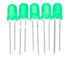
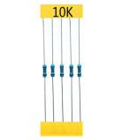
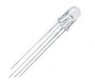
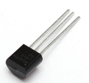
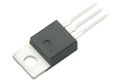
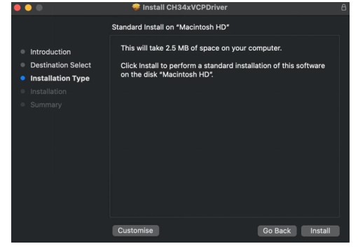
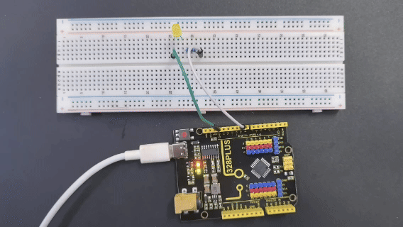
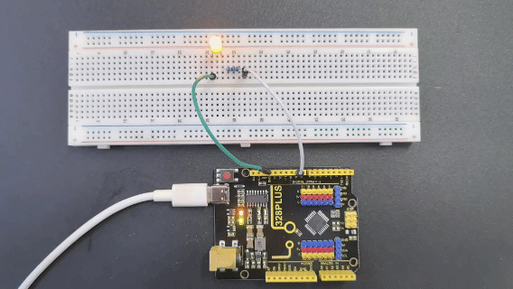
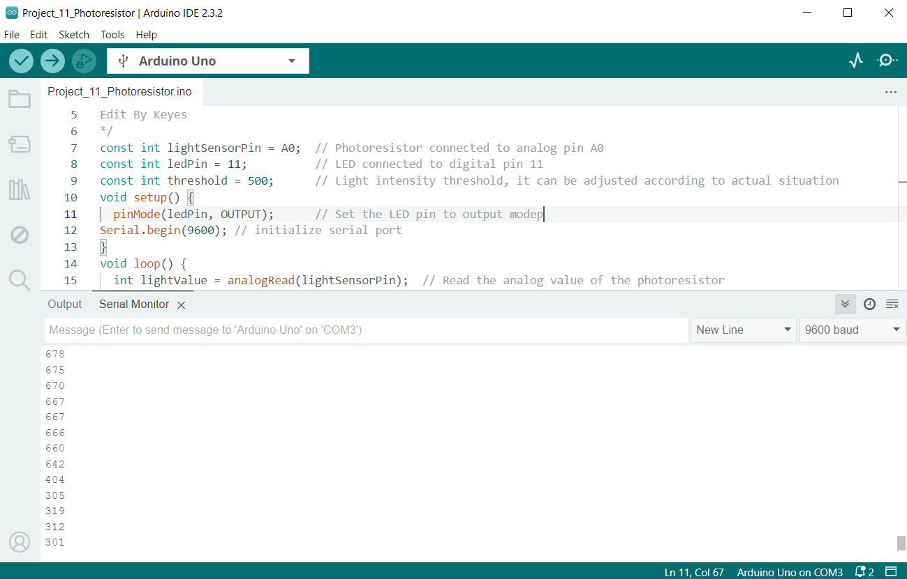
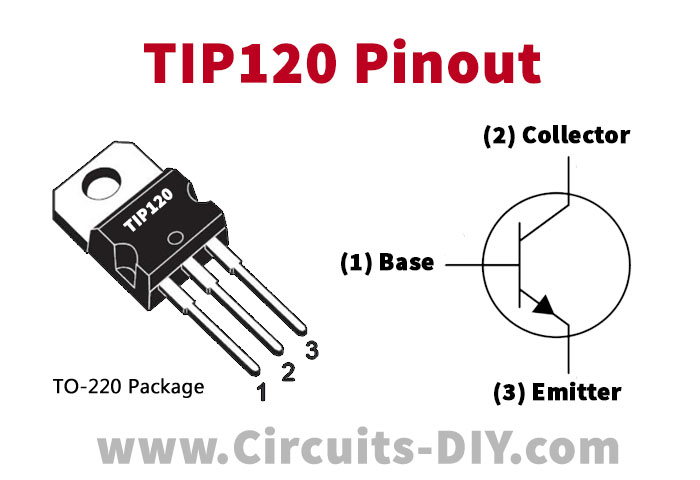

# KT0280 Keyes New RFID Starter Kit

 
## 1.Introduction

Keyes RFID Starter Kit is an Arduino-compatible development kit designed for beginners and electronics enthusiasts. This kit contains multiple sensors and modules to help you get started quickly and practice a variety of basic and intermediate electronics projects.

## 2.Features

1\. **User-Friendliness**: Arduino is popular for its simplicity and ease of use, allowing users to get started without needing advanced programming or electronic expertise.

2\. **Abundant Component Modules**: The kit includes various modules like LEDs, sensors, displays, and motors, enabling users to undertake diverse projects.

3\. **Detailed Tutorials**: It offers detailed tutorials for 40 projects, covering working principles, code, and wiring diagrams to help users gradually master the basics.

4\. **Versatile Applications**: The kit supports the creation of a wide range of projects, from basic temperature monitoring to complex smart home systems, greatly expanding its applicability.

5\. **Expandability**: Beyond the basic projects in the tutorials, users can explore and develop more advanced applications based on personal interests. This flexibility significantly enhances the kit's practical value.

## 3.Component List

|                                                                                                     |  |  |  |    |
|----------------------------------------------------------------------------------------------------------------------------------------------------|-------------------------------------------------------------------------|--------------------------------------------------------------------------|-------------------------------------------------------------------------|---------------------------------------------------|
| 328 Plus board\*1                                                                                                                                  | LED - Blue\*5                                                           | LED - Red\*5                                                             | LED - Yellow\*5                                                         | LED - Green\*5                                    |
|                                                                                                    |                         |                          |                          |    |
| 220Ω Resistor\*10                                                                                                                                  | 10KΩ Resistor\*10                                                       | 1KΩ Resistor\*10                                                         | 100NF capacitor \*1                                                     | 10μF capacitor \*1                                |
|                                                                                                     |                          |   |   |    |
| 10KΩ Potentiometer\*1                                                                                                                              | IC 74HC595N \*1                                                         | Buzzer (Active)\*1                                                       | Buzzer (Passive)\*1                                                     | LED - RGB\*1                                      |
|                                                                                                     |                          |                           |                          |    |
| Button Switch\*4                                                                                                                                   | Button Switch hat\*4                                                    | IR Remote Control\*1                                                     | IR receiver\*1                                                          | LM35 Temp Sensor\*1                               |
|                                                                                                     |                          |                           |                          |    |
| Ball Tilt Sensor\*2                                                                                                                                | Photo Cell\*2                                                           |  Flame Sensor\*1                                                         | TIP122 Transistor\*1                                                    | 1N4007 diode\*1                                   |
|                                                                            |                          |                           |                          |    |
| 1602 LCD \*1                                                                                                                                       | 1 Tube Display\*1                                                       | 4 Tube Display\*1                                                        | 8\*8 LED Matrix\*1                                                      | Soil Humidity Sensor                              |
|                                                                                                     |                          |                           |                          |    |
| water level sensor\*1                                                                                                                              | RFID Reader Module                                                      | 130 Motor Propeller\*1                                                   | 130 Dc Motor\*1                                                         | Stepper Driver\*1                                 |
|   |                          |                           |                          |    |
| Stepper Motor\*1                                                                                                                                   | Servo Motor\*1                                                          | Joystick Module\*1                                                       | 5V relay Module\*1                                                      | 4\*4 Membrane keypads\*1                          |
|                                                                                                     |                          |                           |                          |    |
| HC-SR04 Ultrasonic\*1                                                                                                                              | 830-hole Breadboard\*1                                                  | Fto F Dupont Wire\*10                                                    | Flexible jumper Wire\*65                                                | MtoF Dupont Wire\*10                              |
|                                                                                                     |                          |                           |                          |    |
| Type c USB Cable\*1                                                                                                                                | Resistor card                                                           | 9v Battery holderr\*1                                                    | RFID Card\*1                                                            | RFID Key\*1                                       |

## 4.Getting started with Arduino

**WHAT IS ARDUINO?**

Arduino is an open-source electronics platform based on easy-to-use hardware and software. It’s intended for anyone making interactive projects.

**ARDUINO SOFTWARE**

You can tell your Arduino what to do by writing code in the Arduino programming language and using the Arduino development environment.

### 1. Download Arduino IDE

#### A. Windows System

You could download Arduino IDE from the official website: <https://www.arduino.cc/>

Enter the link and click **SOFTWARE**:


There are various versions of IDE for Arduino. Just download a version compatible with your system.


Here we will show you how to download and install the windows version of Arduino IDE.

There are two versions of IDE for WINDOWS system. You can choose between the installer (.exe) and the Zip file. For installer, it can be directly downloaded, without the need of installing it manually while for Zip package, you will need to install the driver manually.


You just need to click **JUST DOWNLOAD**.

#### B. Mac System

The versions of Arduino IDE vary from operation systems.

For how to download Arduino IDE on Mac, please refer to Windows:


After downloading, double-click to open it and follow the installation instructions.

#### C.Detailed installation steps：

1.Save the .exe file downloaded from the software page to your hard drive and simply run the file .


2.Read the License Agreement and agree it.


3.Choose the installation options.


4.Choose the install location.


5.Click finish and run Arduino IDE


### 2. Install Driver

We need a driver to boot our development board. Or else, the COM port connected to computer will not be found.

#### **Install CH340 Driver on Windows System**[](https://docs.keyestudio.com/projects/Arduino/en/latest/windowsCH340.html#install-ch340-driver-on-windows-system)

Download: <https://fs.keyestudio.com/CH340-WINDOWS>

Windows 10 (and later systems) boasts their own drivers, so there is no need to install additional drivers.

Connect the control board to your computer.

Click Computer– Properties – Device Manager, as shown below. This indicates a successful connection, so the installation of driver is not required.


If the following situation occurs, you need to manually install the driver.


Click to select “Update driver”. And then the driver will start to install.


Tap “Browse my computer for drivers”.


Find the file **usb_ch341_3.1.2009.06** or **cp210x** you have downloaded, and click “Next”.


After finishing installing, click “Close” and the serial port number will show up.


The driver is successfully installed!

Click Computer– Properties – Device Manager to check:


#### **Install CH340 Driver on MAC System**[](https://docs.keyestudio.com/projects/Arduino/en/latest/MacCH340.html#install-ch340-driver-on-mac-system)

**Step 1**: Download the driver from the Website and extract the file to the local installation directory.

<https://fs.keyestudio.com/CH340-MAC>


**Step 2**: For details about how to install the driver in pkg format by default, see Step 3. If OS X 11.0 or later does not support Rosetta, refer to Step 4 to install the dmg driver.

Before installation, please forward to “System Preferences” -> “Security & Privacy” -> “General” page, below the title “Allow apps downloaded from:” choose the choice 2 -> “Mac App Store and identified developers”, then the driver will work normally.


**Step 3**: To install the driver in pkg format, tap the driver file → Continue→ Install




Then the installation will be successful.


To install the pkg format driver on OS X 11.0 and later: Open “LaunchPad” → “CH34xVCPDriver” → Install.


When using OS X 10.9 to OS X 10.15, click “Restart” to restart your computer, and perform the following steps after the restart.


**Step 4**: To install the dmg driver, tap the dmg file and drag “CH34xVCPDriver” to enter the application folder in the operating system.


Then open “LaunchPad” → “CH34xVCPDriver” → Install.


Then the installation will be successful.


When inserting the CH340 control board into the USB port, open System Report -> Hardware ->USB. On the right is USB Device Tree. If the USB device is working properly, you will find a device whose “Vendor ID” is [0x1a86].


Open “Terminal” program under Applications-Utilities folder and type the command “ls /dev/tty\*”.


You should see the “tty.wchusbserialx” where “x” is the assigned device number similar to Windows COM port assignment.

### 3. Arduino IDE Setting

Clickicon to open Arduino IDE.


1.“File”: Including New Sketch, Open…, Sketchbook, Examples, Close, Save(Save as…), Preferences, Advanced…, etc.

2.“Edit”: Including Copy, Paste, Auto Format, Increase/Decrease Font Size, etc. Commonly, you can use shortcuts to do these operations.

3.“Sketch”: Including Verify/Compile, Upload, Include Library, etc.

4.“Tools”: Including Board and Port, which are two of the most important functions.

5.“Help”: Including Check for Updates as well as some official data references.

6.“Serial Plotter”: To display the data from serial port in the way of a line chart.

7.“Serial Monitor”: To prints the data from serial port.

8.Verify code.

9.Verify and upload code.

10.“Sketchbook”: To create a new sketch, or sign in to Arduino Cloud to sync and edit your Cloud Sketches.

11.“Boards Manager”: To install or remove development board.

12.“Library Manager”: To install or remove library.

13.“Debug”: To monitor code and debug breakpoints.

14.Search.

15.Sketch editing area.

16.IDE Output: To report error or successful uploading, and to display data from serial monitor.

### 4. Upload Code via Arduino IED

#### **for Windows**

Upload code: An examples code is provided here: it will print “Hello Keyestudio!” per second.

Copy and paste the following code to Arduino IDE:

/*

keyestudio

Print “Hello Keyestudio!”

http://www.keyestudio.com

*/

void setup() {

// put your setup code here, to run once:

Serial.begin(9600); //Set the serial port baud rate to 9600

}

void loop() {

// put your main code here, to run repeatedly:

Serial.println("Hello Keyestudio!"); //Serial port printing

delay(1000); //Delay of 1 second

}

Click “Tools”——>“Board”——> Arduino AVR Boards, and here we choose Arduino Uno as our development board.


Choose the correct COM port.

If there are so many ports that you have no idea which is the correct one, you may unplug the board to check which one disappears. If there is no COM port, please check whether the driver is installed.


In our demostration, the port is COM3, so we click “Tools”to choose“COM3” in “Port”.


If your board is successfully connected, it will show on the interface.


Click to compile the code. If it succeeds, the following two show up:


Click and set baud rate to 9600, and “Hello Keyestudio!” are being printed!


1.“Toggle Autoscroll”: To set whether to follow the print.

2.“Toggle Timestamp”: To set whether to display printing time.

3.“Clear Output”: To clear the output data

4.Serial Input

5.Serial port sending format

6.Baud rate: To set the baud rate.

7.Printing box.

This is the end of how to upload code!

Now please import libraries for IDE, otherwise an error will occur.

#### **for Mac**

Upload code: An examples code is provided here: it will print “Hello Keyestudio!” per second.

Copy and paste the following code to Arduino IDE:

/*

keyestudio

Print “Hello Keyestudio!”

http://www.keyestudio.com

*/

void setup() {

// put your setup code here, to run once:

Serial.begin(9600); //Set the serial port baud rate to 9600

}

void loop() {

// put your main code here, to run repeatedly:

Serial.println("Hello Keyestudio!"); //Serial port printing

delay(1000); //Delay of 1 second

}

Click “Tools”——>“Board”——> Arduino AVR Boards, and here we choose Arduino Uno as our development board.


Choose the correct COM port.

If there are so many ports that you have no idea which is the correct one, you may unplug the board to check which one disappears. If there is no COM port, please check whether the driver is installed.

In “Tools”, click “Port” to select “/dev/cu.usbderial-0001”.


If your board is successfully connected, it will show on the interface.


Click to compile the code. If it succeeds, the following two show up:


Click and set baud rate to 9600, and “Hello Keyestudio!” are being printed!


1.“Toggle Autoscroll”: To set whether to follow the print.

2.“Toggle Timestamp”: To set whether to display printing time.

3.“Clear Output”: To clear the output data.

4.Serial Input

5.Serial port sending format

6.Baud rate: To set the baud rate.

7.Printing box.

This is the end of how to upload code!

Now please import libraries for IDE, otherwise an error will occur.

## 5.Projects

### Project 1 LED Blink


#### Description

LED, also known as a light-emitting diode, is a semiconductor device that can convert electrical energy into visible light. It consists of two different types of semiconductor materials, one with a negative charge and the other with a positive charge. When current flows through the LED, electrons jump from the negative to the positive layer, releasing photons and producing light.

In this project, we will use an Arduino board and an LED to create the classic "Blink" project. Through this project, you will understand the working principle of LEDs and write a simple program to control the blinking of the LED.

#### Hardware

1\. 328 Plus development board x1

2\. 5mm LED x1

3\. 220-ohm resistor x1

4\. Breadboard x1

5\. Jumper wires

#### Component Knowledge

**What is resistor?**

Resistor is the electronic component in the circuit, which limits and regulates current flow. Its unit is (Ω).

The units larger than ohms are kiloohms (KΩ) and megaohms (MΩ). When in use, in addition to the size of the resistance, you must also pay attention to its power. In the project, the leads at both ends of the resistor should be bent at a 90° angle to fit the breadboard properly. If the lead is too long, it can be cut to an appropriate length.


**What is breadboard?**

A breadboard is used to build and test circuits quickly before finalizing any circuit design. The breadboard has many holes into which circuit components like ICs and resistors can be inserted. A typical breadboard is shown below:


The bread board has strips of metal which run underneath the board and connect the holes on the top of the board. The metal strips are laid out as shown below. Note that the top and bottom rows of holes are connected horizontally while the remaining holes are connected vertically.


To use the bread board, the legs of components are placed in the holes. Each set of holes connected by a metal a strip underneath forms anode.

**What is LED?**

A light-emitting diode (LED) is a semiconductor device that emits light when an electric current flows through it. When current passes through an LED, the electrons recombine with holes emitting light in the process. LEDs allow the current to flow in the forward direction and blocks the current in the reverse direction.


Light-emitting diodes are heavily doped p-n junctions. Based on the semiconductor material used and the amount of doping, an LED will emit coloured light at a particular spectral wavelength when forward biased. As shown in the figure, an LED is encapsulated with a transparent cover so that emitted light can come out.

LED Symbol

The LED symbol is the standard symbol for a diode, with the addition of two small arrows denoting the emission of light.


Simple LED Circuit

The figure below shows a simple LED circuit.  
  
The circuit consists of an LED, a voltage supply and a resistor to regulate the current and voltage.

#### LED Working Principle

When the diode is forward biased, the minority electrons are sent from p → n while the minority holes are sent from n → p. At the junction boundary, the concentration of minority carriers increases. The excess minority carriers at the junction recombine with the majority charges carriers.


The energy is released in the form of photons on recombination. In standard diodes, the energy is released in the form of heat. But in light-emitting diodes, the energy is released in the form of photons. We call this phenomenon electroluminescence. Electroluminescence is an optical phenomenon, and electrical phenomenon where a material emits light in response to an electric current passed through it. As the forward voltage increases, the intensity of the light increases and reaches a maximum.

#### LED Specifications

1.8-2.2VDC forward drop

Max current: 20mA

Suggested using current: 16-18mA

Luminous Intensity: 150-200mcd

#### LED Pinout


An LED has a positive (Anode) lead and a negative (Cathode) lead. The schematic symbol of the LED is similar to the diode except for two arrows pointing outwards. The Anode (+) is marked with a triangle, and the Cathode (-) is marked with a line.

The longer lead of an LED is generally the positive (Anode), while the shorter lead is the negative (cathode).

#### Wiring Diagram

1.Insert the LED on the breadboard;

2.Connect one end of the 220 ohm resistor to the row of the breadboard where the LED anode is, and connect the other end of the resistor to digital pin 9 of the development board;

3.Connect the GND pin of the board via jump wire to the row of the breadboard where the LED cathode is.

 

#### Sample Code

```cpp

/*

Keye New RFID Starter Kit

Project 1

LED Blink

Edit By Keyes

*/

void setup() {

pinMode(9, OUTPUT); // Set digital pin 9 as an output

}

void loop() {

digitalWrite(9, HIGH); // Set digital pin 9 to high, turning on the LED

delay(1000); // Wait for 1000 milliseconds (1 second)

digitalWrite(9, LOW); // Set digital pin 9 to low, turning off the LED

delay(1000); // Wait for 1000 milliseconds (1 second)

}

```

#### Code Explanation

First, we need to define a variable to represent the digital pin connected to the LED. In Arduino programming, this can be done with a simple line of code:

```cpp

int ledPin = 9;

```

This line of code defines a variable named `ledPin` and initializes it to 9, indicating that the LED is connected to digital pin number 9 on the Arduino board. In Arduino, each digital pin can be used as either an input or output pin, depending on how we set it up.

Next, we need to set the mode of the `ledPin` so that it can correctly send signals to the LED. This is done using the `pinMode()` function, with the following syntax:

```cpp

pinMode(ledPin, OUTPUT);

```

This line of code sets `ledPin` to output mode (`OUTPUT`). In output mode, the Arduino board can send voltage signals to connected devices. For an LED, this means we can control its on and off states.

Once the pin mode is set, the next step is to control the LED's on and off states by sending high (HIGH) or low (LOW) signals to the LED. This is done using the `digitalWrite()` function, represented by the following two lines of code respectively:

```cpp

digitalWrite(ledPin, HIGH); // Turn on the LED

digitalWrite(ledPin, LOW); // Turn off the LED

```

When the second parameter of the `digitalWrite()` function is `HIGH`, Arduino outputs a high voltage to the `ledPin`, causing the connected LED to light up. Conversely, when the parameter is `LOW`, it outputs a low voltage, and the LED turns off.

To keep the LED state (on or off) for a certain duration, we use the `delay()` function to pause the program execution. For example:

```cpp

delay(1000);

```

This line of code pauses the program for 1000 milliseconds (i.e., 1 second). This means the LED will maintain its current state (either on or off) for one second. By adjusting the number of milliseconds in `delay()`, we can control how long the LED state lasts.

#### Project Result



After uploading the code to the development board, the LED connected to digital pin 9 starts blinking and it will be on and off for 1s.

### Project 2 SOS


#### Description

SOS is an internationally accepted distress signal, which consists of three short dot signals, three long dash signals, and three short dot signals(corresponding to "· · · – – – · · ·" in Morse code).

This project will use an LED to simulate the flashing process of the SOS signal. Each dot signal LED flashes for 0.2s, each dash signal flashes for 0.6s, and the interval between two characters is 0.2s.

#### Hardware

1\. 328 Plus development board x1

2\. USB cable x1

3\. Breadboard x1

4\. LED x1

5\. 220Ω resistor x1

6.Jumper wires

#### Working Principle

SOS("Save Our Souls" or "Save Our Ship") is an internationally accepted distress signal. Its working principle is simple but effective.


The SOS signal usually consists of three letters: three short "S" sounds, three long "O" sounds, and three short "S" sounds. This unique rhythm makes it stand out in various noisy environments. Whether in the ticking of the telegraph or the rustling of the radio, SOS can be clearly identified.

Historically, the emergence of the SOS signal changed the fate of countless people. Ships in distress at sea, crashed planes, and anyone in dire straits can seek help from the outside world by sending SOS signals. Once the SOS signal is received, rescue operations begin immediately.

In modern society, the application of SOS has gone far beyond the maritime field. The emergency call function on mobile phones and other communication devices is actually a variant of SOS. As long as you press a specific key combination in an emergency, your location information and help information will be automatically sent to the police, fire and other rescue departments.

#### Wiring Diagram

The wiring is the same as Project 1.


#### Sample Code

```cpp

/*

Keye New RFID Starter Kit

Project 2

SOS

Edit By Keyes

*/

int ledPin = 9; // Define the digital pin to which the LED is connected

// Define the duration of the dot signal '.' and the dash signal '-' in ms

int dotDuration = 200;

int dashDuration = 600;

// Set the pause time between two characters in ms

int pauseDuration = 200;

void setup() {

pinMode(ledPin, OUTPUT); // Set the pin to output mode

}

void loop() {

// S ···

for (int i = 0; i < 3; i++) {

digitalWrite(ledPin, HIGH);

delay(dotDuration);

digitalWrite(ledPin, LOW);

delay(pauseDuration);

}

delay(pauseDuration);

// O ---

for (int i = 0; i < 3; i++) {

digitalWrite(ledPin, HIGH);

delay(dashDuration);

digitalWrite(ledPin, LOW);

delay(pauseDuration);

}

delay(pauseDuration);

// S ···

for (int i = 0; i < 3; i++) {

digitalWrite(ledPin, HIGH);

delay(dotDuration);

digitalWrite(ledPin, LOW);

delay(pauseDuration);

}

delay(3000); // SOS cycle interval is 3 s

}

```

#### Code Explanation

First, we need to define the digital port that connects the LED. In Arduino programming, this can be done with a simple line of code:

```cpp

int ledPin = 9;

```

This line of code declares an integer variable named `ledPin` and initializes it to 9. This means the LED is connected to digital port 9 on the Arduino board. In Arduino, each digital port can be configured as either input or output, used for reading sensors or controlling external devices like LEDs.

Next, we need to configure the mode of this port in the program's `setup()` function. The `setup()` function is an essential part of every Arduino program, automatically executed once when the Arduino board is powered up, for initial settings. To control the LED, we need to set port 9 to output mode:

```cpp

void setup() {

pinMode(ledPin, OUTPUT);

}

```

Here, `pinMode()` is an Arduino function that sets the mode of a specified digital port. `ledPin` is the port number we defined earlier, and `OUTPUT` is a predefined constant indicating that the port will be used for outputting electrical signals.

Subsequently, we'll write the `loop()` function, which is the core of an Arduino program, repeatedly executing after the device is powered up. In this function, we'll implement the logic to control the LED to flash an SOS signal. We use the `digitalWrite()` function to turn the LED on and off, and the `delay()` function to control the speed and interval of the flashing:

```cpp

void loop() {

// S ···

for (int i = 0; i < 3; i++) {

digitalWrite(ledPin, HIGH);

delay(dotDuration);

digitalWrite(ledPin, LOW);

delay(pauseDuration);

}

delay(pauseDuration);

// O ---

for (int i = 0; i < 3; i++) {

digitalWrite(ledPin, HIGH);

delay(dashDuration);

digitalWrite(ledPin, LOW);

delay(pauseDuration);

}

delay(pauseDuration);

// S ···

for (int i = 0; i < 3; i++) {

digitalWrite(ledPin, HIGH);

delay(dotDuration);

digitalWrite(ledPin, LOW);

delay(pauseDuration);

}

delay(3000); // SOS cycle interval is 3 s

}

```

In this section of the code, `digitalWrite(ledPin, HIGH)` and `digitalWrite(ledPin, LOW)` are used to turn the LED connected to port 9 on and off. The `delay()` function controls the time intervals in milliseconds. By adjusting the values in `delay()`, you can change the speed and rhythm of the SOS signal's flashing.

#### Project Result


After uploading the code and powering on, the LED will flash according to the rhythm of the SOS signal: "· · · – – – · · ·", with 3s between each SOS cycle.

### Project 3 PWM


#### Description

PWM (Pulse Width Modulation) is a common electronic control technology that controls the average value of the output voltage or current by changing the pulse width. To put it simply, it controls the output of energy by controlling the time ratio of "on" and "off".

This project will use an Arduino development board and an LED to control the brightness of the LED through PWM. By writing Arduino code, we will realize the gradient effect of LED brightness to understand the working principle and application of PWM.

#### Hardware

1\. 328 Plus development board x1

2\. LED x1

3\. 220 ohm resistor x1

4\. Breadboard x1

5.Jumper wires

#### Working Principle

Arduino PWM (Pulse Width Modulation) is used to control LED brightness, motor speed, etc. It can control analog devices by quickly switching digital pins to simulate different voltage levels. This project will explore how Arduino PWM works.

The basic principle of PWM is to adjust the average value of the output voltage by changing the width of the pulse. Arduino's digital pins can only output high level (5V) or low level (0V). But if you quickly switch between high and low levels and control the duration of the high level, you can simulate a voltage between 0V and 5V. The proportion of the high level duration to the entire cycle is called the duty cycle. The larger the duty cycle, the higher the output voltage.


Arduino's analogWrite() function can easily implement PWM. It accepts two parameters: pin number and duty cycle. The value range of the duty cycle is 0-255, which corresponds to 0% to 100%. For example, analogWrite(9, 127) means outputting a PWM waveform with a 50% duty cycle on pin 9.

Arduino's timer/counter module is used to generate PWM signals. Different Arduino boards have different numbers of timers/counters. Each timer/counter has multiple channels, and each channel can independently generate a PWM. Arduino UNO has 3 timers and 6 PWM channels, which are located on pins 3, 5, 6, 9, 10, and 11.


The core of the timer/counter is a counter register (TCNTn). It will automatically increase by one every clock cycle until it reaches the set maximum value (TOP), then it will clear to zero and start again. At the same time, there is a comparison match register (OCRnA/B) used to save the duty cycle value. Whenever the counter value is equal to the compare match register, the PWM output will flip (from high level to low level, or from low level to high level). By setting different TOP values and comparison matching values, the PWM frequency and duty cycle can be changed.

Arduino's analogWrite() function will automatically set the timer's working mode, generally using fast PWM mode (Fast PWM). In this mode, the counter continuously counts at a fixed frequency and compares with the compare match register. Once the count value is equal to TOP, the counter will reset to zero and the PWM output will flip.

For example, if we use a 16MHz clock and an 8-bit counter with a TOP value of 255, and a compare match value of 127, then the PWM frequency is 16MHz/(255+1)=62.5kHz. PWM outputs high level when the count value is less than 127, and outputs low level when it is greater than 127. Since 127/256=50%, the PWM waveform with 50% duty cycle is output, which is equivalent to 2.5V DC.

To sum up, Arduino PWM quickly switches the pin level through the timer and adjusts the duty cycle, thereby simulating a continuously variable analog voltage on the digital pin. This provides a simple and flexible means to control LED brightness, motor speed, etc. Understanding the principle of PWM will help you better apply this technology and allow Arduino to create more magical works.

#### Wiring Diagram

The wiring is the same as Project 1.

 

#### Sample Code

```cpp

/*

Keye New RFID Starter Kit

Project 3

PWM

Edit By Keyes

*/

int ledPin = 9; // Define the pin of the LED

int brightness = 0; // Define the brightness variable of the LED

int fadeAmount = 5; // Define the step size of the brightness change

void setup() {

pinMode(ledPin, OUTPUT); // Set LED pin to output mode

}

void loop() {

analogWrite(ledPin, brightness); // Use analogWrite function to output PWM signal

brightness = brightness + fadeAmount; // Adjust brightness variable

if (brightness <= 0 || brightness >= 255) {

fadeAmount = -fadeAmount; // When the brightness reaches the maximum or minimum value, change the direction of the brightness change

}

delay(30); // Delay 30ms to control the speed of brightness change

}

```

#### Code Explanation

The code defines variables and constants to control the LED's behavior:

```cpp

int ledPin = 9; // LED pin

int brightness = 0; // LED brightness

int fadeAmount = 5; // Brightness change step

```

Here, `ledPin` is set to 9, meaning the LED is connected to digital pin 9 on the Arduino board. `brightness` tracks the LED's current brightness, starting at 0 (off). `fadeAmount` is the increment/decrement for brightness changes, set to 5.

The `setup()` function initializes settings:

```cpp

void setup() {

pinMode(ledPin, OUTPUT); // Set LED pin to output mode

}

```

In `setup()`, `pinMode()` sets `ledPin` to output mode (`OUTPUT`), necessary for controlling LED brightness.

The `loop()` function controls LED brightness changes:

```cpp

void loop() {

analogWrite(ledPin, brightness); // Use analogWrite to control LED brightness

brightness = brightness + fadeAmount; // Adjust brightness

if (brightness <= 0 || brightness >= 255) {

fadeAmount = -fadeAmount; // Reverse direction when reaching max/min

}

delay(30); // Delay to control brightness change speed

}

```

In `loop()`, `analogWrite()` outputs a PWM signal to `ledPin`, controlling LED brightness. `brightness` is adjusted by `fadeAmount`, creating a fading effect.

When `brightness` reaches 0 or 255, `fadeAmount` is reversed using `fadeAmount = -fadeAmount;`, making the brightness change direction. This creates a smooth fade between the brightest and darkest states.

Finally, `delay(30);` pauses the program for 30 milliseconds. This delay controls the speed of brightness changes; shorter delays result in faster changes.

#### Project Result

After uploading the code, the LED will show a gradient effect.



The brightness will gradually increase from 0 to 255, then gradually decrease to 0. By adjusting the `fadeAmount` variable, you can change the speed of the brightness change.

### Project 4 Traffic Lights


#### Description

Traffic lights are important traffic safety facilities on the road. They use different light colors to direct the passage of vehicles and pedestrians to ensure road safety and order.

This project will use a Arduino development board and LEDs to implement a simple traffic light system. By writing Arduino code, you can control the LEDs of red, yellow, and green colors to realize the basic functions of traffic lights.

#### Hardware

1\. 328 Plus development board x1

2\. Red LED x1

3\. Yellow LED x1

4\. Green LED x1

5\. 220 ohm resistor x3

6\. Breadboard x1

7\. Jumper wires

#### Working Principle

Traffic lights are an indispensable part of the modern transportation system, which use red, yellow, and green lights to control the passage of vehicles and pedestrians, thereby ensuring orderly and safe traffic. This project will seek to how traffic lights work.

The traffic lights mainly consist of an electronic controller and a signal light. The electronic controller is the "brain" of the traffic light. It controls the changes of the signal light according to the preset time and logic. Signal lights are usually composed of LEDs or incandescent bulbs, which display three colors: red, yellow, and green.


The working cycle of traffic lights is usually divided into four stages: red light, red and yellow light, green light and yellow light. During the red light phase, the red light lights up and all vehicles and pedestrians must stop and wait. When the red light ends, the red and yellow lights will light up at the same time, prompting drivers and pedestrians to prepare to leave. Next, the green light turns on and vehicles and pedestrians can pass. Finally, the yellow light turns on, reminding drivers and pedestrians that the green light is about to end and they need to prepare to stop or speed up to pass.

#### Wiring Diagram

1.Connect the red LED anode to digital pin D10 on the board, and cathode to pin GND with a 220 ohm resistor in serial;

2.Connect the yellow LED anode to digital pin D7 on the board, and cathode to pin GND with a 220 ohm resistor in serial;

3.Connect the green LED anode to digital pin D4 on the board, and cathode to pin GND with a 220 ohm resistor in serial;

 

#### Sample Code

```cpp

/*

Keye New RFID Starter Kit

Project 4

Traffic light

Edit By Keyes

*/

int redPin = 10; // Red LED is connected to digital pin 10

int yellowPin = 7; // Yellow LED is connected to digital pin 7

int greenPin = 4; // Green LED is connected to digital pin 4

void setup() {

pinMode(redPin, OUTPUT);

pinMode(yellowPin, OUTPUT);

pinMode(greenPin, OUTPUT);

}

void loop() {

// Red LED will be on for 5s

digitalWrite(redPin, HIGH);

delay(5000);

// Red LED will be off and green LED will be on for 3s

digitalWrite(redPin, LOW);

digitalWrite(greenPin, HIGH);

delay(3000);

// Green LED will be off and yellow LED will be on for 1s

digitalWrite(greenPin, LOW);

digitalWrite(yellowPin, HIGH);

delay(1000);

// Yellow LED will be off

digitalWrite(yellowPin, LOW);

}

```

#### Code Explanation

The code defines three integer variables, `redPin`, `yellowPin`, and `greenPin`, which store the digital pin numbers connected to the three LEDs on the Arduino board. The red LED is connected to digital pin 10, the yellow LED is connected to digital pin 7, and the green LED is connected to digital pin 4.

```cpp

int redPin = 10; // Red LED connected to digital pin 10

int yellowPin = 7; // Yellow LED connected to digital pin 7

int greenPin = 4; // Green LED connected to digital pin 4

```

In the `setup()` function, these three pins are set to output mode (`OUTPUT`) using the `pinMode()` function. This is because the LEDs need to receive a power signal from the Arduino board to control their on/off state.

```cpp

void setup() {

pinMode(redPin, OUTPUT);

pinMode(yellowPin, OUTPUT);

pinMode(greenPin, OUTPUT);

}

```

The `loop()` function is the core of the Arduino program and is executed repeatedly. In this function, the `digitalWrite()` function controls the on/off state of each LED, while the `delay()` function controls the duration of each state.

1\. First, the red LED is set to high level (`HIGH`), which means it is turned on, for 5 seconds (5000 milliseconds).

```cpp

digitalWrite(redPin, HIGH);

delay(5000);

```

2\. After 5 seconds, the red LED turns off (set to low level, `LOW`), and the green LED turns on for 3 seconds.

```cpp

digitalWrite(redPin, LOW);

digitalWrite(greenPin, HIGH);

delay(3000);

```

3\. Next, the green LED turns off, and the yellow LED turns on for only 1 second.

```cpp

digitalWrite(greenPin, LOW);

digitalWrite(yellowPin, HIGH);

delay(1000);

```

4\. Finally, the yellow LED turns off.

```cpp

digitalWrite(yellowPin, LOW);

```

#### Project Result

After uploading the code to the development board, the LEDs will be on and off according to the set time sequence, simulating the working status of a traffic light. 


The red light is on for 5s and then goes off; the green light is on for 3s and then goes off; the yellow light is on for 1s and then goes off.

### Project 5 LED Flowing Light


#### Description

A flowing water light flashes continuously like running water. It is a common decorative light that is widely used in various occasions, such as festival celebrations, shopping mall windows, stage performances, etc.

This project will use an Arduino development board and 5 LEDs to make a simple LED flowing water light. By controlling the sequence of LEDs on and off, you can create a visual effect like flowing water.

#### Hardware

1\. 328 Plus development board x1

2\. LED x5

3\. 220 ohm resistor x5

4\. Breadboard x1

5\. Jumper wires

#### Working Principle

The working principle of the LED flowing water light is to control the on and off sequence of the LEDs through the Arduino development board, thereby producing a visual effect like flowing water. The Arduino development board is connected to the positive pin of the LED through the digital output pin, while the negative pin of the LED is connected to the GND (ground) pin of the board through a resistor. By writing Arduino code, we can control the high and low levels of the digital output pins to control the LED on and off.


#### Wiring Diagram

1.Connect the 5 LED anode pins to digital pins D2, D3, D4, D5, D6 on the Arduino development board respectively.

2.Connect the cathode pins of each of the five LED to one end of each of the five 220 ohm resistors.

3.Connect the other end of the five 220 ohm resistors to the GND (ground) of the development board.


#### Sample Code

```cpp

/*

Keye New RFID Starter Kit

Project 5

LED flowing light

Edit By Keyes

*/

int ledPins[] = {2, 3, 4, 5, 6, }; // Define the pin of the LED

int ledCount = 5; // Number of LEDs

int delayTime = 100; // Delay time in ms

void setup() {

for (int i = 0; i < ledCount; i++) {

pinMode(ledPins[i], OUTPUT); // Set the LED pin to output mode

}

}

void loop() {

for (int i = 0; i < ledCount; i++) {

digitalWrite(ledPins[i], HIGH); // Light up the current LED

delay(delayTime); // Delay

digitalWrite(ledPins[i], LOW); // Light off the current LED

}

for (int i = ledCount - 2; i > 0; i--) {

digitalWrite(ledPins[i], HIGH); // Light up the current LED

delay(delayTime); // Delay

digitalWrite(ledPins[i], LOW); // Light off the current LED

}

}

```

#### Code Explanation

Variable Definitions

```cpp

int ledPins[] = {2, 3, 4, 5, 6}; // Define the pins for the LEDs

int ledCount = 5; // Number of LEDs

int delayTime = 100; // Delay time in milliseconds

```

`ledPins[]`: This is an integer array that stores the digital pin numbers to which each LED is connected. In this example, the LEDs are connected to digital pins 2, 3, 4, 5, and 6 on the Arduino board.

`ledCount`: This variable stores the total number of LEDs, making it convenient to use in for loops.

`delayTime`: Controls the delay time between each LED turning on or off, in milliseconds.

Setup Function `setup()`

```cpp

void setup() {

for (int i = 0; i < ledCount; i++) {

pinMode(ledPins[i], OUTPUT); // Set the LED pins as output mode

}

}

```

The `setup()` function is a standard initialization function in Arduino programs, automatically called once at the beginning of the program.

`pinMode(ledPins[i], OUTPUT)`: This line of code configures each LED pin as output mode. `OUTPUT` is a constant in the Arduino language used to specify the pin as an output.

Main Loop Function `loop()`

```cpp

void loop() {

for (int i = 0; i < ledCount; i++) {

digitalWrite(ledPins[i], HIGH); // Turn on the current LED

delay(delayTime); // Delay

digitalWrite(ledPins[i], LOW); // Turn off the current LED

}

for (int i = ledCount - 2; i > 0; i--) {

digitalWrite(ledPins[i], HIGH); // Turn on the current LED

delay(delayTime); // Delay

digitalWrite(ledPins[i], LOW); // Turn off the current LED

}

}

```

The `loop()` function is the main loop part of the Arduino program, repeatedly executed after the `setup()` function.

The first for loop is responsible for turning on each LED in sequence, keeping each LED on for the time specified by `delayTime`, and then turning it off.

The second for loop turns off the LEDs in reverse order, starting from the second to last LED and ending at the second LED.

`digitalWrite(pin, value)`: Used to control the high or low level on the specified pin. `HIGH` represents a high level, turning the LED on; `LOW` represents a low level, turning the LED off.

#### Project Result

After uploading the sample code to the development board,


the LEDs will light up and turn off in sequence from left to right, and then from right to left, creating a flowing water effect.

### Project 6 Active Buzzer


#### Description

An active buzzer is a buzzer with a built-in drive circuit. Compared with traditional passive buzzers, it features small size, adjustable tone, and simple drive. In daily life, we often encounter active buzzers, such as mobile phones, computers as well as household appliances.

In this project, we will make a simple alarm system via an Arduino board and an active buzzer. This system can be used in a variety of situations, such as doorbell prompts and temperature exceeding warnings.

#### Hardware

1\. 328 Plus development board x1

2\. Active buzzer x1

3\. Jumper wires 

#### Working Principle

Active buzzer is a common electronic sound-generating device and is widely used in various electronic equipment. Here's how it works:

1.  Oscillation circuit: The active buzzer contains an oscillation circuit inside, which is usually composed of resistors, capacitors, transistors and other components. When the buzzer is powered on, the oscillation circuit generates an electrical signal of a specific frequency.
1.  Piezoelectric element: The buzzer also contains a piezoelectric element, which is usually made of piezoelectric ceramics or piezoelectric film. Piezoelectric elements have unique properties: when a voltage is applied, they produce mechanical deformation; conversely, when subjected to mechanical stress, they produce a voltage.

3. Sound generation: The electrical signal generated by the oscillation circuit is applied to the piezoelectric element, causing it to rapidly mechanically deform and push the surrounding air to generate sound waves. The frequency of the sound wave depends on the frequency of the oscillation circuit, so the tone emitted by the buzzer can be controlled by changing the parameters of the oscillation circuit.

4. Drive circuit: The active buzzer has a simple built-in drive circuit to amplify the signal generated by the oscillation circuit and provide sufficient current to the piezoelectric element to produce a loud enough sound.


In short, the active buzzer generates an electrical signal of a specific frequency through an internal oscillation circuit and uses a piezoelectric element to convert the electrical signal into sound. This simple and effective working principle makes the active buzzer a commonly used electronic sound-generating device.

#### Specifications

Min/Max Operating Voltage +3.3V to +5V

Maximum Current: 30mA

Resonance Frequency: 2500Hz ± 300Hz continous

Minimum Sound Output 85Db @ 4in (10cm)

Storage Temperature: -22°F to 221°F (-30°C to 105°C)

Operating Temperature: -4°F to 158°F (-20°C to 70°C)

#### Pinout


#### Wiring Diagram

1\. Connect the positive pole of the active buzzer (usually "S" or "+") to the digital pin D8 on the development board.

2\. Connect the negative pole of the buzzer (“-”) to GND.


#### Sample Code

```cpp

/*

Keye New RFID Starter Kit

Project 6

Active buzzer

Edit By Keyes

*/

const int BUZZER_PIN = 8;// Define the digital port to which the buzzer is connected

void setup() {

// Set the buzzer port to output mode

pinMode(BUZZER_PIN, OUTPUT);

}

void loop() {

// Make the buzzer sound

digitalWrite(BUZZER_PIN, HIGH);

delay(1000); // Sound lasts 1s

// Stop sounding

digitalWrite(BUZZER_PIN, LOW);

delay(1000); // Stop sounding for 1s

}

```

#### Code Explanation

```cpp

const int BUZZER_PIN = 8; // Define a constant BUZZER_PIN with a value of 8, indicating the buzzer is connected to digital pin 8

```

First, the code defines a constant `BUZZER_PIN` to store the pin number 8 where the buzzer is connected. Using a constant makes the code easier to understand and maintain.

```cpp

void setup() {

// Set the buzzer pin to output mode

pinMode(BUZZER_PIN, OUTPUT);

}

```

The `setup()` function is a special initialization function in Arduino that runs first when the program starts or resets. Here, the `pinMode()` function sets the buzzer pin to output mode. This means the pin will output a voltage signal to control an external device—in this case, the buzzer.

```cpp

void loop() {

// Make the buzzer sound

digitalWrite(BUZZER_PIN, HIGH);

delay(1000); // Sound for 1 second

// Stop the sound

digitalWrite(BUZZER_PIN, LOW);

delay(1000); // Stop for 1 second

}

```

The `loop()` function runs continuously and is the core functional block of Arduino code. In this loop, the code uses the `digitalWrite()` function to set the pin to `HIGH`, making the buzzer sound. Then, it uses `delay(1000)` to create a 1-second delay, allowing the buzzer to sound for 1 second. After that, the code sets the pin to `LOW` to stop the buzzer sound and delays again for 1 second. Therefore, this loop makes the buzzer sound for 1 second and stop for 1 second in a regular alternating pattern.

#### Project Result

After uploading the above code to the development board, the active buzzer will emit a sound every second, forming an intermittent sound.


Such output can be used as various prompts or warning signals.

### Project 7 Passive Buzzer


#### Description

Passive buzzer is a common electronic component that is widely used in various electronic devices to issue sound prompts or alarms. Unlike the active buzzer, the passive buzzer itself does not contain an oscillation circuit and requires an external circuit to provide a pulse signal to work.

This project aims to control a passive buzzer to emit sounds of different frequencies through an Arduino development board to play a simple melody.

#### Hardware

1\. 328 Plus development board x1

2\. Passive buzzer x1

3\. Breadboard x1

4\. Jumper wires

#### Working Principle

Passive buzzer is a common electronic component that is widely used in various electronic devices to sound prompts or alarm sounds. Its working principle is based on the piezoelectric effect.

There is a piezoelectric ceramic piece inside the passive buzzer. When a voltage is applied, the piezoelectric ceramic piece will mechanically deform, causing it to vibrate and emit sound. When the frequency of the AC voltage matches the natural frequency of the piezoelectric ceramic piece, the buzzer will produce maximum sound output.


Passive buzzers require an external circuit to provide a driving signal, which usually use a square wave or pulse wave signal. The frequency of the drive signal determines the pitch of the buzzer sound, while the amplitude of the signal affects the volume. By changing the frequency and duty cycle of the driving signal, the buzzer can be controlled to emit different sound effects.

Compared with active buzzers, passive buzzers have simple structure and low cost, but they require external circuits to provide driving signals. In practical applications, it is necessary to select a suitable passive buzzer according to specific needs and design a corresponding drive circuit to achieve the required sound effect.

#### Specifications

Min/Max Operating Voltage 1.5V to 5V DC

Current: <25mA

Frequency: <20Hz to >2.5kHz

#### Pinout


#### Wiring Diagram

1\. Connect the positive pole of the passive buzzer to the digital pin D8 of the development board.

2\. Connect the negative pole of the passive buzzer to GND of the port.


#### Sample Code

```cpp

/*

Keye New RFID Starter Kit

Project 7

Passive buzzer

Edit By Keyes

*/

const int buzzerPin = 8; // Define the digital pin to which the buzzer is connected

// Define the frequency corresponding to the note

#define NOTE_C4 262

#define NOTE_D4 294

#define NOTE_E4 330

#define NOTE_F4 349

#define NOTE_G4 392

#define NOTE_A4 440

#define NOTE_B4 494

#define NOTE_C5 523

// Define a melody array containing notes and duration

int melody[] = {

NOTE_C4, NOTE_G4, NOTE_G4, NOTE_A4, NOTE_G4, 0, NOTE_B4, NOTE_C5

};

int noteDurations[] = {

4, 8, 8, 4, 4, 4, 4, 4

};

void setup() {

pinMode(buzzerPin, OUTPUT); // Set the buzzer pin to output mode

}

void loop() {

// Play a melody in a loop

for (int thisNote = 0; thisNote < 8; thisNote++) {

int noteDuration = 1000 / noteDurations[thisNote]; // Calculate note duration

tone(buzzerPin, melody[thisNote], noteDuration); // Play notes

int pauseBetweenNotes = noteDuration * 1.30; // Calculate the pause time between notes

delay(pauseBetweenNotes); // Wait for pause time

noTone(buzzerPin); // Stop playing notes

}

}

```

#### Code Explanation

1\. Define the buzzer pin

```cpp

const int buzzerPin = 8; // Define the digital pin that the buzzer is connected to

```

This line of code defines a constant `buzzerPin` and sets it to 8. This means that the buzzer is connected to digital I/O pin 8 on the Arduino board. In Arduino programming, using constants can improve code readability and maintainability.

2\. Define note frequencies

```cpp

#define NOTE_C4 262

#define NOTE_D4 294

#define NOTE_E4 330

#define NOTE_F4 349

#define NOTE_G4 392

#define NOTE_A4 440

#define NOTE_B4 494

#define NOTE_C5 523

```

These preprocessor directives define the frequencies (in Hertz) of various musical notes. These values represent the standard frequencies of different notes, such as middle C (C4) at 262Hz. These definitions make it more intuitive and convenient to reference these notes in the code.

3\. Define the melody and rhythm

```cpp

int melody[] = {

NOTE_C4, NOTE_G4, NOTE_G4, NOTE_A4, NOTE_G4, 0, NOTE_B4, NOTE_C5

};

int noteDurations[] = {

4, 8, 8, 4, 4, 4, 4, 4

};

```

These two arrays define the notes in the melody and the duration of each note, respectively. The `melody` array stores a sequence of note frequencies, while the `noteDurations` array defines the relative duration of each note. For example, `4` represents a quarter note, and `8` represents an eighth note.

Setup initialization

```cpp

void setup() {

pinMode(buzzerPin, OUTPUT); // Set the buzzer pin as an output

}

```

In the `setup()` function, we set `buzzerPin` as an output using the `pinMode()` function. This is because the buzzer needs to receive electrical signals from the Arduino to produce sound.

Main loop to play the melody

```cpp

void loop() {

for (int thisNote = 0; thisNote < 8; thisNote++) {

int noteDuration = 1000 / noteDurations[thisNote]; // Calculate the note duration

tone(buzzerPin, melody[thisNote], noteDuration); // Play the note

int pauseBetweenNotes = noteDuration * 1.30; // Calculate the pause between notes

delay(pauseBetweenNotes); // Wait for the pause duration

noTone(buzzerPin); // Stop playing the note

}

}

```

The code in the `loop()` function is the core of the entire program. It iterates through each note in the `melody` array using a loop and plays each note on the buzzer using the `tone()` function. The actual duration of each note is calculated by dividing 1000 milliseconds by the corresponding value in the `noteDurations` array. After playing each note, the program pauses for a certain duration using the `delay()` function. This pause is slightly longer than the duration of the note itself to create a gap between notes. The `noTone()` function is used to stop playing the current note, and then the program proceeds to the next note.

#### Project Result

After uploading the code, the passive buzzer will play a simple melody in sequence according to the notes and duration in the melody array.


### Project 8 RGB LED


#### Description

RGB LED (Red Green Blue Light Emitting Diode) is a light-emitting diode that can emit light in three basic colors of red, green, and blue, and produce various other colors through different combinations of these three colors.

This project will use a RGB LED to achieve color changes and gradient effects of RGB LED through Arduino programming.

#### Hardware

1\. 328 Plus development board x1

2\. RGB LED x1

3\. 220 ohm resistor x3

4\. Breadboard x1

5\. Jumper wires

#### Working Principle

An RGB LED is basically an LED package that can produce almost any color. It can be used in different applications such as outdoor decoration lighting, stage lighting designs, home decoration lighting, LED matrix display, and more.

RGB LEDs have three internal LEDs (Red, Green, and Blue) that can be combined to produce almost any color output. In order to produce different kinds of colors, we need to set the intensity of each internal LED and combine the three color outputs. In this project, we are going to use PWM to adjust the intensity of the red, green, and blue LEDs individually and the trick here is that our eyes will see the combination of the colors, instead of the individual colors because the LEDs are very close to each other inside.

**RGB LED Types and Structure**

As mentioned earlier, RGB LEDs have three LEDs inside them and usually, these three internal LEDs share either a common anode or a common cathode especially in a through-hole package. So basically, we can categorize RGB LEDs as either common anode or common cathode type just like in seven segment displays.


When you look at an RGB LED, you'll see that it has four leads. If you face it so that its longest lead is second from the left, the leads should be in the following order: red, anode or cathode, green, and blue.

**Common Anode RGB LED**

In a common anode RGB LED, the anode of the internal LEDs are all connected to the external anode lead. To control each color, you need to apply a LOW signal or ground to the red, green, and blue leads and connect the anode lead to the positive terminal of the power supply.


**Common Cathode RGB LED**

In a common cathode RGB LED, the cathode of the internal LEDs are all connected to the external cathode lead. To control each color, you need to apply a HIGH signal or VCC to the red, green, and blue leads and connect the anode lead to the negative terminal of the power supply.

#### Specifications

Low Thermal Resistance

No UV rays

Super High flux Output and High luminance

Forward Current for Red, Blue and Green color: 20mA

Forward Voltage

Red: 2v (typical)

Blue: 3.2(typical)

Green: 3.2(typical)

Luminous Intensity

Red: 800 mcd

Blue: 4000 mcd

Green: 900 mcd

Wavelength

Red: 625 nm

Blue: 520 nm

Green: 467.5 nm

Operating Temperature: -25 ℃ to 85 ℃

Storage Temperature: -30 ℃ to 85 ℃

#### Wiring Diagram

Connect the R pin of the RGB LED to digital pin D9 on the board

Connect the G pin of the RGB LED to digital pin D10 on the board

Connect the B pin of the RGB LED to digital pin D11 on the board

Connect the GND pin of the RGB LED to GND on the board


#### Sample Code

```cpp

/*

Keye New RFID Starter Kit

Project 8

RGB LED

Edit By Keyes

*/

int redPin = 9; // red pin

int greenPin = 10; // green pin

int bluePin = 11; // blue pin

void setup() {

pinMode(redPin, OUTPUT);

pinMode(greenPin, OUTPUT);

pinMode(bluePin, OUTPUT);

}

void loop() {

// red gradient

for (int i = 0; i <= 255; i++) {

analogWrite(redPin, i);

delay(10);

}

for (int i = 255; i >= 0; i--) {

analogWrite(redPin, i);

delay(10);

}

// green gradient

for (int i = 0; i <= 255; i++) {

analogWrite(greenPin, i);

delay(10);

}

for (int i = 255; i >= 0; i--) {

analogWrite(greenPin, i);

delay(10);

}

// blue gradient

for (int i = 0; i <= 255; i++) {

analogWrite(bluePin, i);

delay(10);

}

for (int i = 255; i >= 0; i--) {

analogWrite(bluePin, i);

delay(10);

}

}

```

#### Code Explanation

The code defines three integer variables, `redPin`, `greenPin`, and `bluePin`, which are assigned the values 9, 10, and 11, respectively. These numbers represent the corresponding pins on the Arduino board connected to the RGB LED. These pins will be configured in output mode to send analog signals to control the brightness of the LEDs.

```cpp

int redPin = 9; // Pin connected to the red LED

int greenPin = 10; // Pin connected to the green LED

int bluePin = 11; // Pin connected to the blue LED

```

In the `setup()` function, we use the `pinMode()` function to set each color pin to output (OUTPUT). This is necessary because the Arduino pins are set to input mode by default.

```cpp

void setup() {

pinMode(redPin, OUTPUT);

pinMode(greenPin, OUTPUT);

pinMode(bluePin, OUTPUT);

}

```

The `loop()` function contains the main logic for controlling the RGB LED color gradient. Three separate for loops are used to control the brightness of the red, green, and blue LEDs, respectively. Each loop first increases gradually from 0 to 255 and then decreases gradually back to 0. This process creates a fade-in, fade-out effect from completely off to the brightest and then back to off. The `analogWrite()` function is used to set the PWM (Pulse Width Modulation) value of a specific pin, which adjusts the brightness of the LED.

```cpp

void loop() {

// Red fade

for (int i = 0; i <= 255; i++) {

analogWrite(redPin, i);

delay(10);

}

for (int i = 255; i >= 0; i--) {

analogWrite(redPin, i);

delay(10);

}

// Green fade

for (int i = 0; i <= 255; i++) {

analogWrite(greenPin, i);

delay(10);

}

for (int i = 255; i >= 0; i--) {

analogWrite(greenPin, i);

delay(10);

}

// Blue fade

for (int i = 0; i <= 255; i++) {

analogWrite(bluePin, i);

delay(10);

}

for (int i = 255; i >= 0; i--) {

analogWrite(bluePin, i);

delay(10);

}

}

```

#### Project Result

After uploading the code to the development board, the RGB LED will display a gradient effect of red, green and blue in sequence.


The brightness of each color will gradually increase from 0 to 255, and then gradually decrease to 0.

### Project 9 74HC595 Chip


#### Description

The 74HC595 is a common IO chip that controls multiple outputs with a small number of control pins, making it ideal for scenarios where multiple LEDs or output devices need to be controlled.

In this project, we control 7 LEDs on and off via 74HC595 chip to achieve the effect of water flow lights.

#### Hardware

1\. 328 Plus development board x1

2\. 74HC595 chip x1

3\. LED x7

4\. 220 resistor x7

5\. Breadboard x1

6\. Jumper wires

#### Working Principle

The 74HC595 has two 8-bit registers (which can be thought of as “memory containers”). The first is referred to as the Shift Register, and the second as the Storage/Latch Register.

Every time the 74HC595 receives a clock pulse, two things happen:

The bits contained in the shift register are shifted to the left by one position. Bit 0’s value is pushed into bit 1, while bit 1’s value is pushed into bit 2, and so on.

Bit 0 in the shift register accepts the current value on the DATA pin. On the rising edge of the clock pulse, if the DATA pin is high, 1 is pushed into the shift register, otherwise 0.

This process will continue as long as 74HC595 is clocked.

When the latch pin is enabled, the contents of the shift register are copied to the storage/latch register. Each bit of the storage register is linked to one of the IC’s output pins QA-QH. As a result, whenever the value in the storage register changes, the output changes.

The animation below will help you understand it better.


#### Specifications

8-bit serial input

8-bit serial or parallel output

Storage register with 3-state outputs

Shift register with direct clear

100 MHz (typical) shift out frequency

#### Pinout


GND is the ground pin.

VCC is the power supply for the 74HC595 shift register, which must be connected to 5V.

SER (Serial Input) pin is used to send data into the shift register one bit at a time.

SRCLK (Shift Register Clock) is the clock for the shift-register and is positive-edge triggered. This means that the bits are pushed in on the rising edge of the clock.

RCLK (Register Clock / Latch) is a very important pin. When this pin is pulled HIGH, the contents of the Shift Register are copied into the Storage/Latch Register, which eventually appears at the output. So, the latch pin can be seen as the last step before we see our results at the output.

SRCLR (Shift Register Clear) pin allows us to reset the entire Shift Register, setting all the bits to zero. Because this is an active-low pin, we must pull the SRCLR pin LOW to perform the reset.

OE (Output Enable) is also an active-low pin: when pulled HIGH, the output pins are disabled (set to high impedance state). When it is pulled LOW, the output pins function normally.

QA–QH (Output Enable) are the output pins.

QH’ pin outputs bit 7 of the shift register. This allows you to daisy-chain the 74HC595s. If you connect this pin to the SER pin of another 74HC595, and feed both ICs the same clock signal, they will behave as if they were a single IC with 16 outputs. Of course, with this technique, you can daisy-chain as many ICs as you want.

#### Wiring Diagram

1\. Connect pin VCC of the 74HC595 chip to 5V on the board, and pin GND to GND on the board.

2\. Connect DS(pin 14) of 74HC595 chip to D11 on the board, SHCP(pin 11) to D12, and STCP(pin 12) to D13.

3\. Connect Q0-Q7(pin 15, pin 1-6) of 74HC595 to the anodes of 7 LED via 220 ohm resistor, connect cathodes of LED to GND.


#### Sample Code

```cpp

/*

Keye New RFID Starter Kit

Project 9

74HC595 chip

Edit By Keyes

*/

const int DS = 11; // serial data input

const int SHCP = 12; // Shift register clock input

const int STCP = 13; // Latch clock input

void setup() {

pinMode(DS, OUTPUT);

pinMode(SHCP, OUTPUT);

pinMode(STCP, OUTPUT);

}

void loop() {

for (int i = 0; i < 7; i++) {

digitalWrite(STCP, LOW);

shiftOut(DS, SHCP, MSBFIRST, 1 << i); // Move data into the shift register by serial

digitalWrite(STCP, HIGH); // Output shift register data to the latch in parallel

delay(200);

}

}

```

#### Code Explanation

First, the code defines three pin variables: DS, SHCP, and STCP, which are used for serial data input, shift register clock input, and latch register clock input, respectively. These pins are mapped to specific pins on the Arduino board through digital definitions.

```cpp

const int DS = 11; // Serial data input

const int SHCP = 12; // Shift register clock input

const int STCP = 13; // Latch register clock input

```

Next, in the `setup()` function, all three pins are set to output mode because they will be used to send signals to the shift register.

```cpp

void setup() {

pinMode(DS, OUTPUT);

pinMode(SHCP, OUTPUT);

pinMode(STCP, OUTPUT);

}

```

Main loop logic

In the `loop()` function, the code controls the sequential lighting of the LEDs through a loop. The loop iterates seven times, and each iteration controls the state of one LED through the shift register and latch register.

```cpp

void loop() {

for (int i = 0; i < 7; i++) {

digitalWrite(STCP, LOW);

shiftOut(DS, SHCP, MSBFIRST, 1 << i);

digitalWrite(STCP, HIGH);

delay(200);

}

}

```

**Setting STCP to low level**: Before sending data, the STCP pin is set to low level to prepare the shift register to receive data.

```cpp

digitalWrite(STCP, LOW);

```

**Shifting out the data**: The `shiftOut()` function is used to send data bit by bit from the DS pin to the shift register. The `MSBFIRST` parameter indicates that the data is sent starting from the most significant bit. `1 << i` is a bitwise operation that represents only one bit being high level (1) while the other bits are low level (0). This operation effectively controls which LED is lit.

```cpp

shiftOut(DS, SHCP, MSBFIRST, 1 << i);

```

**Setting STCP to high level**: After the data is sent, the STCP pin is set to high level. This action triggers the contents of the shift register to be copied to the latch register, updating the display state of the LEDs.

```cpp

digitalWrite(STCP, HIGH);

```

**Delay**: The `delay(200)` function call keeps each lit LED on for 200 milliseconds, allowing users to clearly see the LED lighting sequence.

#### Project Result

After uploading code, 7LED will light up in sequence which looks like a water flow. With 74HC595 chip, we control 7 outputs only through three Arduino pins, which largely saves pins.

### Project 10 Button-Controlled LED


#### Description

Button switch is a common electrical component that controls the on and off of a circuit by pressing a button, which is widely used in various electronic devices, such as mobile phones, computers, televisions, remote controls, etc.

This project will use a button switch and a LED to make a Button-Controlled LED project, which is a simple and interesting Arduino project that controls the LED on and off through a button switch. This project can help beginners understand how button works and how to use digital inputs and outputs in Arduino.

#### Hardware

1\. 328 Plus development board x1

2\. Breadboard x1

3\. Button x1

4\. LED x1

5\. 220 ohm resistor x1

6\. 10k ohm resistor x1

7\. Jumper wires

#### Working Principle

The button switch is a common mechanical switch. When the button is pressed, two contacts will be closed, allowing current to pass; when the button is released, the contacts will be opened and the current stops. In this project, we will use a pull-up resistor so that when the button is not pressed, the digital pin of the Arduino will read high (5V); when pressed, the digital pin will read low level (0V).


Buttons are a common input device that are widely used in various electronic products, such as keyboards, remote controls, and phones. The working principle of the button is based on the switching of the circuit. When the button is pressed, the internal conductive sheets contact each other, closing the circuit and allowing current to flow; when the button is released, the conductive sheets separate, the circuit is disconnected, and the current stops flowing. .

The internal structure of the button usually includes components such as conductive sheets, elastic parts, and shells. The conductive sheet is generally made of metal materials and is used to conduct circuits; elastic parts such as springs or rubber provide a restoring force so that the buttons can automatically return to their original position after being released; the shell plays a role in protection and fixation, and determines the look and feel of the buttons.


Through the switch characteristics and circuit design of the buttons, various functions can be realized, such as digital or character input, device control, parameter adjustment, etc. As one of the important ways of human-computer interaction, buttons are indispensable in modern electronic equipment due to their simple and reliable working principle.

#### Specifications

Mode of Operation: Tactile feedback

Power Rating: MAX 50mA 24V DC

Insulation Resistance: 100Mohm at 100v

Operating Force: 2.55±0.69 N

Contact Resistance: MAX 100mOhm

Operating Temperature Range: -20 to +70 ℃

Storage Temperature Range: -20 to +70 ℃

#### Pinout


#### Wiring Diagram

1\. Connect one pin of the button to GND and the digital pin D5 of the development board via 10K resistor respectively, and the other pin to VCC.

2\. Connect the anode (long pin) of the LED to the digital pin D12 of the Arduino board and the cathode (short pin) to GND via a 220 ohm resistor.


#### Sample Code

```cpp

/*

Keye New RFID Starter Kit

Project 10

Button-Controlled LED

Edit By Keyes

*/

const int buttonPin = 5;

const int ledPin = 12;

int buttonState = 0;

void setup() {

pinMode(ledPin, OUTPUT);

pinMode(buttonPin, INPUT);

}

void loop() {

buttonState = digitalRead(buttonPin);

if (buttonState == LOW) {

digitalWrite(ledPin, LOW);

} else {

digitalWrite(ledPin, HIGH);

}

}

```

#### Code Explanation

Variable Definitions

```cpp

const int buttonPin = 5; // Constant definition, the pin number of the button

const int ledPin = 12; // Constant definition, the pin number of the LED light

int buttonState = 0; // Variable definition, used to store the state of the button

```

First, we define three variables:

`buttonPin`: represents the pin number where the button is connected to the Arduino, which is pin 5.

`ledPin`: represents the pin number where the LED light is connected to the Arduino, which is pin 12.

`buttonState`: used to store the state value read from the button.

setup Function

```cpp

void setup() {

pinMode(ledPin, OUTPUT); // Set the LED pin as output mode

pinMode(buttonPin, INPUT); // Set the button pin as input mode

}

```

The `setup()` function is executed once when the Arduino starts or resets and is used for initialization settings. In this function:

`pinMode(ledPin, OUTPUT)`: sets the LED pin as output mode, which means that the current can be controlled through this pin to turn the LED on or off.

`pinMode(buttonPin, INPUT)`: sets the button pin as input mode, which means that this pin is used to read the state of the button.

loop Function

```cpp

void loop() {

buttonState = digitalRead(buttonPin); // Read the button state and store it in the buttonState variable

if (buttonState == LOW) { // If the button is in the unpressed state (low level)

digitalWrite(ledPin, LOW); // Set the LED light to the off state

} else { // Otherwise (button is in the pressed state, high level)

digitalWrite(ledPin, HIGH); // Set the LED light to the on state

}

}

```

The `loop()` function is repeatedly executed during the program run. In this function:

`buttonState = digitalRead(buttonPin)`: uses the `digitalRead` function to read the voltage level state of the button pin and stores the result in the `buttonState` variable.

`if (buttonState == LOW)`: checks if the read button state is low level (button is not pressed).

`digitalWrite(ledPin, LOW)`: sets the LED light to the off state (low level).

If the button state is not low level (i.e., high level, indicating the button is pressed),

`digitalWrite(ledPin, HIGH)`: sets the LED light to the on state (high level).

#### Project Result

After uploading the code to the development board，When the button is not pressed, the LED turns off; when the button is pressed, the LED turns on.


### Project 11 Tilt Switch


#### Description

The ball tilt switch is a sensor that uses the principle of gravity to detect the tilt angle through the movement of internal balls. When the switch is tilted, the ball rolls onto the contacts, closing the circuit and triggering the signal.

This project will guide you to create a simple Arduino project via a 328 Plus development board and a Tilt Switch.

#### Hardware

1\. 328 Plus development board x1

2\. Tilt Switch x1

3\. Breadboard x1

4\. 10k ohm resistor x1

5\. Jumper wires

#### Working Principle

A ball tilt sensor is typically made up of a metal tube with a little metal ball that rolls around in it. One end of the cavity has two conductive elements (poles). The sensor is designed in such a way that a sufficient level of tilt allows the ball to roll, making or breaking an electrical connection.


When the sensor is upright the ball touches the poles and makes an electrical connection. And when the sensor is tilted the ball rolls off the poles and the connection is broken.

#### Specifications

Detect orientation or inclination

Small and inexpensive

Low-power and easy-to-use

If used properly, they will not wear out.

Sensitivity range: > +-15 degrees

Lifetime: 50,000+ cycles (switches)

Power supply: Up to 24V, switching less than 5mA

#### Pinout


#### Wiring Diagram

1\. Connect one pin of the tilt switch to digital pin D4 on the board;

2\. connect the other pin of the tilt switch to GND(ground).


#### Sample Code

```cpp

/*

Keye New RFID Starter Kit

Project 11

Tilt Switch

Edit By Keyes

*/

const int tiltPin = 4; // Define the digital pin of the tilt switch

void setup() {

pinMode(tiltPin,INPUT); // Set the tilt switch pin to input mode

Serial.begin(9600); // Initialize serial communication, and set baud rate to 9600

}

void loop() {

int tiltState = digitalRead(tiltPin); // Read tilt switch status

if (tiltState == LOW) { // If the tilt switch is closed (tilt)

Serial.println("Tilt switch is triggered！");

} else { // If the tilt switch is disconnected (vertical)

Serial.println("Tilt switch is not triggered");

}

delay(500); // delay 500ms

}

```

#### Code Explanation

Variable Definitions

```cpp

const int tiltPin = 4; // Define the digital pin for the tilt switch

```

This line of code defines a constant named `tiltPin` with a value of 4. This means that the tilt switch is connected to digital pin 4 on the Arduino board. The `const` keyword indicates that this pin number will not change during the program execution.

setup() Function

```cpp

void setup() {

pinMode(tiltPin, INPUT); // Set the tilt switch pin as an input

Serial.begin(9600); // Initialize serial communication with a baud rate of 9600

}

```

The `setup()` function is called once when the Arduino board is powered on. It is used to set pin modes and perform initial setup.

`pinMode(tiltPin, INPUT);` This line sets the `tiltPin` as an input mode, which is necessary because we need to read the state (open or closed) of the tilt switch from this pin.

`Serial.begin(9600);` This line starts serial communication and sets the communication baud rate to 9600. This allows the Arduino to send data to a computer or other serial devices via USB.

loop() Function

```cpp

void loop() {

int tiltState = digitalRead(tiltPin); // Read the state of the tilt switch

if (tiltState == LOW) { // If the tilt switch is closed (tilted)

Serial.println("Tilt switch is triggered!");

} else { // If the tilt switch is open (vertical)

Serial.println("Tilt switch is not triggered");

}

delay(500); // Delay for 500 milliseconds

}

```

The `loop()` function is repeatedly executed after the `setup()` function. It is the core part of the program, used to continuously monitor and respond to the state of the tilt switch.

`int tiltState = digitalRead(tiltPin);` This line reads the voltage state (high or low) of the `tiltPin` and stores it in the `tiltState` variable.

`if (tiltState == LOW)` checks if `tiltState` is `LOW` (low voltage), which typically indicates that the tilt switch is triggered (closed state). If so, it sends a message via the serial port: "Tilt switch is triggered!".

If `tiltState` is not `LOW`, it means the tilt switch is not triggered (open state), and it sends "Tilt switch is not triggered" via the serial port.

`delay(500);` This line pauses the program for 500 milliseconds. This reduces the reading frequency, avoiding continuous rapid reactions to the tilt state, thereby conserving processing resources and power.

#### Project Result

After uploading the code to the development board, open the serial monitor of the Arduino IDE and set the baud rate to 9600. When the tilt switch is in the vertical position, the serial monitor will display "Tilt switch is not triggered."; when the tilt switch is tilted to a certain angle, the serial monitor will display "Tilt switch has been triggered!".


### Project 12 Photoresistor


#### Description

Photoresistor is a resistor that is sensitive to light. When light shines on a photoresistor, its resistance changes. The stronger the light, the lower the resistance; the weaker the light, the higher the resistance. This characteristic makes photoresistor an important optoelectronic component and is widely used in various light control circuits.

This project will use a 328 Plus development board, and a photoresistor to implement a simple light-controlled LED circuit. When the ambient light becomes dark, the LED will automatically light up; when it becomes brighter, the LED will automatically turn off.

#### Hardware

1\. 328 Plus development board x 1

2\. Photoresistor x 1

3\. LED x 1

4\. 220Ω resistor x 1

5\. 10kΩ resistor x 1

6\. Breadboard x 1

7\. Jumper wires

#### Working Principle

To understand the working principle of a Photoresistor, let’s brush up a little about the valence electrons and the free electrons.

As we know valence electrons are those found in the outermost shell of an atom. Hence, these are loosely attached to the nucleus of the atom. This means that only some small amount of energy is needed to pull it out from the outer orbit.

Free electrons on the other hand are those which are not attached to the nucleus and hence free to move when an external energy like an electric field is applied. Thus when some energy makes the valence electron pull out from the outer orbit, it acts as a free electron; ready to move whenever an electric field is applied. The light energy is used to make valence electron a free electron.

This very basic principle is used in the Photoresistor. The light that falls on a photoconductive material is absorbed by it which in turn makes lots of free electrons from the valence electrons.

The figure below shows a pictorial representation of the same:

Photoresistor Working Priciple

As the light energy falling on the photoconductive material increases, number of valence electrons that gain energy and leave the bonding with the nucleus increases. This leads to a large number of valence electrons jump to the conduction band, ready to move with an application of any external force like an electric field.

*Thus, as the light intensity increases, the number of free electrons increases. This means the photoconductivity increases that imply a decrease in photo resistivity of the material.*

Now that we have covered the working mechanism, we got an idea that a photoconductive material is used for the construction of a Photoresistor. According to the type of photoconductive material the Photoresistors are of two types. A brief introduction is given in the next section

#### Specifications

Resistance:10kΩ

Working voltage:3.3-5V

Working current:20MA

Maximum power :0.1W

Operating temperature: -10 degrees Celsius to +50 degrees Celsius

#### Pinout


#### Wiring Diagram

1\. Connect one end of the photoresistor to 5V pin of the development board, and the other end of the pin to 10kΩ resistor,

2\. connect that 10kΩ resistor to GND of the board.

3\. Connect the joint of the photoresistor and the 10kΩ resistor to the analog input pin A0 of the development board.

4\. Connect the anode of the LED (long pin) to the digital pin 13 on the board via a 220Ω resistor, and the cathode (short pin) to the GND.


#### Sample Code

```cpp

/*

Keye New RFID Starter Kit

Project 12

Photoresistor

Edit By Keyes

*/

const int lightSensorPin = A0; // Photoresistor connected to analog pin A0

const int ledPin = 11; // LED connected to digital pin 11

const int threshold = 500; // Light intensity threshold, it can be adjusted according to actual situation

void setup() {

pinMode(ledPin, OUTPUT); // Set the LED pin to output mode

Serial.begin(9600); // initialize serial port

}

void loop() {

int lightValue = analogRead(lightSensorPin); // Read the analog value of the photoresistor

Serial.println(lightValue); // print the light sensor value on the serial monitor

if (lightValue < threshold) {

digitalWrite(ledPin, HIGH); // If the light intensity is less than the threshold, the LED will light up

} else {

digitalWrite(ledPin, LOW); // If the light intensity is greater than the threshold, the LED will light off

}

delay(100); // delay 100ms

}

```

#### Code Explanation

1\. Define constants and variables

```cpp

const int lightSensorPin = A0; // Light sensor is connected to analog pin A0

const int ledPin = 11; // LED is connected to digital pin 11

const int threshold = 500; // Light intensity threshold, can be adjusted according to actual conditions

```

`lightSensorPin` defines the pin to which the light sensor is connected, which is analog pin A0.

`ledPin` defines the pin to which the LED is connected, which is digital pin 11.

`threshold` sets the threshold for light intensity. When the ambient light is below this value, the LED will light up; otherwise, the LED will turn off. This threshold can be adjusted according to actual needs.

2\. Initialization setup

```cpp

void setup() {

pinMode(ledPin, OUTPUT); // Set the LED pin as an output mode

Serial.begin(9600); // Initialize serial communication with a baud rate of 9600

}

```

`pinMode(ledPin, OUTPUT)` sets the LED pin to output mode, so that the LED can be controlled to turn on or off.

`Serial.begin(9600)` initializes serial communication for debugging and viewing the light sensor readings. The baud rate is set to 9600.

3\. Loop reading and control

```cpp

void loop() {

int lightValue = analogRead(lightSensorPin); // Read the analog value of the light sensor

Serial.println(lightValue); // Print the value of the light sensor on the serial monitor

if (lightValue < threshold) {

digitalWrite(ledPin, HIGH); // If the light intensity is less than the threshold, turn on the LED

} else {

digitalWrite(ledPin, LOW); // If the light intensity is greater than or equal to the threshold, turn off the LED

}

delay(100); // Delay for 100 milliseconds

}

```

`analogRead(lightSensorPin)` reads the analog value of the light sensor. This returns an integer between 0 and 1023, representing the light intensity detected by the light sensor.

`Serial.println(lightValue)` prints the light sensor reading to the serial monitor for debugging and observing real-time light intensity changes.

`if (lightValue < threshold)` checks if the reading is less than the preset threshold:

If it is less than the threshold, `digitalWrite(ledPin, HIGH)` is executed to turn on the LED.

If it is not less than the threshold, `digitalWrite(ledPin, LOW)` is executed to turn off the LED.

`delay(100)` sets a delay time of 100 milliseconds to prevent the program from running too quickly and causing the LED to flicker.

#### Project Result

After uploading the code to the development board, the LED will automatically turn on when the ambient light becomes dark; when the ambient light becomes brighter, the LED will automatically turn off. You can observe changes in the LED by blocking or illuminating the photoresistor.



### Project 13 Flame Detection


#### Description

An IR flame sensor is a device that uses infrared technology to detect flames. It can sense the infrared radiation generated by the flame and convert it into electrical signals to achieve flame alarm and control.

This project aims to use the 328 Plus development board and a Flame Sensor to implement the flame detection function through Arduino programming. When the Flame Sensor detects a flame, the LED will light up and the buzzer will sound an alarm. This project can be used in fire warning systems to improve the safety of homes and industrial sites.

#### Hardware

1\. 328 Plus development board x1

2\. Flame Sensor x1

3\. LED x1

4\. Buzzer x1

5\. 10kΩ resistor x 1

6\. Breadboard x1

7\. Jumper wires

#### Working Principle

A flame sensor is an electronic device used to detect the presence of flame. Its working principle is based on the infrared radiation produced by the flame.

Flame sensors usually contain an infrared receiver inside, such as a thermopile or photodiode. When a flame appears, it emits a large amount of infrared radiation. The sensor receives these radiations and converts them into electrical signals.


The strength of the electrical signal output by the sensor depends on the size and distance of the flame. This signal can be amplified and processed and used to trigger alarms or activate automatic fire extinguishing systems.

Flame sensors are very sensitive to infrared light, but they can also produce false alarms to other infrared sources, such as sunlight or hot objects. In order to reduce false alarms, some flame sensors also use technologies such as ultraviolet detection or flicker frequency analysis.

In summary, flame sensors utilize the infrared radiation of flames to achieve reliable fire detection, which are widely used in industrial and civil fields, providing an important guarantee for fire safety.

#### Specifications

Photosensitivity is high

Response time is fast

Sensitivity is adjustable

Detection angle is 600,

It is responsive to the flame range.

Operating voltage of this sensor is 3.3V to 5V

#### Pinout


#### Wiring Diagram

1\. Connect the Flame Sensor pin to analog pin A1 on the board,

2\. Connect the positive pin of the buzzer to the digital pin D12 on the board and the negative pin to GND.


#### Sample Code

```cpp

/*

Keye New RFID Starter Kit

Project 13

Flame detection

Edit By Keyes

*/

int flamePin = A1; // connect flame sensor pin to Arduino analog pin

int buzzerPin = 12; // set the buzzer pin

int flameValue = 0; // store the values read by the sensor

void setup() {

pinMode(buzzerPin, OUTPUT); // set buzzer pin to output

pinMode(flamePin, INPUT); // set flame sensor pin to input

Serial.begin(9600); // initialize serial port for debugging

}

void loop() {

flameValue = analogRead(flamePin); // read flame sensor value

Serial.println(flameValue); // print the flame sensor value on the serial monitor

if (flameValue > 50) { // determine whether there is flame

digitalWrite(buzzerPin, HIGH); // flame is detected, and buzzer alarms.

} else {

digitalWrite(buzzerPin, LOW); // no flame is detected, and buzzer stays quiet.

}

delay(100); // delay 100ms

}

```

#### Code Explanation

```cpp

int flamePin = A1; // Connect the flame sensor pin to Arduino's analog pin A1

int buzzerPin = 12; // Set the buzzer pin to digital pin 12

int flameValue = 0; // Used to store the value read from the flame sensor

```

First, we define two pin variables `flamePin` and `buzzerPin`, used for the flame sensor and buzzer respectively. `flameValue` is used to store the analog value read from the sensor.

```cpp

void setup() {

pinMode(buzzerPin, OUTPUT); // Set the buzzer pin as output mode

pinMode(flamePin, INPUT); // Set the flame sensor pin as input mode

Serial.begin(9600); // Initialize serial communication with a baud rate of 9600

}

```

In the `setup` function, we set the buzzer pin to output mode and the flame sensor pin to input mode. Then, we initialize serial communication using `Serial.begin(9600)` for debugging purposes.

```cpp

void loop() {

flameValue = analogRead(flamePin); // Read the value from the flame sensor

Serial.println(flameValue); // Print the flame sensor value on the serial monitor

if (flameValue > 50) { // Check if there is a flame

digitalWrite(buzzerPin, HIGH); // Flame detected, buzzer sounds the alarm

} else {

digitalWrite(buzzerPin, LOW); // No flame detected, buzzer remains silent

}

delay(100); // Delay for 100 milliseconds

}

```

In the `loop` function, we first read the value from the flame sensor using `analogRead(flamePin)` and store it in the `flameValue` variable. Next, we print the read value to the serial monitor using `Serial.println(flameValue)` for observation. Then, the program determines whether a flame is detected by checking if `flameValue` is greater than 50. If a flame is detected (`flameValue` is greater than 50), the buzzer is set to high level, and it sounds an alarm; otherwise, the buzzer is set to low level and remains silent. Finally, there is a delay of 100 milliseconds.

#### Project Result

During the project, the Arduino serial monitor can monitor the readings of the flame sensor in real-time.


When a flame approaches the sensor, its reading increases significantly, usually exceeding the set threshold of 50. At this point, the buzzer emits an alarm sound, indicating that a flame has been detected. If the flame moves away, the reading decreases below the threshold, and the buzzer stops sounding the alarm.


### Project 14 Temperature Sensor

 Description

The LM35 is a widely used temperature sensor that directly converts Celsius temperature into a proportional voltage output. This means that, without complicated calculations, you can simply measure the voltage to get a temperature reading.

This project aims to create a temperature monitoring system using the 328 Plus development board and a LM35 temperature sensor.

#### Hardware

1\. 328 Plus development board x1

2\. LM35 temperature sensor x1

3\. Breadboard x1

4\. Jumper wires

#### Working Principle

The LM35 uses a solid-state technique to measure the temperature. It makes use of the fact that the voltage drop between the base and emitter (forward voltage – Vbe) of the [Diode-connected transistor](https://en.wikipedia.org/wiki/Diode-connected_transistor) decreases at a known rate as the temperature increases. By precisely amplifying this voltage change, it is easy to generate an analog signal that is directly proportional to temperature.


This linear relationship between forward voltage and temperature is the reason why diode-connected transistors are used as temperature measurement devices. Essentially this is how temperature is measured, although there have been some improvements in this technique over the years. More information about this technique can be found [here](https://www.ti.com/lit/an/sboa277a/sboa277a.pdf).

The good news is that all these complex calculations are done inside the LM35. It just outputs a voltage that is linearly proportional to temperature.

How to Measure Temperature

The LM35 is easy to use; just connect the left pin to power (4V to 30V) and the right pin to ground (assuming the flat side of the sensor is facing you). Then the middle pin will have an analog voltage that is directly proportional (linear) to the temperature in °C. This can be easily seen in the output voltage vs temperature characteristic. Note that the analog output voltage is independent of the power supply.


To convert the voltage to temperature, simply use the basic formula:

Temperature (°C) = Vout * 100

For example, if the voltage out is 0.5V that means that the temperature is 0.5 * 100 = 50 °C

Specifications

Minimum and Maximum Input Voltage is 35V and -2V respectively. Typically 5V.

Can measure temperature ranging from -55°C to 150°C

Output voltage is directly proportional (Linear) to temperature (i.e.) there will be a rise of 10mV (0.01V) for every 1°C rise in temperature.

±0.5°C Accuracy

Drain current is less than 60uA

Low cost temperature sensor

Small and hence suitable for remote applications

Available in TO-92, TO-220, TO-CAN and SOIC package

#### Pinout


#### Wiring Diagram

1\. Connect pin VCC of LM35 to 5V power on the board;

2\. Connect pin GND of LM35 to GND on the board;

3\. Connect pin Vout of LM35 to analog pin A0 on the board.


#### Sample Code

```cpp

/*

Keye New RFID Starter Kit

Project 14

Temperature detection

Edit By Keyes

*/

// Define the pin of LM35

const int sensorPin = A0;

void setup() {

// Initialize serial communication, and baud rate is 9600

Serial.begin(9600);

}

void loop() {

// Read the analog value of the LM35 output

int sensorValue = analogRead(sensorPin);

// Convert analog value to voltage value (unit: mV)

float voltage = sensorValue * (5000.0 / 1023.0);

// Convert voltage value to temperature value (unit: ℃)

float temperature = voltage / 10.0;

// Display temperature value on serial monitor

Serial.print("Temperature: ");

Serial.print(temperature);

Serial.println(" °C");

// delay 1s

delay(1000);

}

```

#### Code Explanation

Defining the LM35 Pin

```cpp

const int sensorPin = A0;

```

This line of code defines a constant `sensorPin` with a value of `A0`. `A0` is an analog input pin on the Arduino board used to receive the analog output signal from the LM35 temperature sensor.

Initialization Setup

```cpp

void setup() {

// Initialize serial communication, and baud rate is 9600

Serial.begin(9600);

}

```

The `setup()` function is a special function in an Arduino program that is executed only once after the Arduino board is powered on or reset. In this function, we initialize serial communication using `Serial.begin(9600);` and set the baud rate to 9600. This allows the Arduino to connect to the computer via USB and send data to the computer's serial monitor.

Main Loop

```cpp

void loop() {

// Read the analog value of the LM35 output

int sensorValue = analogRead(sensorPin);

// Convert analog value to voltage value (unit: mV)

float voltage = sensorValue * (5000.0 / 1023.0);

// Convert voltage value to temperature value (unit: ℃)

float temperature = voltage / 10.0;

// Display temperature value on serial monitor

Serial.print("Temperature: ");

Serial.print(temperature);

Serial.println(" °C");

// delay 1s

delay(1000);

}

```

The `loop()` function is another special function that continuously executes in a loop after the `setup()` function is completed. Here is an explanation of each line of code in this function:

**Reading the Analog Value**:

```cpp

int sensorValue = analogRead(sensorPin);

```

The `analogRead(sensorPin)` function is used to read the analog value output by the LM35 sensor connected to pin `A0`. This value is an integer between 0 and 1023, representing a voltage from 0V to 5V.

**Converting Analog Value to Voltage Value**:

```cpp

float voltage = sensorValue * (5000.0 / 1023.0);

```

The analog value is converted to the actual voltage value (unit: millivolts). Since the Arduino's analog input range is 0-1023, representing 0V to 5V, each unit of analog value is approximately equal to 4.887 millivolts (5000/1023 ≈ 4.887).

**Converting Voltage Value to Temperature Value**:

```cpp

float temperature = voltage / 10.0;

```

The LM35's output characteristic is 10 millivolts per degree Celsius, so dividing the voltage value by 10 yields the temperature value (unit: degrees Celsius).

**Displaying Temperature on Serial Monitor**:

```cpp

Serial.print("Temperature: ");

Serial.print(temperature);

Serial.println(" °C");

```

The `Serial.print()` and `Serial.println()` functions are used to display the temperature value on the serial monitor.

**Delaying for 1 Second**:

```cpp

delay(1000);

```

The `delay(1000)` function pauses the program for 1000 milliseconds (i.e., 1 second). This is done to provide sufficient time intervals between consecutive readings, making the output easy to read.

#### Project Result

After uploading the code to the development board, open the serial monitor of the Arduino IDE and set the baud rate to 9600. Then the current ambient temperature will be printed every second in degrees Celsius (℃).


### Project 15 Soil Humidity Sensor


#### Description

A soil humidity sensor is used to measure the moisture content of soil, so it is widely applied in agriculture, horticulture as well as environmental humidity monitoring.

In this project, we adopt the 328 Plus development board and the Soil Humidity Sensor to real-time monitor soil humidity in the growing environment.

Through this experiment, we may understand the working principle of the sensor and learn how to collect and process sensor data via Arduino programming, so as to provide data support for further optimization of plant growth environment.

#### Hardware

1\. 328 Plus development board x1

2\. Soil Humidity Sensor x1

3\. DuPont wires

#### Working Principle

The soil moisture sensor operates in a straightforward manner.

The fork-shaped probe with two exposed conductors acts as a variable resistor (similar to a potentiometer) whose resistance varies with the soil’s moisture content.


This resistance varies inversely with soil moisture:

The more water in the soil, the better the conductivity and the lower the resistance.

The less water in the soil, the lower the conductivity and thus the higher the resistance.

The sensor produces an output voltage according to the resistance, which by measuring we can determine the soil moisture level.

Specifications:

Power Supply Voltage: 3.3V or 5V

Working Current: ≤ 20mA

Output Voltage: 0-2.3V (When the sensor is totally immersed in water, the voltage will be 2.3V) the higher humidity, the higher the output voltage

Sensor type: Analog output

Interface definition: Pin1- signal, Pin2- GND, Pin3 - VCC

Packaging : Electrostatic bag sealing

#### Pinout


V is the power supply pin of the soil moisture sensor that can be connected to 3.3V or 5V of the supply.

G is the ground pin of the board and it should be connected to the ground pin of the Arduino

S is the **Analog output pin** of the board that will give us an analog signal in between vcc and ground.

#### Wiring Diagram

1\. Connect the VCC pin of the soil humidity sensor to 5V port on the board.

2\. Connect GND pin of the soil humidity sensor to GND on the board.

3\. Connect S pin of the soil humidity sensor to analog input pin A0 on the board.


#### Sample Code

```cpp

/*

Keye New RFID Starter Kit

Project 15

Soil humidity sensor

Edit By Keyes

*/

// Define the analog pin of the sensor

const int soilPin = A0;

void setup() {

// Initialize the serial port and set baud rate to 9600

Serial.begin(9600);

}

void loop() {

// Read the soil humidity sensor analog value

int soilValue = analogRead(soilPin);

// Map analog value to range of 0-100, which represents relative humidity

int soilHumidity = map(soilValue, 0, 1023, 0, 100);

// Print the humidity value on the serial monitor

Serial.print("Soil Humidity: ");

Serial.print(soilHumidity);

Serial.println("%");

// Delay 1s

delay(1000);

}

```

#### Code Explanation

First, let's start with the first part of the code, which defines the analog pin for the sensor connection:

```cpp

const int soilPin = A0;

```

This line of code defines a constant `soilPin` with a value of `A0`. On the Arduino board, `A0` represents analog input pin 0, which is where the soil humidity sensor is connected. By connecting the sensor output to this pin, the Arduino can read the analog voltage value measured by the sensor.

Next, we see the `setup()` function:

```cpp

void setup() {

// Initialize the serial port and set baud rate to 9600

Serial.begin(9600);

}

```

The `setup()` function is used for initializing settings in Arduino code. Here, we initialize serial communication using `Serial.begin(9600);` and set the baud rate to 9600. This is the rate at which data is communicated between the Arduino and the connected computer. After initializing the serial port, we can send data to the connected computer to be displayed on the serial monitor.

Then, the code enters the main `loop()` function, which is the core part of the Arduino program that executes repeatedly:

```cpp

void loop() {

// Read the soil humidity sensor analog value

int soilValue = analogRead(soilPin);

// Map analog value to range of 0-100, which represents relative humidity

int soilHumidity = map(soilValue, 0, 1023, 0, 100);

// Print the humidity value on the serial monitor

Serial.print("Soil Humidity: ");

Serial.print(soilHumidity);

Serial.println("%");

// Delay 1s

delay(1000);

}

```

Inside the `loop()` function, the analog value from the soil humidity sensor connected to pin `A0` is read using `analogRead(soilPin);`. The `analogRead` function returns an integer between 0 and 1023, representing the voltage level read from the sensor.

The read analog value is then converted to a percentage of relative humidity using the `map()` function. The `map()` function maps a value from one range to another range, in this case, mapping the 0-1023 value to 0-100, which represents the humidity percentage.

The converted humidity value is output through the serial port using the `Serial.print()` and `Serial.println()` functions, sending the humidity value to the serial monitor in the format "Soil Humidity: X%".

Finally, the `delay(1000);` function call pauses the program for 1000 milliseconds (1 second). This is done to avoid continuously reading and sending data, giving the sensor and Arduino enough response time and making the output easy to read.

#### Project Result

After uploading the code to the development board, open the serial monitor of the Arduino IDE and set the baud rate to 9600. The soil humidity value will show up on the monitor in percentage(%). These values will change in different environment, so according to these values, we can clearly know the moisture in the plant environment.


### Project 16 Water Level Sensor

 Description

A water level sensor is a device used to detect and measure the height of water levels. In Arduino projects, a simple water level sensor module is often used. This module comes with a set of probes that conduct electricity when they come into contact with water. If the water level rises or falls, the sensor can detect changes in the electrical signal. This signal is then processed by the Arduino to monitor the water level. Water level detection is a common application, and today we will provide a detailed explanation of how to build a water level sensor system using Arduino.

#### Hardware

1\. 328 Plus development board x1

2\. water level sensor x1

3\. DuPont wires

#### Working Principle

The operation of the water level sensor is fairly simple.The power and sense traces form a variable resistor (much like a potentiometer) whose resistance varies based on how much they are exposed to water.


This resistance varies inversely with the depth of immersion of the sensor in water:

The more water the sensor is immersed in, the better the conductivity and the lower the resistance.

The less water the sensor is immersed in, the poorer the conductivity and the higher the resistance.

The sensor generates an output voltage proportional to the resistance; by measuring this voltage, the water level can be determined.

#### Pinout


S (Signal) is an analog output pin that will be connected to one of your Arduino’s analog inputs.

\+ (VCC) pin provides power to the sensor. It is recommended that the sensor be powered from 3.3V to 5V. Please keep in mind that the analog output will vary depending on the voltage supplied to the sensor.

– (GND) is the ground pin.

#### Wiring Diagram

Connect the VCC pin of the water level sensor to the 5V voltage pin of the Arduino. - Connect the GND pin of the water level sensor to the GND of the Arduino. - Connect the SIGNAL pin of the water level sensor to the analog input pin A0 of the Arduino.


#### Sample Code

```cpp

/*

Keye New RFID Starter Kit

Project 16

Water level sensor

Edit By Keyes

*/

// Define the pin for the water level sensor

const int waterSensorPin = A0;

void setup() {

// Initialize serial communication at a baud rate of 9600

Serial.begin(9600);

}

void loop() {

// Read the analog value from the water level sensor

int waterLevel = analogRead(waterSensorPin);

// Convert the analog value to a voltage value

float voltage = waterLevel * (5.0 / 1023.0);

// Output water level information to the Serial Monitor

Serial.print("Water Level: ");

Serial.print(waterLevel);

Serial.print(" (Analog Value), ");

Serial.print(voltage);

Serial.println(" V (Voltage)");

// Read once per second

delay(1000);

}

```

#### Code Explanation

`const int waterSensorPin = A0;` defines the Arduino analog pin A0 to which the water level sensor is connected.

`Serial.begin(9600);` initializes serial communication so that the sensor output can be viewed through the Serial Monitor.

`analogRead(waterSensorPin)` is used to read the analog value from the connected water level sensor and store it in the variable `waterLevel`.

`float voltage = waterLevel * (5.0 / 1023.0)` converts the analog value to a voltage value, allowing us to understand the water level information more intuitively.

`Serial.print` and `Serial.println` are used to output the analog value and voltage value of the water level to the Serial Monitor.

`delay(1000)` waits for 1 second between each reading.

#### Project Result

After uploading the code to Arduino, open the Serial Monitor in the Arduino IDE, and you will see the analog output value and voltage value from the water level sensor, which can help you determine the water level. By adjusting the sensor's position in the water, you can observe changes in the values.


### Project 17 Potentiometer


#### Description

A potentiometer consists of a rotatable knob and a resistor, whose resistance value is changed by rotating the knob, thus controlling current in the circuit.

In this project, we create a circuit in which the LED brightness can be adjusted by programming on the development board and rotating the potentiometer. So we can understand how the potentiometer works and how to use analog inputs in the Arduino.

#### Hardware

1\. 328 Plus development board x1

2\. Breadboard x1

3\. Potentiometer(10kΩ) x1

4\. LED x1

5\. 220Ω resistor x1

6\. Jumper wires

#### Working Principle

A potentiometer has 3 pins. Two terminals (the blue and green) are connected to a resistive element and the third terminal (the black one) is connected to an adjustable wiper.


The potentiometer can work as a **rheostat** (variable resistor) or as a **voltage divider**.

Rheostat

To use the potentiometer as a rheostat, only two pins are used: one outside pin and the center pin. The position of the wiper determines how much resistance the potentiometer is imposing to the circuit, as the figure demonstrates:


If we have a 10kΩ potentiometer, it means that the maximum resistance of the variable resistor is 10kΩ and the minimum is 0Ω. This means that by changing the wiper position, you get a value between 0Ω and 10kΩ.

Specifications:

Standard Resistance Range：10 to 2 megohms

Resistance Tolerance：±10 % std.

Absolute Minimum Resistance:2 ohm max

Contact Resistance Variation:2 % or 3 ohms max.(whichever is greater)

Voltage:±0.05 %

Resistance:±0.15 %

Resolution:Infinite

Insulation Resistance“500 vdc. 1,000 megohms min.

Power Rating(300 volts max.)

85 °C：0.5 watt

150 °C：0 watt

Temperature Range：-55 °C to +125 °C

Temperature Coefficient：±100 ppm/°C

Torque：5.0 oz-in. max.

#### Pinout


#### Wiring Diagram

1\. Insert the three pins of the potentiometer to the breadboard holes.

2\. Connect one outside pin of the potentiometer to the 5V pin of the development board.

3\. Connect another outside pin of the potentiometer to the GND pin of the development board.

4\. Connect the middle pin of the potentiometer to the analog input pin A1 of the development board.

5\. Connect the anode of LED (long pin) to the digital pin 11 on the board via 220Ωresistor.

6\. Connect the cathode of LED (short pin) to the GND on the board.


#### Sample Code

```cpp

/*

Keye New RFID Starter Kit

Project 17

potentiometer

Edit By Keyes

*/

int potPin = A1; // Connect the potentiometer to analog pin A1

int ledPin = 11; // Connect LED to digital pin 11

int potValue = 0; // store the read values of potentiometer

int ledValue = 0; // store the brightness values of LED

void setup() {

pinMode(ledPin, OUTPUT); // set LED pin to output

}

void loop() {

potValue = analogRead(potPin); // Read the potentiometer value (range 0-1023)

ledValue = map(potValue, 0, 1023, 0, 255); // map the potentiometer value to the LED brightness(0-255)

analogWrite(ledPin, ledValue); // set LED brightness

delay(10); // delay

}

```

#### Code Explanation

First, let's start with the definition and initialization part of the code:

```cpp

int potPin = A1; // Connect the potentiometer to analog pin A1

int ledPin = 11; // Connect LED to digital pin 11

int potValue = 0; // store the read values of potentiometer

int ledValue = 0; // store the brightness values of LED

```

Here, we define four variables:

`potPin`: defines the analog input pin A1 on the Arduino board where the potentiometer is connected.

`ledPin`: defines the digital pin 11 to which the LED is connected.

`potValue`: used to store the values read from the potentiometer.

`ledValue`: used to store the brightness values mapped to the LED.

Next is the `setup()` function:

```cpp

void setup() {

pinMode(ledPin, OUTPUT); // set LED pin to output

}

```

The `setup()` function is executed only once in Arduino code and is used to set pin modes or initialize serial communication. Here, we set `ledPin` to output mode because the LED needs to receive power signals from the Arduino.

Then, we enter the main loop `loop()` function:

```cpp

void loop() {

potValue = analogRead(potPin); // Read the potentiometer value (range 0-1023)

ledValue = map(potValue, 0, 1023, 0, 255); // map the potentiometer value to the LED brightness(0-255)

analogWrite(ledPin, ledValue); // set LED brightness

delay(10); // delay

}

```

The `loop()` function runs continuously on the Arduino after uploading, performing the following operations:

1\. Read the value of the potentiometer from `potPin` using the `analogRead()` function. The potentiometer values range from 0 to 1023, representing the position of the potentiometer knob.

2\. Map the read potentiometer value (0-1023) to the brightness value (0-255) that the LED can accept using the `map()` function. This is because the `analogWrite()` function used for PWM output can only accept values from 0 to 255.

3\. Send the mapped brightness value to `ledPin` using the `analogWrite()` function, adjusting the LED brightness accordingly.

4\. The `delay(10)` call pauses the loop for 10 milliseconds after each execution. This reduces the reading frequency and prevents unnecessary flickering caused by adjusting the brightness too quickly.

#### Project Result

After uploading the code to the development board, rotate the potentiometer and you will see the LED brightness changes. Rotate clockwise to make it brighter, and rotate counterclockwise to make it darker.


### Project 18 Simple Smart Farm


#### Description

This project aims to create a simple smart farm system using Arduino. By connecting common sensors such as soil moisture sensors, photoresistors, and water level sensors, it enables real-time monitoring of soil moisture, light intensity, and water level. This system helps users understand various parameters of the plant growth environment and provides a foundation for smart agriculture research and applications.

#### Hardware

1.328 Plus development board x1

2.Soil moisture sensor ×1

3.Photoresistor (light sensor) ×1

4.Water level sensor ×1

5.Breadboard x1 

6.jumper wires

#### Working Principle

**Soil Moisture Sensor**: Detects soil conductivity and outputs a corresponding voltage value, reflecting soil moisture level.

**Photoresistor**: Changes its resistance based on light intensity, generating a different voltage signal to reflect environmental lighting.

**Water Level Sensor**: Detects water level height and outputs a corresponding voltage value, reflecting the current water level information.

Arduino reads the analog signals from each sensor using the `analogRead()` function, processes them, and outputs specific values through the serial monitor for user observation and analysis.

#### Wiring Diagram

**Soil Moisture Sensor**: Connects to Arduino's A1 pin

**Photoresistor**: Connects to Arduino's A2 pin

**Water Level Sensor**: Connects to Arduino's A3 pin


#### Sample Code

```cpp

/*

Keye New RFID Starter Kit

Project 18

Simple Smart Farm

Edited by Keyes

*/

// Define sensor connection pins

const int soilMoistureSensorPin = A1; // Soil moisture sensor pin

const int photoresistorPin = A2; // Photoresistor pin

const int waterLevelSensorPin = A3; // Water level sensor pin

void setup() {

// Initialize serial communication

Serial.begin(9600);

}

void loop() {

// Read sensor data

int soilMoistureValue = analogRead(soilMoistureSensorPin); // Soil moisture data

int lightValue = analogRead(photoresistorPin); // Light intensity

int waterLevelValue = analogRead(waterLevelSensorPin); // Water level information

// Print sensor data

Serial.print("Soil Moisture Value: ");

Serial.println(soilMoistureValue);

Serial.print("Light Intensity Value: ");

Serial.println(lightValue);

Serial.print("Water Level Value: ");

Serial.println(waterLevelValue);

// Wait for a while

delay(1000); // Measure once per second

}

```

#### Code Explanation

1\. **Pin Definitions**

```cpp

const int soilMoistureSensorPin = A1;

const int photoresistorPin = A2;

const int waterLevelSensorPin = A3;

```

\-Sensor connection pins are defined using `const int`, making future code maintenance and modification easier.

2\. **Initialization Setup**

```cpp

void setup() {

// Initialize serial communication

Serial.begin(9600);

}

```

`Serial.begin(9600);` initializes the serial communication with a baud rate set at 9600, allowing you to view the data on the serial monitor.

3\. **Main Loop Function**

```cpp

void loop() {

// Read sensor data

int soilMoistureValue = analogRead(soilMoistureSensorPin); // Soil moisture data

int lightValue = analogRead(photoresistorPin); // Light intensity

int waterLevelValue = analogRead(waterLevelSensorPin); // Water level information

// Print sensor data

Serial.print("Soil Moisture Value: ");

Serial.println(soilMoistureValue);

Serial.print("Light Intensity Value: ");

Serial.println(lightValue);

Serial.print("Water Level Value: ");

Serial.println(waterLevelValue);

// Wait for a while

delay(1000); // Measure once per second

}

```

The `analogRead()` function reads the analog signals from each sensor, ranging from 0 to 1023.

`Serial.print()` and `Serial.println()` print the values to the serial monitor.

`delay(1000);` makes the program loop every 1 second.

#### Project Results

After uploading the code to the Arduino, open the Arduino IDE's Serial Monitor , set the baud rate to 9600. You will see output similar to the following:


### Project 19 1-digit LED Segment Display


#### Description

A digital tube is a common electronic display that shows numbers, letters, and symbols by emitting light. 1-digit tubes are the simplest kind, which can only display one number or symbol.

This project will guide to create a simple Arduino project through 328 Plus development board and 1-digit tube display. Through this project, you will learn how to control this tube to display numbers from 0 to 9.

#### Hardware

1\. 328 Plus development board x1

2\. 1-digit LED Segment Display x1

3\. 220Ω resistor x1

4\. Breadboard x1

5\. Jumper wires

#### Working Principle

The 7-segment display, also written as “seven segment display”, consists of seven LEDs arranged in a ‘8’-shaped pattern. Each LED is referred to as a segment, because when illuminated, it forms part of a digit. An eighth LED is sometimes used to indicate a decimal point.


Each segment LED has one of its connection pins brought directly out of the rectangular plastic package. These pins are labeled with the letters ‘a’ through ‘g’. The remaining LED pins are wired together to form a single common pin.

Each segment can be individually turned on or off by setting the corresponding pin to HIGH or LOW, just like a regular LED. By lighting up individual segments, you can create any numerical character and even some basic representations of letters.

#### Specifications

Available in two modes Common Cathode (CC) and Common Anode (CA)

Available in many different sizes like 9.14mm,14.20mm,20.40mm,38.10mm,57.0mm and 100mm (Commonly used/available size is 14.20mm)

Available colours: White, Blue, Red, Yellow and Green (Res is commonly used)

Low current operation

Better, brighter and larger display than conventional LCD displays.

Current consumption : 30mA / segment

Peak current : 70mA

#### Pinout

Now, let’s review the segment configuration so you know which pin corresponds to which segment. The 7-segment display pinout is as follows.


a, b, c, d, e, f, g, and DP are connected to the digital pins on an Arduino to operate the display’s individual segments. By lighting up individual segments, you can create any numeric character.

COM The pins 3 and 8 are connected internally to form a common pin. Depending on the type of display, this pin must be connected to either GND (common cathode) or 5V (common anode).

Common Cathode(CC) vs Common Anode(CA)

There are two types of seven segment displays: common cathode (CC) and common anode (CA).

The internal structure of both types is nearly identical. The difference is the polarity of the LEDs and the common terminal. As the name implies, in common cathode displays, all of the cathodes (or negative terminals) of the segment LEDs are tied together, whereas in common anode displays, all of the anodes (or positive terminals) of the segment LEDs are tied together.

In a common cathode display, the com pin is connected to GND, and a positive voltage is applied to each segment (a-g) to illuminate it.


Common Cathode 7 Segment Working

In a common anode display, the com pin is connected to VCC, and each segment (a-g) is individually grounded to illuminate it.


Common Anode 7 Segment Working

#### Wiring Diagram


Connect pin a to digital pin D6

Connect pin b to digital pin D7

Connect pin c to digital pin D5

Connect pin d to digital pin D10

Connect pin e to digital pin D11

Connect pin f to digital pin D8

Connect pin g to digital pin D9

Connect pin DP to digital pin D4

Connect pin COM to GND pin with a 220Ω resistor


#### Sample Code

```cpp

/*

Keye New RFID Starter Kit

Project 19

1-digit LED Segment Display

Edit By Keyes

*/

// define the pins of each segments

const int a = 6;

const int b = 7;

const int c = 5;

const int d = 10;

const int e = 11;

const int f = 8;

const int g = 9;

const int dp = 4;

// Define the segment combination of number 0 to 9

const int num[10][7] = {

{1, 1, 1, 1, 1, 1, 0}, // 0

{0, 1, 1, 0, 0, 0, 0}, // 1

{1, 1, 0, 1, 1, 0, 1}, // 2

{1, 1, 1, 1, 0, 0, 1}, // 3

{0, 1, 1, 0, 0, 1, 1}, // 4

{1, 0, 1, 1, 0, 1, 1}, // 5

{1, 0, 1, 1, 1, 1, 1}, // 6

{1, 1, 1, 0, 0, 0, 0}, // 7

{1, 1, 1, 1, 1, 1, 1}, // 8

{1, 1, 1, 1, 0, 1, 1} // 9

};

void setup() {

// set pins to output

pinMode(a, OUTPUT);

pinMode(b, OUTPUT);

pinMode(c, OUTPUT);

pinMode(d, OUTPUT);

pinMode(e, OUTPUT);

pinMode(f, OUTPUT);

pinMode(g, OUTPUT);

pinMode(dp, OUTPUT);

}

void loop() {

// show number 0 to 9 in loop

for (int i = 0; i < 10; i++) {

displayNumber(i);

delay(1000);

}

}

// show numbers

void displayNumber(int n) {

// set the on and off of each segment

digitalWrite(a, num[n][0]);

digitalWrite(b, num[n][1]);

digitalWrite(c, num[n][2]);

digitalWrite(d, num[n][3]);

digitalWrite(e, num[n][4]);

digitalWrite(f, num[n][5]);

digitalWrite(g, num[n][6]);

digitalWrite(dp, LOW); // Decimal point is off

}

```

#### Code Explanation

Pin Definitions

The beginning of the code defines the Arduino pins connected to each segment of the seven-segment display:

```cpp

const int a = 6;

const int b = 7;

const int c = 5;

const int d = 10;

const int e = 11;

const int f = 8;

const int g = 9;

const int dp = 4;

```

Here, variables `a` to `g` correspond to the seven segments of the display, while `dp` represents the decimal point. Each variable is assigned a number indicating the specific pin number they are connected to on the Arduino.

Number Definitions

Next, an array `num` is defined to represent how each number is displayed on the seven-segment display:

```cpp

const int num[10][7] = {

{1, 1, 1, 1, 1, 1, 0}, // 0

{0, 1, 1, 0, 0, 0, 0}, // 1

...

{1, 1, 1, 1, 0, 1, 1} // 9

};

```

Each row in the array represents a number (from 0 to 9), and the seven values (0 or 1) in each row indicate whether the corresponding segment (`a` to `g`) should be lit. 1 means the segment is lit, while 0 means it is off.

Setup Function

In the `setup()` function, all pins are configured as output mode:

```cpp

void setup() {

pinMode(a, OUTPUT);

pinMode(b, OUTPUT);

...

pinMode(dp, OUTPUT);

}

```

This function runs once when the Arduino starts up, ensuring that all pins controlling the seven-segment display are set as outputs.

Main Loop

The `loop()` function contains a loop that continuously displays numbers 0 to 9:

```cpp

void loop() {

for (int i = 0; i < 10; i++) {

displayNumber(i);

delay(1000);

}

}

```

Here, the `displayNumber()` function is responsible for controlling the seven-segment display to show a specific number, while `delay(1000)` makes each number display for 1 second.

Displaying Numbers

Finally, the `displayNumber()` function controls the lighting of each segment based on the input number parameter `n` using the `digitalWrite()` function:

```cpp

void displayNumber(int n) {

digitalWrite(a, num[n][0]);

...

digitalWrite(g, num[n][6]);

digitalWrite(dp, LOW); // Decimal point off

}

```

Each `digitalWrite()` call sets a specific segment to high or low, controlling whether the segment is lit or off. The decimal point remains off in this project.

#### Project Result

Upload code and you will see the digital tube shows number from 0 to 9 in sequence, with each lighting up for 1s.


### Project 20 4-digit LED Segment Display


#### Description

The four-digit tube consists of four separate seven-segment digital tubes that can show four numbers or characters.

In this project, we will introduce how to create an Arduino project that shows numbers you want by the 328 Plus development board and 4-digit LED Segment Display.

#### Hardware

1\. 328 Plus development board x1

2\. 4-digit LED Segment Display x1

3\. Breadboard x1

4.Jumper wires

#### Working Principle

The four-digit tube consists of four separate seven-segment digital tubes that can show four numbers or characters.


This reduces the number of pins of a multi-digit display but increases the complexity of controlling it. For example, with this wiring, if we apply voltage to the A pin of the 4-digit display, the A segments of all LED blocks will be turned on. In order to control which LED block will let that signal to pass, we have another pin for each of the LED blocks, the digit pin. Therefore, in a 4-digit display we will also have 4 digit pins that control the LED blocks individually. Below we show the 4 digit LED display with the additional 4 control input pins, one for each of the LED block.

4-digit *7-segment* LED display internal connectivity showing the segment pins and the digit control pins that control whether or not the signal from the segment pins will be displayed in the corresponding LED block.

As a result if we want to display the number 1111, we have to apply voltage to the D1, D2, D3 and D4 because all displays will show a digit. We also need to apply voltage to inputs B and C as shown below:

Image showing with red color the wires that should be activated for displaying the number ‘1111’

#### Specifications

Function: SDK

Segment color: Milky white or same as emitting color

Digit height: 0.28 inch

Face color: Black, grey or red

Digit number: 4

Feature: Energy saving & high stability

#### Pinout

A typical 4-digit 7-segment LED display has 12 pins, with six pins on each side, as shown in the figure below.


4-digit *7-segment* LED display pinout

Four of these pins (D1, D2, D3, and D4) are used to control the individual digits and determine which signals pass through the LED blocks. The remaining pins correspond to the individual segments.

#### Wiring Diagram

Connect the cathode pins (D1, D2, D3, D4) of the digital tube to digital pins (D2, D3, D4, D5) on the board.

Connect the anode pins (a, b, c, d, e, f, g, dp) of the digital tube to digital pins (D6, D7, D8, D9, D10, D11, D12, D13) on the board.


#### Install Library

Before starting to code, we need to install the TimerOne library file first.

**Navigate to Library Manager**: Click on the “Tools” menu option, then select “Manage Libraries…”.


**Search for Libraries**:

In the Library Manager window that pops up, you'll see a search box. Enter the name of the"TimerOne" library .


**Select and Install Libraries**:

Find the desired library in the search results and click on it.

An “Install” button will appear on the right side of the window. Click the “Install” button.


**Wait for Installation**: The Arduino IDE will automatically download and install the selected library. Once the installation is complete, the “Install” button will change to “Installed”, indicating a successful installation.

#### Sample Code

```cpp

/*

Keye New RFID Starter Kit

Project 20

4-digit LED Segment Display

Edit By Keyes

*/

#include <TimerOne.h>

//the pins of 4-digit 7-segment display attach to pin2-13 respectively

int a = 6;

int b = 7;

int c = 8;

int d = 9;

int e = 10;

int f = 11;

int g = 12;

int p = 13;

int d4 = 5;

int d3 = 4;

int d2 = 3;

int d1 = 2;

long n = 0;// n represents the value displayed on the LED display. For example, when n=0, 0000 is displayed. The maximum value is 9999.

int x = 100;

int del = 5;//Set del as 5; the value is the degree of fine tuning for the clock

int count = 0;//Set count=0. Here count is a count value that increases by 1 every 0.1 second, which means 1 second is counted when the value is 10

void setup()

{

//set all the pins of the LED display as output

pinMode(d1, OUTPUT);

pinMode(d2, OUTPUT);

pinMode(d3, OUTPUT);

pinMode(d4, OUTPUT);

pinMode(a, OUTPUT);

pinMode(b, OUTPUT);

pinMode(c, OUTPUT);

pinMode(d, OUTPUT);

pinMode(e, OUTPUT);

pinMode(f, OUTPUT);

pinMode(g, OUTPUT);

pinMode(p, OUTPUT);

Timer1.initialize(100000); // set a timer of length 100000 microseconds (or 0.1 sec - or 10Hz => the led will blink 5 times, 5 cycles of on-and-off, per second)

Timer1.attachInterrupt( add ); // attach the service routine here

}

/*************************************\**/

void loop()

{

clearLEDs();//clear the 7-segment display screen

pickDigit(0);//Light up 7-segment display d1

pickNumber((n/1000));// get the value of thousand

delay(del);//delay 5ms

clearLEDs();//clear the 7-segment display screen

pickDigit(1);//Light up 7-segment display d2

pickNumber((n%1000)/100);// get the value of hundred

delay(del);//delay 5ms

clearLEDs();//clear the 7-segment display screen

pickDigit(2);//Light up 7-segment display d3

pickNumber(n%100/10);//get the value of ten

delay(del);//delay 5ms

clearLEDs();//clear the 7-segment display screen

pickDigit(3);//Light up 7-segment display d4

pickNumber(n%10);//Get the value of single digit

delay(del);//delay 5ms

}

/**************************************/

void pickDigit(int x) //light up a 7-segment display

{

//The 7-segment LED display is a common-cathode one. So also use digitalWrite to set d1 as high and the LED will go out

digitalWrite(d1, HIGH);

digitalWrite(d2, HIGH);

digitalWrite(d3, HIGH);

digitalWrite(d4, HIGH);

switch(x)

{

case 0:

digitalWrite(d1, LOW);//Light d1 up

break;

case 1:

digitalWrite(d2, LOW); //Light d2 up

break;

case 2:

digitalWrite(d3, LOW); //Light d3 up

break;

default:

digitalWrite(d4, LOW); //Light d4 up

break;

}

}

//The function is to control the 7-segment LED display to display numbers. Here x is the number to be displayed. It is an integer from 0 to 9

void pickNumber(int x)

{

switch(x)

{

default:

zero();

break;

case 1:

one();

break;

case 2:

two();

break;

case 3:

three();

break;

case 4:

four();

break;

case 5:

five();

break;

case 6:

six();

break;

case 7:

seven();

break;

case 8:

eight();

break;

case 9:

nine();

break;

}

}

void clearLEDs() //clear the 7-segment display screen

{

digitalWrite(a, LOW);

digitalWrite(b, LOW);

digitalWrite(c, LOW);

digitalWrite(d, LOW);

digitalWrite(e, LOW);

digitalWrite(f, LOW);

digitalWrite(g, LOW);

digitalWrite(p, LOW);

}

void zero() //the 7-segment led display 0

{

digitalWrite(a, HIGH);

digitalWrite(b, HIGH);

digitalWrite(c, HIGH);

digitalWrite(d, HIGH);

digitalWrite(e, HIGH);

digitalWrite(f, HIGH);

digitalWrite(g, LOW);

}

void one() //the 7-segment led display 1

{

digitalWrite(a, LOW);

digitalWrite(b, HIGH);

digitalWrite(c, HIGH);

digitalWrite(d, LOW);

digitalWrite(e, LOW);

digitalWrite(f, LOW);

digitalWrite(g, LOW);

}

void two() //the 7-segment led display 2

{

digitalWrite(a, HIGH);

digitalWrite(b, HIGH);

digitalWrite(c, LOW);

digitalWrite(d, HIGH);

digitalWrite(e, HIGH);

digitalWrite(f, LOW);

digitalWrite(g, HIGH);

}

void three() //the 7-segment led display 3

{

digitalWrite(a, HIGH);

digitalWrite(b, HIGH);

digitalWrite(c, HIGH);

digitalWrite(d, HIGH);

digitalWrite(e, LOW);

digitalWrite(f, LOW);

digitalWrite(g, HIGH);

}

void four() //the 7-segment led display 4

{

digitalWrite(a, LOW);

digitalWrite(b, HIGH);

digitalWrite(c, HIGH);

digitalWrite(d, LOW);

digitalWrite(e, LOW);

digitalWrite(f, HIGH);

digitalWrite(g, HIGH);

}

void five() //the 7-segment led display 5

{

digitalWrite(a, HIGH);

digitalWrite(b, LOW);

digitalWrite(c, HIGH);

digitalWrite(d, HIGH);

digitalWrite(e, LOW);

digitalWrite(f, HIGH);

digitalWrite(g, HIGH);

}

void six() //the 7-segment led display 6

{

digitalWrite(a, HIGH);

digitalWrite(b, LOW);

digitalWrite(c, HIGH);

digitalWrite(d, HIGH);

digitalWrite(e, HIGH);

digitalWrite(f, HIGH);

digitalWrite(g, HIGH);

}

void seven() //the 7-segment led display 7

{

digitalWrite(a, HIGH);

digitalWrite(b, HIGH);

digitalWrite(c, HIGH);

digitalWrite(d, LOW);

digitalWrite(e, LOW);

digitalWrite(f, LOW);

digitalWrite(g, LOW);

}

void eight() //the 7-segment led display 8

{

digitalWrite(a, HIGH);

digitalWrite(b, HIGH);

digitalWrite(c, HIGH);

digitalWrite(d, HIGH);

digitalWrite(e, HIGH);

digitalWrite(f, HIGH);

digitalWrite(g, HIGH);

}

void nine() //the 7-segment led display 9

{

digitalWrite(a, HIGH);

digitalWrite(b, HIGH);

digitalWrite(c, HIGH);

digitalWrite(d, HIGH);

digitalWrite(e, LOW);

digitalWrite(f, HIGH);

digitalWrite(g, HIGH);

}

/*****************************************\**/

void add()

{

// Toggle LED

count ++;

if(count == 10)

{

count = 0;

n++;

if(n == 10000)

{

n = 0;

}

}

}

```

#### Code Explanation

```cpp

#include <TimerOne.h>

```

This line includes a library named `TimerOne`, which is used to create timers and interrupts.

```cpp

int a = 6;

int b = 7;

int c = 8;

int d = 9;

int e = 10;

int f = 11;

int g = 12;

int p = 13;

int d4 = 5;

int d3 = 4;

int d2 = 3;

int d1 = 2;

long n = 0;

int x = 100;

int del = 5;

int count = 0;

```

These lines define a series of variables and constants:

`a` through `g` and `p` are pins used to connect the 7-segment LED.

`d1` through `d4` are pins used to select the digit to display.

`n` stores the number to be displayed.

`x` defines the frequency of LED blinking, set to 100 times per second.

`del` is the delay between each digit refresh, measured in milliseconds.

`count` is used to count intervals of 0.1 seconds for updating the display.

```cpp

void setup() {

pinMode(d1, OUTPUT);

pinMode(d2, OUTPUT);

pinMode(d3, OUTPUT);

pinMode(d4, OUTPUT);

pinMode(a, OUTPUT);

pinMode(b, OUTPUT);

pinMode(c, OUTPUT);

pinMode(d, OUTPUT);

pinMode(e, OUTPUT);

pinMode(f, OUTPUT);

pinMode(g, OUTPUT);

pinMode(p, OUTPUT);

Timer1.initialize(100000);

Timer1.attachInterrupt( add );

}

```

In the `setup()` function:

All LED and digit pins are set as output pins.

The timer is initialized with an interval of 100,000 microseconds (0.1 second).

The interrupt service function `add` is attached to the timer.

```cpp

void loop() {

clearLEDs();

pickDigit(0);

pickNumber((n/1000));

delay(del);

clearLEDs();

pickDigit(1);

pickNumber((n%1000)/100);

delay(del);

clearLEDs();

pickDigit(2);

pickNumber(n%100/10);

delay(del);

clearLEDs();

pickDigit(3);

pickNumber(n%10);

delay(del);

}

```

In the `loop()` function, the following steps are repeated to display the digits:

Clear the LED display.

Select each digit sequentially and display the corresponding number.

```cpp

void pickDigit(int x) {

digitalWrite(d1, HIGH);

digitalWrite(d2, HIGH);

digitalWrite(d3, HIGH);

digitalWrite(d4, HIGH);

switch(x) {

case 0:

digitalWrite(d1, LOW);

break;

case 1:

digitalWrite(d2, LOW);

break;

case 2:

digitalWrite(d3, LOW);

break;

default:

digitalWrite(d4, LOW);

break;

}

}

```

The `pickDigit(int x)` function is used to illuminate a specific digit:

First, turn off all digit LEDs.

Based on the value of the parameter `x`, select the digit to illuminate.

```cpp

void pickNumber(int x) {

switch(x) {

default:

zero();

break;

case 1:

one();

break;

case 2:

two();

break;

case 3:

three();

break;

case 4:

four();

break;

case 5:

five();

break;

case 6:

six();

break;

case 7:

seven();

break;

case 8:

eight();

break;

case 9:

nine();

break;

}

}

```

The `pickNumber(int x)` function is used to select the number to be displayed based on the parameter `x`, and it calls the corresponding number display function.

```cpp

void clearLEDs() {

digitalWrite(a, LOW);

digitalWrite(b, LOW);

digitalWrite(c, LOW);

digitalWrite(d, LOW);

digitalWrite(e, LOW);

digitalWrite(f, LOW);

digitalWrite(g, LOW);

digitalWrite(p, LOW);

}

```

The `clearLEDs()` function is used to turn off all LEDs to clear the display.

```cpp

void add() {

count ++;

if(count == 10) {

count = 0;

n++;

if(n == 10000) {

n = 0;

}

}

}

```

The `add()` function is the interrupt service routine for the timer, used to update the displayed number:

Increment `count` every 0.1 seconds.

When `count` reaches 10, reset it to 0 and increment `n`.

If `n` reaches 10,000, reset it to 0 to cycle the display.

#### Project Result

After uploading the code to the Arduino board, you will see a four-digit 7-segment LED display start flashing numbers at specified intervals. The displayed numbers will gradually increase from 0 to 9999 and then restart from 0. The LED will flash 5 times per second, updating the number every 0.1 seconds.


### Project 21 8x8 LED Matrix


#### Description

8\*8 LED dot matrix consists of 8 rows and 8 columns of LED, a total of 64 LEDs. Each one can be independently controlled, turned on or off, thus forming different patterns and characters.

In this project, you will learn how to program on the 328 Plus development boards to control an 8×8 LED matrix display, showcasing patterns of a large heart and a small heart.

#### Hardware

1\. 328 Plus development board x 1

2\. 8*8 LED Matrix x 1

3\. Breadboard x 1

4\. Jumper wires

#### Working Principle

The external view of a dot-matrix is shown as follows


The 8*8 dot-matrix is made up of sixty-four LEDs, and each LED is placed at the cross point of a row and a column.

When the electrical level of a certain row is 1 and the electrical level of a certain column is 0, the corresponding LED will lighten. If you want to light the LED on the first dot, you should set pin 9 to high level and pin 13 to low level.

If you want to light LEDs on the first row, you should set pin 9 to high level and pins 13, 3, 4, 10, 6, 11, 15 and 16 to low level.

If you want to light the LEDs on the first column, set pin 13 to low level and pins 9, 14, 8, 12, 1, 7, 2 and 5 to high level.

The internal view of a dot-matrix is shown as follows


If we have an 8x8 dot matrix, And how do we know where pin 1 is? As in IC Chips near Pin 1, a dot mentioned at IC/Microcontroller Chip. But here, how do we know?


Pins Starts at knob side

At the led matrix module, the manufacturer writes the tag or mark at pin 1 side, as shown in the figure. We definitely find it. And also a curve mentioned at pin number 1 side.


Battery connection

Row = + Positive Supply

Column = - Negative Supply

The testing power supply should be 1.5V DC required. So the only one battery cell enough or uses one 130 ohm resistance in series at a positive/negative side.


Led matrix Testing with Battery cell

After that attached led to the power supply. We found that the 8th column and 5th rows led become ON as Connection shown in the figure. How to connect the battery cell with a matrix display.


Column and Row Pin connection

#### Pin Test of LED Dot Matrix

As shown in fig pin 1 and pin 16 got Energize and 8th Column and 5th-row led become ON. We should verify the Dot-matrix before using it because if any led found blown we can replace it with a good one.


Led matrix light up

if you want to display a happy face, here’s what you need to do:


#### Wiring Diagram


Row 1--8> digital pins D2--D9

Column 1--8> digital pins D10--D17


#### Sample Code

```cpp

/*

Keye New RFID Starter Kit

Project 21

8\*8 LED Matrix

Edit By Keyes

*/

// 2-dimensional array of row pin numbers:

int R[] = {2,7,A5,5,13,A4,12,A2};

// 2-dimensional array of column pin numbers:

int C[] = {6,11,10,3,A3,4,8,9};

unsigned char biglove[8][8] = //the big "heart"

{

0,0,0,0,0,0,0,0,

0,1,1,0,0,1,1,0,

1,1,1,1,1,1,1,1,

1,1,1,1,1,1,1,1,

1,1,1,1,1,1,1,1,

0,1,1,1,1,1,1,0,

0,0,1,1,1,1,0,0,

0,0,0,1,1,0,0,0,

};

unsigned char smalllove[8][8] = //the small "heart"

{

0,0,0,0,0,0,0,0,

0,0,0,0,0,0,0,0,

0,0,1,0,0,1,0,0,

0,1,1,1,1,1,1,0,

0,1,1,1,1,1,1,0,

0,0,1,1,1,1,0,0,

0,0,0,1,1,0,0,0,

0,0,0,0,0,0,0,0,

};

void setup()

{

// iterate over the pins:

for(int i = 0;i<8;i++)

// initialize the output pins:

{

pinMode(R[i],OUTPUT);

pinMode(C[i],OUTPUT);

}

}

void loop()

{

for(int i = 0 ; i < 100 ; i++) //Loop display 100 times

{

Display(biglove); //Display the "Big Heart"

}

for(int i = 0 ; i < 50 ; i++) //Loop display 50 times

{

Display(smalllove); //Display the "small Heart"

}

}

void Display(unsigned char dat[8][8])

{

for(int c = 0; c<8;c++)

{

digitalWrite(C[c],LOW);//use thr column

//loop

for(int r = 0;r<8;r++)

{

digitalWrite(R[r],dat[r][c]);

}

delay(1);

Clear(); //Remove empty display light

}

}

void Clear() //clear the display

{

for(int i = 0;i<8;i++)

{

digitalWrite(R[i],LOW);

digitalWrite(C[i],HIGH);

}

}

```

#### Code Explanation

1\. Pin Configuration

First, we need to configure the row and column pins:

```cpp

// 2-dimensional array of row pin numbers:

int R[] = {2, 7, A5, 5, 13, A4, 12, A2};

// 2-dimensional array of column pin numbers:

int C[] = {6, 11, 10, 3, A3, 4, 8, 9};

```

In the code, two arrays `R[]` and `C[]` are defined to represent the pin numbers for the rows and columns of the LED matrix respectively. The arrays `R[]` and `C[]` each contain 8 pins, which are used to control an 8x8 LED matrix.

2\. Pattern Definition

Next, we define two 2-dimensional arrays, `biglove` and `smalllove`, which represent the patterns for a large heart and a small heart:

```cpp

unsigned char biglove[8][8] = {

0,0,0,0,0,0,0,0,

0,1,1,0,0,1,1,0,

1,1,1,1,1,1,1,1,

1,1,1,1,1,1,1,1,

1,1,1,1,1,1,1,1,

0,1,1,1,1,1,1,0,

0,0,1,1,1,1,0,0,

0,0,0,1,1,0,0,0,

};

unsigned char smalllove[8][8] = {

0,0,0,0,0,0,0,0,

0,0,0,0,0,0,0,0,

0,0,1,0,0,1,0,0,

0,1,1,1,1,1,1,0,

0,1,1,1,1,1,1,0,

0,0,1,1,1,1,0,0,

0,0,0,1,1,0,0,0,

0,0,0,0,0,0,0,0,

};

```

In these arrays, `1` indicates that the LED is on, and `0` indicates that the LED is off. Using these arrays, the LEDs on the matrix can be manipulated to form heart patterns.

3\. Initialization Settings

In the `setup()` function, all the pins are initialized as output pins:

```cpp

void setup() {

for (int i = 0; i < 8; i++) {

pinMode(R[i], OUTPUT);

pinMode(C[i], OUTPUT);

}

}

```

4\. Main Loop Function

In the `loop()` function, the primary operations are to sequentially display the large heart pattern and the small heart pattern:

```cpp

void loop() {

for (int i = 0; i < 100; i++) {

Display(biglove);

}

for (int i = 0; i < 50; i++) {

Display(smalllove);

}

}

```

Using `for` loops, the large heart pattern is displayed 100 times and the small heart pattern 50 times.

5\. Display Function

The `Display(unsigned char dat[8][8])` function is responsible for the specific display operations:

```cpp

void Display(unsigned char dat[8][8]) {

for (int c = 0; c < 8; c++) {

digitalWrite(C[c], LOW);

for (int r = 0; r < 8; r++) {

digitalWrite(R[r], dat[r][c]);

}

delay(1);

Clear();

}

}

```

This function scans each column one by one, using `dat[r][c]` to determine whether each LED should be on or off. The `Clear()` function is then called to clear the display to prevent ghosting effects.

6\. Clear Display Function

The `Clear()` function is used to clear the current display content:

```cpp

void Clear() {

for (int i = 0; i < 8; i++) {

digitalWrite(R[i], LOW);

digitalWrite(C[i], HIGH);

}

}

```

All row pins are set to low voltage and column pins to high voltage, thus turning off all the LEDs.

#### Project Result

After uploading the code to the Arduino board, the LED matrix can clearly display patterns of both large and small hearts. As the patterns switch, there is a noticeable change in the lighting, making the effect very intuitive.


### Project 22 Servo


#### Description

Servo is an actuator that converts electrical signals into mechanical displacement. It plays an important role in life and is widely used in robotics, drones, smart homes as well we industrial control.

In this project, we write Arduino code to control the servo by 328 Plus development board.

#### Hardware

1\. 328 Plus development board x1

2\. Servo x1

3\. DuPont wires

#### Working Principle

There are four main components inside of a hobby servo, a DC motor, a gearbox, a potentiometer and a control circuit. The DC motor is high speed and low torque but the gearbox reduces the speed to around 60 RPM and at the same time increases the torque.


The potentiometer is attached on the final gear or the output shaft, so as the motor rotates the potentiometer rotates as well, thus producing a voltage that is related to the absolute angle of the output shaft. In the control circuit, this potentiometer voltage is compared to the voltage coming from the signal line. If needed, the controller activates an integrated H-Bridge which enables the motor to rotate in either direction until the two signals reach a difference of zero.

A servo motor is controlled by sending a series of pulses through the signal line. The frequency of the control signal should be 50Hz or a pulse should occur every 20ms. The width of pulse determines angular position of the servo and these type of servos can usually rotate 180 degrees (they have a physical limits of travel).


Generally pulses with 1ms duration correspond to 0 degrees position, 1.5ms duration to 90 degrees and 2ms to 180 degrees. Though the minimum and maximum duration of the pulses can sometimes vary with different brands and they can be 0.5ms for 0 degrees and 2.5ms for 180 degrees position.

#### Specifications

T-pro Mini Servo Motor SG-90 9g Servo

Best choice for RC aircraft

Accessories attached

ROHS compliance

Dimension: 23x12.2x29mm

Torque: 0.5kg/cm

Stall torque: 1.5kg/cm at 5V

Operating speed: 0.3sec/60degree at 4.8V

Operating voltage: 4.2-6V

Temperature range: 0-55 °C

Dead band width: 10us

Gear medium: Nylon

#### Pinout


GND Ground (Brown Wire) – This is the ground pin.

VCC +5V (Red Wire) – Voltage is supplied to the servo motor through this Pin.

Control (Orange Wire) – Through this wire, Position control signals are received via PWM.

#### Wiring Diagram

1\. Connect the red wire (positive) of the servo to 5V pin on the board

2\. Connect the black wire (negative) of the servo to GND on the board

3\. Connect the orange wire (signal) of the servo to digital pin D9 on the board


#### Sample Code

```cpp

/*

Keye New RFID Starter Kit

Project 22

Servo

Edit By Keyes

*/

#include <Servo.h>

Servo myservo; // create a Servo object

void setup() {

myservo.attach(9); // connect servo to digital pin 9

}

void loop() {

myservo.write(0); // rotate servo to 0 degree

delay(1000); // delay 1s

myservo.write(90); // rotate servo to 90 degree

delay(1000); // delay 1s

myservo.write(180); // rotate servo to 180 degree

delay(1000); // delay 1s

}

```

#### Code Explanation

Importing Libraries and Creating a Servo Object

First, at the top of the Arduino program, we need to include the `Servo.h` library, which can be done using the preprocessor directive `#include <Servo.h>`. Next, we create an object of the `Servo` class, named `myservo` in this example. This object will be used for all subsequent operations related to the servo motor.

```cpp

#include <Servo.h>

Servo myservo; // Create a servo object

```

Setup Function

In the `setup()` function, we connect the servo motor to a specific digital pin on the Arduino board. In this example, we use digital pin 9. The line `myservo.attach(9);` binds the servo object to digital pin 9, allowing the output signal from that pin to control the servo motor.

```cpp

void setup() {

myservo.attach(9); // Connect the servo motor to digital pin 9

}

```

Loop Function

In the `loop()` function, we write the specific logic to control the servo motor. This function will repeat continuously, forming an infinite loop. In this example, we make the servo motor rotate to 0 degrees, 90 degrees, and 180 degrees, respectively. After each rotation, the program pauses for one second (1000 milliseconds), which is achieved using the `delay(1000);` function.

```cpp

void loop() {

myservo.write(0); // Rotate servo to 0 degrees

delay(1000); // Delay for 1 second

myservo.write(90); // Rotate servo to 90 degrees

delay(1000); // Delay for 1 second

myservo.write(180); // Rotate servo to 180 degrees

delay(1000); // Delay for 1 second

}

```

In this process, the `myservo.write(angle);` function is used to specify the target angle for the servo motor. The parameter `angle` is an integer representing the angle to which the motor should rotate. The Servo library handles the generation of signals to ensure the motor moves to the specified position.

#### Project Result

After uploading code, the servo rotates to 0°, 90° and 180°, with each position for 1s. These actions repeat.


### Project 23 Stepper Motor


#### Description

Stepper motor can convert electrical signals into precise angular displacement to realize precise positioning control. 5V stepper motor only requires a voltage of 5 volts, so it features small size, light weight and simple operation, and is widely used in many electronic equipment and automation system.

In this project, we precisely control the stepper motor by 328 Plus development board. Through this project, you will understand the **Working Principle** of the stepper motor, learn how to control the stepper motor and adjust its speed, rotation direction and rotation Angle as needed.

#### Hardware

1\. 328 Plus development board x1

2\. Stepper Motor 28BYJ-48 x1

3\. ULN2003 stepper motor drive board x1

4\. Breadboard x1

5\. DuPont wires

#### Working Principle

The 28BYJ-48 is a 5-wire unipolar stepper motor that runs on 5V. It’s perfect for projects that require precise positioning, like opening and closing a vent.


Because the motor does not use contact brushes, it has a relatively precise movement and is quite reliable.

Despite its small size, the motor delivers a decent torque of 34.3 mN.m at a speed of around 15 RPM. It provides good torque even at a standstill and maintains it as long as the motor receives power.

The only drawback is that it is somewhat power-hungry and consumes energy even when it is stationary.

#### Stepper Motor Pinout

The 28BYJ-48 stepper motor has five wires. The pinout is as follows:


The 28BYJ-48 has two coils, each of which has a center tap. These two center taps are connected internally and brought out as the 5th wire (red wire).

Together, one end of the coil and the center tap form a **Phase**. Thus, 28BYJ-48 has a total of four phases.

The red wire is always pulled HIGH, so when the other lead is pulled LOW, the phase is energized.

The stepper motor rotates only when the phases are energized in a logical sequence known as a **step sequence**.

The ULN2003 Driver Board

Because the 28BYJ-48 stepper motor consumes a significant amount of power, it cannot be controlled directly by a microcontroller such as Arduino. To control the motor, a driver IC such as the ULN2003 is required; therefore, this motor typically comes with a ULN2003-based driver board.

The ULN2003, known for its high current and high voltage capability, provides a higher current gain than a single transistor and allows a microcontroller’s low voltage low current output to drive a high current stepper motor.

The ULN2003 consists of an array of seven Darlington transistor pairs, each of which can drive a load of up to 500mA and 50V. This board utilizes four of the seven pairs.


The board has four control inputs and a power supply connection.

Additionally, there is a Molex connector that is compatible with the connector on the motor, allowing you to plug the motor directly into it.

The board includes four LEDs that indicate activity on the four control input lines. They provide a good visual indication while stepping.

There is an ON/OFF jumper on the board for disabling the stepper motor if needed.

#### Stepper Driver Pinout

The ULN2003 stepper driver board has the following pinout:


IN1 – IN4 are motor control input pins. Connect them to the Arduino’s digital output pins.

GND is the ground pin.

VCC pin powers the motor. Because the motor consumes a significant amount of power, it is preferable to use an external 5V power supply rather than from the Arduino.

out1-out4 This is where the motor plugs in. The connector is keyed, so it will only go in one way.

#### Wiring Diagram

1.Connect the stepper motor to pins out1, out2, out3 out4 on the ULN2003 drive board.

2.connect ULN2003 drive board + and - to 5V and GND on the development board respectively.

3.Connect digital pins D8, D9, D10, D11 on the development board to pins IN1, IN2, IN3, IN4 on the drive board.


#### Sample Code

```cpp

/*

Keye New RFID Starter Kit

Project 23

Stepper Motor

Edit By Keyes

*/

#include <Stepper.h>

const int stepsPerRevolution = 2048; // the steps of a cycle

// initialization

Stepper myStepper(stepsPerRevolution, 8, 10, 9, 11);

void setup() {

// Set motor speed(rpm)

myStepper.setSpeed(5);

// initialize serial port

Serial.begin(9600);

}

void loop() {

// rotate a cycle clockwise

Serial.println("clockwise");

myStepper.step(stepsPerRevolution);

delay(500);

// rotate half a cycle counterclockwise

Serial.println("counterclockwise");

myStepper.step(-stepsPerRevolution / 2);

delay(500);

}

```

#### Code Explanation

Importing the Library

```cpp

#include <Stepper.h>

```

This line of code imports the Stepper library in Arduino, which provides functions and methods for controlling stepper motors, simplifying the programming complexity.

Defining Constants and Creating a Stepper Object

```cpp

const int stepsPerRevolution = 2048; // Number of steps per revolution

Stepper myStepper(stepsPerRevolution, 8, 10, 9, 11);

```

Here, a constant `stepsPerRevolution` is defined, representing the number of steps required for the motor to complete one revolution. This value depends on the specific model and configuration of the motor. Next, an object `myStepper` of the `Stepper` class is created, initialized with the number of steps and the four pin numbers (8, 10, 9, 11) that control the motor. These four pins are connected to the control interface of the stepper motor driver.

Setup Function

```cpp

void setup() {

myStepper.setSpeed(5); // Set the motor speed (rpm)

Serial.begin(9600); // Initialize the serial port

}

```

In the `setup()` function, the code first calls `myStepper.setSpeed(5);` to set the motor's rotation speed to 5 revolutions per minute (rpm). Then, it initializes the serial communication port using `Serial.begin(9600);`, setting the baud rate to 9600 for data transmission and debugging information output.

Main Loop Function

```cpp

void loop() {

Serial.println("clockwise"); // Output clockwise rotation information

myStepper.step(stepsPerRevolution); // Rotate the motor clockwise by one revolution

delay(500); // Delay for 500 milliseconds

Serial.println("counterclockwise"); // Output counterclockwise rotation information

myStepper.step(-stepsPerRevolution / 2);// Rotate the motor counterclockwise by half a revolution

delay(500); // Delay for 500 milliseconds

}

```

In the `loop()` function, the code first outputs the message "clockwise" using `Serial.println("clockwise");`, then calls `myStepper.step(stepsPerRevolution);` to rotate the motor clockwise by one full revolution. The `delay(500);` function pauses the program for 500 milliseconds.

Next, it outputs the message "counterclockwise" and uses `myStepper.step(-stepsPerRevolution / 2);` to rotate the motor counterclockwise by half a revolution. The negative sign indicates the rotation direction is counterclockwise. After that, it delays for another 500 milliseconds.

#### Project Result

After uploading code, the stepper motor will rotates a cycle clockwise and then half a cycle counterclockwise, in a loop. Meanwhile, the real-time rotation direction can be checked on the monitor.


### Project 24 5V Relay


#### Description

Relay module is used to control high current or voltage in a circuit. It consists of a coil and a contact. When the coil is energized, the contacts close, and then the circuit is connected. When the coil is powered off, the contact and is disconnected, thus breaking the circuit.

In this project, we control the 5V relay module through the Arduino development board, so as to realize the switch control of the external circuit or equipment. When the Arduino outputs high, the relay will be triggered, and the normally open contact is closed, so then connect the external circuit; When the Arduino outputs low, the relay will return to its initial state and disconnect the external circuit.

#### Hardware

1. 328 Plus development board x1

2. 5V relay x1

3. LED x1

4. 220 ohm resistor x1

5. DuPont wires

#### Working Principle

At the core of a relay is an electromagnet (a wire coil that becomes a temporary magnet when electricity is passed through it). A relay can be thought of as an electric lever; you turn it on with a relatively small current, and it turns on another device with a much larger current.

Relay Basics

Here’s a small animation showing how a relay links two circuits together.


To illustrate, think about two simple circuits: one with an electromagnet and a switch or sensor, and the other with a magnetic switch and a light bulb.

Initially, both circuits are open, with no current flowing through them.

When a small current flows through the first circuit, the electromagnet is energized, creating a magnetic field around it. The energized electromagnet attracts the second circuit’s contact, closing the switch and allowing a large current to flow.

When the current in the first circuit stops flowing, the contact returns to its original position, reopening the second circuit.

Specifications

Supply voltage – 3.3V to 5V

Quiescent current: 2mA

Current when the relay is active: \~70mA

Relay maximum contact voltage – 250VAC or 30VDC

Relay maximum current – 10A

#### Pinout


GND is the common ground pin.

VCC pin provides power to the module.

S is used to control the relay. This is an active low pin, which means that pulling it LOW activates the relay and pulling it HIGH deactivates it.

Output Terminals:

COM terminal connects to the device you intend to control.

NC terminal is normally connected to the COM terminal, unless you activate the relay, which breaks the connection.

NO terminal is normally open, unless you activate the relay that connects it to the COM terminal.

#### Wiring Diagram

1\. Connect VCC pin of the relay to Arduino 5V

2\. Connect GND pin of the relay to Arduino GND

3\. Connect S pin of the relay to Arduino Digital pin D3

4\. Connect an external circuit or device to the normally open and common contacts of the relay


High voltage connections can be made to this screw terminal. For example: Bulb, ceiling fan etc., But in this project we are just using an LED.

When you make the connection between a) and b), the connected LED is always ON until it receives a signal from the Arduino to turn it OFF.

When you make the connection between b) and c), the connected LED is OFF until it receives a signal from the Arduino to turn it ON.


#### Sample Code

```cpp

/*

Keye New RFID Starter Kit

Project 24

5V Relay

Edit By Keyes

*/

const int relayPin = 3; // set relay pin

void setup() {

pinMode(relayPin, OUTPUT); // set pin to output

}

void loop() {

digitalWrite(relayPin, HIGH); // output high to trigger the relay

delay(1000); // delay 1s

digitalWrite(relayPin, LOW); //output low to disable the relay

delay(1000); // delay 1s

}

```

#### Code Explanation

First, let's start with the first line of the code:

```cpp

const int relayPin = 3; // set relay pin

```

This line defines a constant named `relayPin` and assigns it a value of 3. In Arduino, `const int` is used to define an integer constant, which means that once assigned, `relayPin` cannot be changed during program execution. The number 3 here indicates that the relay is connected to digital I/O pin 3 on the Arduino board.

Next is the `setup()` function:

```cpp

void setup() {

pinMode(relayPin, OUTPUT); // set pin to output

}

```

The `setup()` function is a mandatory part of every Arduino program. It runs only once and is used for initialization. In this function, we call `pinMode()`, which is a built-in function in the Arduino language used to set the mode of a specific pin. The `pinMode()` function takes two parameters: the pin number and the mode. Here, we set the mode of `relayPin` (i.e., digital pin 3) to `OUTPUT`, meaning this pin will be used as an output to send voltage.

Then comes the `loop()` function:

```cpp

void loop() {

digitalWrite(relayPin, HIGH); // output high to trigger the relay

delay(1000); // delay 1s

digitalWrite(relayPin, LOW); //output low to disable the relay

delay(1000); // delay 1s

}

```

The `loop()` function is the core of the Arduino program. It repeatedly executes after the Arduino board is powered on. In this function, we use the `digitalWrite()` function to control the relay. The `digitalWrite()` function also takes two parameters: the pin number and the state (HIGH or LOW). First, we set `relayPin` to `HIGH`, which sends a 5V voltage to the relay, triggering it to close. Then, the program pauses for 1000 milliseconds (i.e., 1 second) using `delay(1000);`, so the relay stays closed for a while.

After that, `digitalWrite(relayPin, LOW);` sets the pin state to `LOW`, cutting off the voltage supply to the relay, causing it to return to the open state. The `delay(1000);` function is called again to pause the program for 1 second, and then this loop starts over.

#### Project Result

After uploading code, the relay changes its state (on or off) per second. When the relay is turned on, NO is connected to COM and external circuit is closed. When the relay is turned off, NO is disconnected to COM and the circuits is opened.


### Project 25 Ultrasonic Sensor


#### Description

HC-SR04 ultrasonic sensor is a commonly used distance measurement sensor, which measures the distance between the object and the sensor. The sensor is small in size, low in price and easy to use, so it has been widely used in robotics, smart home and industrial control.

In this project, we build a distance measurement system by 328 Plus development board and the HC-SR04 ultrasonic sensor. Through this project, you will learn how to measure the distance between an object and the sensor using the HC-SR04 ultrasonic sensor and display the measurement results on a serial monitor.

#### Hardware

1\. 328 Plus development board x1

2\. HC-SR04 ultrasonic sensor x1

3\. DuPont wires

#### Working Principle

It emits an ultrasound at 40 000 Hz which travels through the air and if there is an object or obstacle on its path It will bounce back to the module. Considering the travel time and the speed of the sound you can calculate the distance.


In order to generate the ultrasound we need to set the Trig pin on a High State for 10 µs. That will send out an 8 cycle ultrasonic burst which will travel at the [speed of sound](https://en.wikipedia.org/wiki/Speed_of_sound). The Echo pins goes high right away after that 8 cycle ultrasonic burst is sent, and it starts listening or waiting for that wave to be reflected from an object.

If there is no object or reflected pulse, the Echo pin will time-out after 38ms and get back to low state.


If we receive a reflected pulse, the Echo pin will go down sooner than those 38ms. According to the amount of time the Echo pin was HIGH, we can determine the distance the sound wave traveled, thus the distance from the sensor to the object.

For that purpose we are using the following basic formula for calculating distance:

*Distance = Speed x Time*

We actually know both the speed and the time values. The time is the amount of time the Echo pin was HIGH, and the speed is the speed of sound which is 340m/s. There’s one additional step we need to do, and that’s divide the end result by 2. and that’s because we are measuring the duration the sound wave needs to travel to the object and bounce back.


Let’s say the Echo pin was HIGH for 2ms. If we want the get the distance result in cm, we can convert the speed of sound value from 340m/s to 34cm/ms.

*Distance = (Speed x Time) / 2* **= (34cm/ms x 1.5ms) / 2 = 25.5cm.**

So, if the Echo pin was HIGH for 2ms (which we measure using the **pulseIn()** function), the distance from the sensor to the object is 34cm.

#### Specifications

Working Voltage DC 5V

Working Current 15mA

Working Frequency 40KHz

Max Range 4m

Min Range 2cm

Measuring Angle 15 degree

Trigger Input Signal 10µS TTL pulse

Echo Output Signal Input TTL lever signal and the range in proportion

#### Pinout


VCC supplies power to the HC-SR04 ultrasonic sensor. You can connect it to the 5V output from your Arduino.

Trig (Trigger) pin is used to trigger ultrasonic sound pulses. By setting this pin to HIGH for 10µs, the sensor initiates an ultrasonic burst.

Echo pin goes high when the ultrasonic burst is transmitted and remains high until the sensor receives an echo, after which it goes low. By measuring the time the Echo pin stays high, the distance can be calculated.

GND is the ground pin. Connect it to the ground of the Arduino.

#### Wiring Diagram

1\. Connect ultrasonic sensor VCC to 5V on the board

2\. Connect ultrasonic sensor Trig pin to digital pin D6 on the board

3\. Connect ultrasonic sensor Echo pin to digital pin D5 on the board

4\. Connect ultrasonic sensor GND pin to GND on the board


#### Sample Code

```cpp

/*

Keye New RFID Starter Kit

Project 25

Ultrasonic Sensor

Edit By Keyes

*/

const int trigPin = 6; // Define trigger pin number

const int echoPin = 5; // Define echo pin number

long duration; // Declare a long integer variable for storing the round-trip time of the ultrasonic pulse

int distance; // Declare an integer variable for storing the calculated distance

void setup() {

pinMode(trigPin, OUTPUT); // Set trigPin as output

pinMode(echoPin, INPUT); // Set echoPin as input

Serial.begin(9600); // Initialize serial communication with a baud rate of 9600

}

void loop() {

digitalWrite(trigPin, LOW); // Ensure the trigger pin is low

delayMicroseconds(2); // Wait for 2 microseconds

digitalWrite(trigPin, HIGH); // Send a 10-microsecond pulse

delayMicroseconds(10); // Keep the pulse for 10 microseconds

digitalWrite(trigPin, LOW); // End the pulse

duration = pulseIn(echoPin, HIGH); // Read the length of the pulse from the echo pin

// Calculate distance: sound speed is 0.034 cm per microsecond, divide the round-trip distance by 2

distance = duration * 0.034 / 2;

Serial.print("Distance: "); // Print text "Distance: "

Serial.print(distance); // Print the measured distance

Serial.println(" cm"); // Print the unit " cm" and go to the next line

delay(500); // Wait for 0.5 seconds before measuring again

}

```

#### Code Explanation

Definition of Pins and Variables

```cpp

const int trigPin = 6;

const int echoPin = 5;

long duration;

int distance;

```

In this section, two constants `trigPin` and `echoPin` are defined, representing the digital pin numbers on the Arduino board connected to the trigger (Trig) and echo (Echo) pins of the HC-SR04 sensor. Additionally, two variables `duration` and `distance` are defined to store the duration of the echo signal and the calculated distance.

Setup Function

```cpp

void setup() {

pinMode(trigPin, OUTPUT);

pinMode(echoPin, INPUT);

Serial.begin(9600);

}

```

The `setup()` function is a standard initialization function in Arduino code that sets the pin modes and initializes serial communication. `pinMode(trigPin, OUTPUT)` and `pinMode(echoPin, INPUT)` set the Trig pin to output mode and the Echo pin to input mode, respectively. `Serial.begin(9600)` starts the serial port and sets the data transmission rate to 9600 bits per second, allowing data to be output to the serial monitor on the computer.

Main Loop

```cpp

void loop() {

digitalWrite(trigPin, LOW);

delayMicroseconds(2);

digitalWrite(trigPin, HIGH);

delayMicroseconds(10);

digitalWrite(trigPin, LOW);

duration = pulseIn(echoPin, HIGH);

distance = duration * 0.034 / 2;

Serial.print("Distance: ");

Serial.print(distance);

Serial.println(" cm");

delay(500);

}

```

The `loop()` function contains the main logic of the program and is repeatedly executed. First, the Trig pin is set to a low level and held for 2 microseconds to ensure the stability of the ultrasonic signal transmission. Then, the Trig pin is set to a high level for 10 microseconds, triggering the sensor to send an ultrasonic pulse. After that, the Trig pin is set back to a low level, waiting for the Echo pin to receive the echo.

`duration = pulseIn(echoPin, HIGH);` measures the time the Echo pin remains at a high level (i.e., the time for the ultrasonic wave to travel back and forth). `distance = duration * 0.034 / 2;` calculates the distance based on the speed of sound (approximately 340 meters/second or 0.034 centimeters/microsecond). Since the sound wave needs to travel both ways, the actual distance is the time multiplied by the speed and then divided by 2.

Finally, the calculated distance is output through the serial port, and there is a delay of 500 milliseconds after each measurement.

#### Project Result

After uploading code, open the serial monitor and set baud rate to 9600. The distance value will be output on the monitor in cm. When the object approaches or keeps away form the sensor, the value changes.


### Project 26 Smart Bin


#### Description

Smart bin not only has the basic functions of traditional garbage cans, but also integrates a variety of intelligent technologies, which brings a lot of convenience to our lives.

In this project, we make a smart bin by 328 Plus development board, ultrasonic sensor and servo. When someone is near the bin, the lid will automatically open; When people leave, the lid automatically closes

#### Hardware

1. 328 Plus development board x1

2. HC-SR04 ultrasonic sensor x1

3. SG90 servo x1

4. DuPont wires

5. Jumper wires

#### Working Principle

The HC-SR04 ultrasonic sensor calculates the distance from the object by transmitting and receiving ultrasonic waves. When a person is detected, the servo controls the lid to open. When the person leaves, the lid closes.


#### Wiring Diagram

1.  Connect HC-SR04 Trig pin to digital pin D6, Echo pin to digital pin D5.
2.  Connect the yellow wire(signal) of servo to digital pin D10 on the board.

 

#### Sample Code

```cpp

/*

Keye New RFID Starter Kit

Project 26

Smart Bin

Edited By Keyes

*/

#include <Servo.h>

const int trigPin = 6; // Ultrasonic sensor Trig pin

const int echoPin = 5; // Ultrasonic sensor Echo pin

const int servoPin = 10; // Servo motor pin

Servo myservo; // Create a servo object

void setup() {

pinMode(trigPin, OUTPUT); // Set Trig pin as output

pinMode(echoPin, INPUT); // Set Echo pin as input

myservo.attach(servoPin); // Attach servo motor to pin 10

myservo.write(0); // Initialize servo to 0 degrees

Serial.begin(9600); // Initialize serial communication with a baud rate of 9600

}

void loop() {

long duration, distance;

// Send a 10-microsecond high pulse to trigger the ultrasonic sensor

digitalWrite(trigPin, LOW);

delayMicroseconds(2);

digitalWrite(trigPin, HIGH);

delayMicroseconds(10);

digitalWrite(trigPin, LOW);

// Read the high pulse duration from the Echo pin

duration = pulseIn(echoPin, HIGH);

// Calculate distance (in centimeters)

distance = duration * 0.034 / 2;

// Print the distance value to the serial monitor

Serial.print("Distance: ");

Serial.print(distance);

Serial.println(" cm");

if (distance < 20) { // If the distance is less than 20 cm, open the lid

myservo.write(180);

delay(3000); // Keep it open for 3 seconds

} else { // If the distance is greater than 20 cm, close the lid

myservo.write(0);

}

delay(100); // Delay for 100 milliseconds

}

```

#### Code Explanation

**Library File Inclusion:**

```cpp

#include <Servo.h>

```

This includes the Arduino Servo library, which is used to control the servo motor.

**Pin Definitions and Object Creation:**

```cpp

const int trigPin = 6; // Trig pin for the ultrasonic sensor

const int echoPin = 5; // Echo pin for the ultrasonic sensor

const int servoPin = 10; // Pin for the servo motor

Servo myservo; // Create a servo motor object

```

Defines the Trig and Echo pins for the ultrasonic sensor and the pin for the servo motor connection. It also creates a servo object for later control.

**Initialization Setup:**

```cpp

void setup() {

pinMode(trigPin, OUTPUT); // Set the Trig pin as an output

pinMode(echoPin, INPUT); // Set the Echo pin as an input

myservo.attach(servoPin); // Attach the servo to digital pin 10

myservo.write(0); // Set initial servo position to 0 degrees (closed position)

Serial.begin(9600); // Initialize serial communication at 9600 baud rate

}

```

Sets the pin modes for the ultrasonic sensor, connects the servo, and initializes its position. Serial communication is also started for debugging and monitoring sensor data.

**Main Loop Function:**

```cpp

void loop() {

// ... (continued as above)

}

```

In the main loop, the ultrasonic sensor data is continuously read, and the servo's action is controlled based on distance.

**Ultrasonic Sensor Trigger and Read:**

```cpp

// Send a 10-microsecond high pulse to trigger the ultrasonic sensor

digitalWrite(trigPin, LOW);

delayMicroseconds(2);

digitalWrite(trigPin, HIGH);

delayMicroseconds(10);

digitalWrite(trigPin, LOW);

// Read the high duration on the Echo pin

duration = pulseIn(echoPin, HIGH);

```

Sends a specific pulse signal to trigger the ultrasonic sensor, then uses the `pulseIn` function to measure the duration of the high signal on the Echo pin.

**Distance Calculation:**

```cpp

// Calculate distance (in centimeters)

distance = duration * 0.034 / 2;

```

Calculates the distance from the sensor to an object based on the principle of ultrasonic sensors. Sound travels in air at approximately 340 meters per second, or 0.034 centimeters per microsecond. Because the sound has to travel to and from the object, the result is divided by two.

**Serial Distance Output:**

```cpp

// Print the distance to the serial monitor

Serial.print("Detected Distance: ");

Serial.print(distance);

Serial.println(" cm");

```

Outputs the calculated distance to the serial monitor, which can be viewed in the Arduino IDE.

**Servo Motor Control:**

```cpp

if (distance < 20) { // If the distance is less than 20 cm, open the trash bin lid

myservo.write(180); // Rotate the servo to 180 degrees (open position)

delay(3000); // Keep it open for 3 seconds

} else { // If the distance is 20 cm or greater, close the trash bin lid

myservo.write(0); // Rotate the servo to 0 degrees (closed position)

}

```

Determines if someone is nearby based on distance. If the detected distance is less than 20 centimeters, it assumes someone is approaching and opens the trash bin lid, holding it open for 3 seconds; otherwise, the servo maintains a closed position.

**Loop Delay:**

```cpp

delay(100); // Delay for 100 milliseconds to control loop frequency

```

Delays the loop by 100 milliseconds to prevent the loop from running too quickly and consuming excessive resources.

#### Project Result

When someone is near the bin (less than 20 cm away), the lid will automatically open for 3 seconds.

When people leave (the distance is greater than or equal to 20 cm), the lid automatically closes to keep the environment clean.


### Project 27 IR Remote


#### Description

IR control is a wireless remote control equipment for signal transmission. It is widely used in TV, air conditioning, audio and other household appliances. By transmitting infrared signals, it controls the receiver to perform corresponding operations.

In this project, we realize infrared remote control function by Arduino programming on 328 Plus development board.

#### Hardware

1. 328 Plus development board x1

2. Infrared Remote Controller x1
   
3. Infrared Receiver x1
   
4. 100NF capacitor x1
   
5. 10μF capacitor x1
   
6. Breadboard x1
   
7. Jumper wires

#### Working Principle

**WHAT IS INFRARED?**

Infrared radiation is a form of light similar to the light we see all around us. The only difference between IR light and visible light is the frequency and wavelength. Infrared radiation lies outside the range of visible light, so humans can’t see it:


Because IR is a type of light, IR communication requires a direct line of sight from the receiver to the transmitter. It can’t transmit through walls or other materials like WiFi or Bluetooth.

**HOW IR REMOTES AND RECEIVERS WORK**

A typical infrared communication system requires an IR transmitter and an IR receiver. The transmitter looks just like a standard LED, except it produces light in the IR spectrum instead of the visible spectrum. If you have a look at the front of a TV remote, you’ll see the IR transmitter LED:


The IR receiver is a photodiode and pre-amplifier that converts the IR light into an electrical signal. IR receiver diodes typically look like this:


**IR SIGNAL MODULATION**

IR light is emitted by the sun, light bulbs, and anything else that produces heat. That means there is a lot of IR light noise all around us. To prevent this noise from interfering with the IR signal, a signal modulation technique is used.

In IR signal modulation, an encoder on the IR remote converts a binary signal into a modulated electrical signal. This electrical signal is sent to the transmitting LED. The transmitting LED converts the modulated electrical signal into a modulated IR light signal. The IR receiver then demodulates the IR light signal and converts it back to binary before passing on the information to a microcontroller:


The modulated IR signal is a series of IR light pulses switched on and off at a high frequency known as the carrier frequency. The carrier frequency used by most transmitters is 38 kHz, because it is rare in nature and thus can be distinguished from ambient noise. This way the IR receiver will know that the 38 kHz signal was sent from the transmitter and not picked up from the surrounding environment.

The receiver diode detects all frequencies of IR light, but it has a band-pass filter and only lets through IR at 38 kHz. It then amplifies the modulated signal with a pre-amplifier and converts it to a binary signal before sending it to a microcontroller.

**IR TRANSMISSION PROTOCOLS**

The pattern in which the modulated IR signal is converted to binary is defined by a transmission protocol. There are many IR transmission protocols. Sony, Matsushita, NEC, and RC5 are some of the more common protocols.

The NEC protocol is also the most common type in Arduino projects, so I’ll use it as an example to show you how the receiver converts the modulated IR signal to a binary one.

Logical ‘1’ starts with a 562.5 µs long HIGH pulse of 38 kHz IR followed by a 1,687.5 µs long LOW pulse. Logical ‘0’ is transmitted with a 562.5 µs long HIGH pulse followed by a 562.5 µs long LOW pulse:


This is how the NEC protocol encodes and decodes the binary data into a modulated signal. Other protocols differ only in the duration of the individual HIGH and LOW pulses.

#### Specifications

Operating Voltage: 2.5V to 5.5V

Carrier Frequency (38kHz)

Operating current: 5mA

High Range and wide coverage area.

Improved immunity against HF and RF noise

Has in-built pre amplifier

TTL and CMOS compatible

#### Pinout


VCC: development board 5V

GND: development board GND

OUT: development board digital pin

#### Wiring Diagram

1.  Connect VCC of IR Remote component to 5V on the board
2.  Connect GND of IR Remote component to GND on the board
3.  Connect OUT of IR Remote component to the digital pin D2 on the board

4. Connect the 100NF and 10μF capacitors between the VCC and GND of the IR receiver.


### Install Library

Before starting to code, we need to install the IRremote library file first.

**Navigate to Library Manager**: Click on the “Tools” menu option, then select “Manage Libraries…”.


**Search for Libraries**:

In the Library Manager window that pops up, you'll see a search box. Enter the name of the" IRremote " library .


**Select and Install Libraries**:

Open the list in the IRremote library file, select version 2.0.1, click and install.


An “Install” button will appear on the right side of the window. Click the “Install” button.


**Wait for Installation**: The Arduino IDE will automatically download and install the selected library. Once the installation is complete, the “Install” button will change to “Installed”, indicating a successful installation.

#### Code Explanation

First, introduce the IRremote library:

```cpp

#include <IRremote.h>

```

This line of code imports the IRremote library. The IRremote library is a library for Arduino that allows Arduino to communicate with external devices via infrared signals. This library supports multiple infrared protocols and can decode signals from common devices such as TV remotes and air conditioner remotes.

Define the receiving pin and objects

Next, the code defines the pin for receiving infrared signals and the necessary objects:

```cpp

const int RECV_PIN = 2; // IR Remote receiver pin

IRrecv irrecv(RECV_PIN); // create IRrecv object

decode_results results; // An object that stores the decoded result

```

Here, `RECV_PIN` defines the pin number on the Arduino for receiving infrared signals, which is set to pin 2. The `IRrecv` object `irrecv` is initialized by specifying the pin and is used to set and read infrared signals. The `decode_results` object `results` is used to store the decoded infrared signal data.

Initialization and configuration

In the `setup()` function, some basic initialization and configuration are performed:

```cpp

void setup() {

Serial.begin(9600); // initialize serial port

irrecv.enableIRIn(); // enable IR Remote receiver

}

```

`Serial.begin(9600);` initializes serial communication with a baud rate of 9600 for data output and display. `irrecv.enableIRIn();` starts the infrared receiver, enabling it to begin receiving signals from the infrared remote control.

Main loop

In the `loop()` function, the code processes the received infrared signals:

```cpp

void loop() {

if (irrecv.decode(&results)) { // If an infrared signal is received

Serial.println(results.value, HEX); // Print the received infrared code

irrecv.resume(); // Receive the next value

}

delay(100); // delay 100ms

}

```

This part of the code is the core of the program, continuously checking whether an infrared signal has been received. `irrecv.decode(&results)` checks if a signal has been received, and if so, the function returns `true` and stores the decoded result in the `results` object. Next, `Serial.println(results.value, HEX);` outputs the received infrared code in hexadecimal format to the serial monitor for observation and debugging. `irrecv.resume();` prepares to receive the next infrared signal. `delay(100);` pauses for 100 milliseconds after each iteration of the loop to avoid excessively frequent processing.

#### Sample Code

```cpp

/*

Keye New RFID Starter Kit

Project 27

IR Remote

Edit By Keyes

*/

#include <IRremote.h> // import IRremote library

const int RECV_PIN = 2; // IR Remote receiver pin

IRrecv irrecv(RECV_PIN); // create IRrecv object

decode_results results; // An object that stores the decoded result

void setup() {

Serial.begin(9600); // initialize serial port

irrecv.enableIRIn(); // enable IR Remote receiver

}

void loop() {

if (irrecv.decode(&results)) { // If an infrared signal is received

Serial.println(results.value, HEX); // Print the received infrared code

irrecv.resume(); // Receive the next value

}

delay(100); // delay 100ms

}

```

#### Project Result

After uploading code, open the serial monitor and set baud rate to 9600. When you press the key on the remote control, the serial monitor displays the received infrared code. Each key corresponds to a unique coded value.


### Project 28 Motor fan


#### Description

The goal of this project is to create a fan system controlled by an Arduino, with adjustable motor speed. By using PWM (Pulse Width Modulation) signals, we can accurately control the fan speed to meet different usage needs. We will use a TIP120 transistor as a switch to drive the motor and achieve speed control through simple Arduino code.

#### Hardware

1\. 328 Plus development board x1

2\. DC Motor x1

3\. TIP120 power transistor x1

4\. 1N4007 diode x1

5\. 1KΩ resistor x1

6\. Breadboard x1

7\. Jumper wires

#### Working Principle

The core of this project is to use Arduino to generate a PWM signal to control the TIP120 transistor. A PWM signal is essentially a type of analog signal, and by adjusting the duty cycle, we can effectively control the current flowing through the motor, thus changing its speed. The TIP120 acts as a switch to control the current of the 130 DC motor, and with the protection of the 1N4007 diode, it prevents damage to the circuit due to the motor's back EMF.

#### Pinout



#### Wiring Diagram

1\. Connect the positive pole of the motor to the collector pin of TIP120 power transistor.

2\. Connect the emitter pin of TIP120 to GND on the board.

3\. Connect the cathode (with white ring) of the 1N4007 diode to the positive pole of the motor and the anode to the power positive.

4\. Connect one end of the 1KΩ resistor to the digital pin D3 on the development board and the other end to the base pin of TIP120.

5\. Connect board GND to power negative.


#### Sample Code

```cpp

/*

Keye New RFID Starter Kit

Project 28

Motor fan

Edit By Keyes

*/

const int motorPin = 3; // Define the motor control pin

void setup() {

pinMode(motorPin, OUTPUT); // Set the motor pin to output mode

}

void loop() {

// Gradually increase PWM signal

for (int speed = 0; speed <= 255; speed++) {

analogWrite(motorPin, speed);

delay(10); // Delay to observe motor speed change

}

// Gradually decrease PWM signal

for (int speed = 255; speed >= 0; speed--) {

analogWrite(motorPin, speed);

delay(10); // Delay to observe motor speed change

}

}

```

#### Code Explanation

**Constant Definition**: `const int motorPin = 3;` sets the PWM output pin for motor control to D3.

**setup() Function**: Use the `pinMode()` function to set motorPin to output, enabling the sending of PWM signals.

**loop() Function**: Two for loops are used to gradually increase and decrease motor speed:

First, the speed increases gradually from 0 to 255, using `analogWrite()` to send PWM signals to motorPin.

Then, the speed decreases gradually from 255 to 0, completing a full acceleration and deceleration process.

#### Project Result

Once the code is successfully connected and uploaded, the Arduino will control the motor speed, enabling the fan to speed up and slow down. By observing the change in fan speed, we can intuitively understand how PWM affects motor speed.


### Project 29 Smart Fan


#### Description

Imagine how cool it would be to make a smart fan that can be controlled remotely! In this project, we use an Arduino microcontroller and infrared (IR) receiver components to create a smart fan system. The fan can be turned on and off and the speed can be adjusted using an IR remote control.

#### Hardware 

1\. 328 Plus development board X1

2\. TIP120 power transistor X1

3\. DC motor X1

4\. 1N4007 diode X1

5\. VS1838 Infrared receiver X1

6\. Infrared remote control X1

7\. 1KΩ resistor X1

8\. 100NF capacitor X1

9\. 10μF capacitor X1

10\. Breadboard and connecting wires

#### Working Principle

The project works by detecting the environment temperature and receiving remote control signals:

1\. **TIP120 Transistor**: The Arduino pin cannot provide enough current to drive the motor, so the TIP120 is used as a switch to allow a larger current to drive the motor.

2\. **1N4007 Diode**: Protects the circuit by preventing damage from the back electromotive force generated when the motor stops.

3\. **IR Remote Control and Receiver**: The IR receiver module receives signals from the remote, allowing the user to manually control the fan's on/off function.

#### **Wiring Diagram**

1\. Use a 1KΩ resistor to connect the base of the TIP120 to the digital pin D5 on the Arduino. Connect the collector to one end of the motor and the emitter to GND.

2\. Connect the anode of the 1N4007 diode to the other end of the motor, and parallel the cathode back to the positive terminal of the power supply.

3\. Connect the VCC and GND of the IR receiver to the 5V and GND on the Arduino, and connect the signal pin to D11.

4\. Connect the 100NF and 10μF capacitors between the VCC and GND of the IR receiver.


#### **Sample Code**

```cpp

/*

Keye New RFID Starter Kit

Project 29

Smart Fan

Edit By Keyes

*/

#include <IRremote.h> // Include the infrared remote library

int RECV_PIN = 11; // Pin connected to the infrared receiver

int MOTOR_PIN = 5; // Motor control pin (PWM)

int motorSpeed = 0; // Motor speed, range 0-255

IRrecv irrecv(RECV_PIN); // Create an infrared receiver object

decode_results results; // Structure to store decoding results

void setup()

{

Serial.begin(9600); // Initialize serial communication at 9600 baud rate

irrecv.enableIRIn(); // Enable infrared reception

pinMode(MOTOR_PIN, OUTPUT); // Set motor pin as output

analogWrite(MOTOR_PIN, motorSpeed); // Initial speed is 0, motor is off

}

void loop()

{

if (irrecv.decode(&results)) // If an infrared signal is received

{

unsigned long value = results.value;

Serial.print("Received infrared value: 0x");

Serial.println(value, HEX); // Print the infrared value in hexadecimal to the serial monitor

// Perform actions based on the received infrared value

if (value == 0xFF02FD) // Assume the "OK" button is encoded as 0xFF02FD

{

// Control fan power

if (motorSpeed == 0)

{

motorSpeed = 128; // Set fan to medium speed

Serial.println("Fan is on, medium speed");

}

else

{

motorSpeed = 0;

Serial.println("Fan is off");

}

analogWrite(MOTOR_PIN, motorSpeed);

}

else if (value == 0xFF629D) // Assume the "UP" button is encoded as 0xFF629D

{

// Increase fan speed

motorSpeed += 50;

if (motorSpeed > 255) motorSpeed = 255; // Limit to maximum value

analogWrite(MOTOR_PIN, motorSpeed);

Serial.print("Fan speed increased, current speed: ");

Serial.println(motorSpeed);

}

else if (value == 0xFFA857) // Assume the "DOWN" button is encoded as 0xFFA857

{

// Decrease fan speed

motorSpeed -= 50;

if (motorSpeed < 0) motorSpeed = 0; // Limit to minimum value

analogWrite(MOTOR_PIN, motorSpeed);

Serial.print("Fan speed decreased, current speed: ");

Serial.println(motorSpeed);

}

else

{

Serial.println("Undefined button");

}

irrecv.resume(); // Receive the next infrared signal

}

}

```

#### Code Explanation

**Initialization Section**

`#include <IRremote.h>`: Includes the IRremote library, which is a standard library for decoding infrared signals.

**Variable Declarations**:

`int RECV_PIN = 11;`: Defines the pin number 11 where the infrared receiver is connected.

`int MOTOR_PIN = 5;`: Defines the motor control pin, using PWM signal, connected to pin 5.

`int motorSpeed = 0;`: Initializes the motor speed, ranging from 0 to 255, with an initial value of 0 indicating the motor is not running.

**Objects and Structures**:

`IRrecv irrecv(RECV_PIN);`: Creates an infrared receiver object `irrecv`, connected to the specified pin.

`decode_results results;`: Defines a structure `results` to store the decoded infrared signals.

**`setup()` Function**

**`Serial.begin(9600);`**: Initializes serial communication with a baud rate of 9600, used for outputting information to the serial monitor.

**`irrecv.enableIRIn();`**: Enables the infrared receiving function to start listening for infrared signals.

**`pinMode(MOTOR_PIN, OUTPUT);`**: Sets the motor control pin as an output.

**`analogWrite(MOTOR_PIN, motorSpeed);`**: Controls the motor speed using PWM signal, initially set to 0 to keep the motor off.

**`loop()` Function**

This is the core part of the program, continuously checking for infrared signal input and processing different functions based on the received signals.

**`if (irrecv.decode(&results))`**: Checks if there is an infrared signal and decodes it.

**`unsigned long value = results.value;`**: Retrieves the raw infrared signal code.

**`Serial.print("Received IR value: 0x");` and `Serial.println(value, HEX);`**: Outputs the received infrared value in hexadecimal format to the serial monitor.

**Functionality Check**:

`if (value == 0xFF02FD)`: Checks if the received signal is the code for the "OK" button, 0xFF02FD.

If `motorSpeed == 0`, it means the fan is currently off, so it sets it to medium speed (128) and outputs "Fan turned on, medium speed".

If `motorSpeed` is not zero, it means the fan is currently on, so it turns it off (sets `motorSpeed = 0`) and outputs "Fan turned off".

Finally, it controls the actual motor speed using `analogWrite(MOTOR_PIN, motorSpeed);`.

`else if (value == 0xFF629D)`: Checks if it is the "UP" button, used to increase the fan speed, with the code 0xFF629D.

Increases the `motorSpeed` value (+50), ensuring it does not exceed the maximum value of 255.

After adjustment, writes the new speed value to the motor control pin using `analogWrite(MOTOR_PIN, motorSpeed);`.

Outputs the current fan speed information to the serial monitor.

`else if (value == 0xFFA857)`: Checks if it is the "DOWN" button, used to decrease the fan speed, with the code 0xFFA857.

Decreases the `motorSpeed` value (-50), ensuring it does not go below the minimum value of 0.

Uses `analogWrite(MOTOR_PIN, motorSpeed);` to control the updated motor speed.

Outputs the current fan speed to the serial monitor.

`else`: If an undefined infrared code is received, outputs "Undefined button" to the serial monitor.

**`irrecv.resume();`**: Prepares to receive the next infrared signal.

#### Project Result

This code successfully implements a fan that can be controlled using an infrared remote. Users can turn the fan on or off with the remote and adjust the fan speed using different buttons.


### Project 30 infrared remote control Smart Home


#### Description

Smart home adopts artificial intelligence technology to provide people with a more comfortable, convenient and safe living experience. It covers many aspects from lighting, security, home appliance control to environmental monitoring, so we can manage and control the home environment through intelligent devices and systems.

In this project, we create a smart home system by the Keyestudio development board, infrared remote control module, relay and stepper motor. You can control various household appliances, such as lights, fans and curtains, with an infrared remote control.

#### Hardware

1\. 328 Plus development board x1

2\. IR receiver x1

3\. Relay module x1

4\. Stepper motor x1

5\. Stepper motor driver x1

6\. IR remote control x1

7\. LED x1

8\. 100NF capacitor x1

9\. 10μF capacitor x1

10\. 220Ω resistor x1

11\. DuPont wires x1

12\. Jumper wires

13\. Breadboard x1

#### Working Principle

When you press the button on the remote control, the infrared receiver receives the corresponding infrared signals. These signals will be decoded to trigger corresponding actions. For example, press the "Light" button to turn on or off the connected light via the relay; press the "Curtain" button to open or close the curtain through stepper motor.


#### Wiring Diagram

1.  Connect digital pin D8, D9, D10, D11 on the board to pins IN1, IN2, IN3, IN4 of the stepper motor via DuPont wires.
2.  Connect pin S of the relay to digital pin D3 on the board.
3.  Connect LED pins to the normally-open contacts and common contacts of the relay.
4.  Connect OUT pin of IR receiver to the digital pin D2 on the board.

 

#### Sample Code

```cpp

/*

Keye New RFID Starter Kit

Project 30

infrared remote Smart Home

Edit By Keyes

*/

#include <IRremote.h>

#include <Stepper.h>

#define IR_RECEIVE_PIN 2

#define RELAY_PIN 3

#define STEPS_PER_REV 2048

IRrecv irrecv(IR_RECEIVE_PIN);

decode_results results;

Stepper stepper(STEPS_PER_REV, 8, 10, 9, 11);

void setup() {

irrecv.enableIRIn(); // initialize ir receiver

pinMode(RELAY_PIN, OUTPUT); // set relay pin to output

stepper.setSpeed(10); // set the stepper motor speed

}

void loop() {

if (irrecv.decode(&results)) {

switch (results.value) {

case 0xFF6897: // light button

digitalWrite(RELAY_PIN, !digitalRead(RELAY_PIN)); // change the relay state

break;

case 0xFF9867: // open curtain button

stepper.step(STEPS_PER_REV); // stepper motor rotates to open the curtain

break;

case 0xFFB04F: // close curtain button

stepper.step(-STEPS_PER_REV); // stepper motor reverses to close the curtain

break;

}

irrecv.resume(); // receive next ir receiver

}

}

```

#### Code Explanation

The code includes references to two libraries:

```cpp

#include <IRremote.h>

#include <Stepper.h>

```

The `IRremote.h` library is used to implement functionality related to infrared remote control, enabling the Arduino to receive and decode signals from an infrared remote. The `Stepper.h` library is used to control a stepper motor, allowing it to rotate with precise angles, which is very useful in automated control systems, such as automatic curtain control.

Next, the code defines some constants and objects:

```cpp

#define IR_RECEIVE_PIN 2

#define RELAY_PIN 3

#define STEPS_PER_REV 2048

IRrecv irrecv(IR_RECEIVE_PIN);

decode_results results;

Stepper stepper(STEPS_PER_REV, 8, 10, 9, 11);

```

`IR_RECEIVE_PIN` defines the pin number (pin 2) where the infrared receiver is connected to the Arduino.

`RELAY_PIN` defines the pin number (pin 3) where the relay is connected.

`STEPS_PER_REV` represents the number of steps required for the stepper motor to complete one full revolution (2048 steps).

An `IRrecv` object is created to handle the reception of infrared signals, and a `decode_results` object is used to store the decoded results. The `Stepper` object is configured with the parameters of the stepper motor, including the number of steps per revolution and the four pins used to control the motor.

In the `setup()` function, some basic initialization settings are made:

```cpp

void setup() {

irrecv.enableIRIn(); // Initialize the infrared receiver

pinMode(RELAY_PIN, OUTPUT); // Set the relay pin as an output

stepper.setSpeed(10); // Set the speed of the stepper motor

}

```

Here, `irrecv.enableIRIn()` starts the infrared receiver module, `pinMode(RELAY_PIN, OUTPUT)` sets the relay pin as an output, and `stepper.setSpeed(10)` sets the rotation speed of the stepper motor.

The `loop()` function is the core of the code. It continuously checks if an infrared signal has been received and performs corresponding actions based on the different signals:

```cpp

void loop() {

if (irrecv.decode(&results)) {

switch (results.value) {

case 0xFF6897: // "Turn on light" button

digitalWrite(RELAY_PIN, !digitalRead(RELAY_PIN)); // Toggle the relay state

break;

case 0xFF9867: // "Open curtain" button

stepper.step(STEPS_PER_REV); // Rotate the stepper motor to open the curtain

break;

case 0xFFB04F: // "Close curtain" button

stepper.step(-STEPS_PER_REV); // Rotate the stepper motor in reverse to close the curtain

break;

}

irrecv.resume(); // Continue receiving the next infrared signal

}

}

```

In this code, `irrecv.decode(&results)` checks if an infrared signal has been received and decodes it. The decoded results are stored in the `results` object. Depending on the different signal values, actions such as toggling the relay or controlling the rotation of the stepper motor are executed. After each operation, `irrecv.resume()` is called to prepare for receiving the next signal.

#### Project Result

With this smart home system, you can easily control lights and curtains (stepper motor) using an infrared remote. Based on the remote key codes read from previous projects, pressing the "1" key on the remote will toggle the lights on or off. Pressing the "2" key will automatically open the curtains (stepper motor rotates forward), and pressing the "3" key will automatically close the curtains (stepper motor rotates backward). This simple and intuitive method makes it more convenient to manage your home devices, enhancing your living comfort.


### Project 31 1602 LCD


#### Description

1602 LCD boasts 16 columns and 2 rows that can display a total of 32 characters. It is easy to use and features low cost, so it is widely used in various electronic equipment.

In this project, we will write programs on the Arduino development board to control the 1602 LCD to display what we want to show.

#### Hardware

1\. 328 Plus development board x1

2\. 1602 LCD display x1

3\. 10K potentiometer x1

4\. Breadboard x1

5\. Jumper wires

#### Working Principle

An LCD screen is an electronic display module that uses liquid crystal to produce a visible image. The 16×2 LCD display is a very basic module commonly used in [DIYs](https://www.electronicsforu.com/category/electronics-projects/hardware-diy) and circuits. The 16×2 translates a display of 16 characters per line in 2 such lines. In this LCD, each character is displayed in a 5×7 pixel matrix.


#### Specifications

Display Type: Alphanumeric character display

Character Format: 5x8 dots matrix format

Display Size: 16 characters x 2 lines

Display Color: Blue or Green

Backlight: LED backlight

Voltage Supply: 5V DC

Operating Temperature: -20°C to +70°C

Interface: 4-bit or 8-bit mode

Dimension: 84.0 x 44.0 x 13.0 mm

#### Pinout


| **No.** | **Mark** | **Pin Description**       | **No.** | **Mark** | **Pin Description**       |
|---------|----------|---------------------------|---------|----------|---------------------------|
| 1       | VSS      | Power GND                 | 9       | D2       | Date I/O                  |
| 2       | VDD      | Power positive            | 10      | D3       | Date I/O                  |
| 3       | V0       | LCD voltage bias signal   | 11      | D4       | Date I/O                  |
| 4       | RS       | Select data/command (V/L) | 12      | D5       | Date I/O                  |
| 5       | R/W      | Select read/write(H/L)    | 13      | D6       | Date I/O                  |
| 6       | E        | Enable signal             | 14      | D7       | Date I/O                  |
| 7       | D0       | Date I/O                  | 15      | A        | Back light power positive |
| 8       | D1       | Date I/O                  | 16      | K        | Back light power negative |

Two power pins, one for module power, another one for back light, generally use 5V. In this project, we use 3.3V for backlight.

**V0** is the pin for adjusting contrast ratio. It usually connects a potentiometer(no more than 5KΩ) in series for its adjustment. In this experiment, we use a 1KΩ resistor. For its connection, it has two methods, namely high potential and low potential. Here, we use low potential method; connect the resistor and then the GND.

**RS** is a very common pin in LCD. It’s a selecting pin for command/data. When the pin is in high level, it’s in data mode; when it’s in low level, it’s in command mode.

**RW** pin is also very common in LCD. It’s a selecting pin for read/write. When the pin is in high level, it’s in read operation; if in low level, it’s in write operation.

**E** pin is also very common in LCD. Usually, when the signal in the bus is stabilized, it sends out a positive pulse requiring read operation. When this pin is in high level, the bus is not allowed to have any change.

**D0-D7** is 8-bit bidirectional parallel bus, used for command and data transmission.

**BLA** is anode for back light; BLK, cathode for back light.

#### Wiring Diagram

Connect 1602 LCD pin VSS to GND

Connect 1602 LCD pin VDD to 5V

Connect 1602 LCD pin V0 to the middle pin of the 10K potentiometer, and the two ends of the potentiometer are connected to 5V and GND respectively.

Connect 1602 LCD pin RS to Arduino digital pin D12

Connect 1602 LCD pin RW to GND

Connect 1602 LCD pin E to Arduino digital pin D11

Connect 1602 LCD pin D4 to Arduino digital pin D5

Connect 1602 LCD pin D5 to Arduino digital pin D4

Connect 1602 LCD pin D6 to Arduino digital pin D3

Connect 1602 LCD pin D7 to Arduino digital pin D2

Connect 1602 LCD pin A to 5V, K to GND


#### Sample Code

```cpp

/*

Keye New RFID Starter Kit

Project 31

1602 LCD

Edit By Keyes

*/

#include <LiquidCrystal.h>

// Initialize 1602 LCD and set the Arduino pin

LiquidCrystal lcd(12, 11, 5, 4, 3, 2);

void setup() {

// set the numbers of row and column of 1602 LCD

lcd.begin(16, 2);

// Print character strings on 1602 LCD

lcd.print("Hello, world!");

}

void loop() {

// set the the cursor to row 2 column 0

lcd.setCursor(0, 1);

// Print the current operating time in ms

lcd.print(millis() / 1000);

}

```

#### Code Explanation

Introduction to the LiquidCrystal Library

```cpp

#include <LiquidCrystal.h>

```

This line of code is the beginning of the program. It includes the LiquidCrystal library using the `#include` directive. This library provides functions and methods for controlling liquid crystal displays (LCDs), particularly those compatible with the HD44780 controller. This type of LCD is very common and widely used for displaying text output on various devices.

Initializing the LCD

```cpp

LiquidCrystal lcd(12, 11, 5, 4, 3, 2);

```

This line of code creates a `LiquidCrystal` object named `lcd`. The numbers inside the parentheses represent the Arduino pins connected to the LCD. These pins are RS, E, D4, D5, D6, and D7, respectively. This connection method is known as 4-bit mode, where only four data lines (D4 to D7) are used to transmit data.

Setup Function

```cpp

void setup() {

lcd.begin(16, 2);

lcd.print("Hello, world!");

}

```

The `setup()` function is a mandatory part of every Arduino program. It is executed only once after the Arduino board is reset. In this function, `lcd.begin(16, 2);` is called first to set the number of columns and rows of the LCD. In this example, it is set to 16 columns and 2 rows.

Immediately after that, `lcd.print("Hello, world!");` displays the text "Hello, world!" on the LCD. This demonstrates how to print a string on the LCD.

Loop Function

```cpp

void loop() {

lcd.setCursor(0, 1);

lcd.print(millis() / 1000);

}

```

The `loop()` function is another core part of Arduino code. It runs indefinitely after the device is reset. In this function, `lcd.setCursor(0, 1);` sets the cursor position to the beginning of the second row (note that row and column numbering starts from 0).

Then, `lcd.print(millis() / 1000);` calculates the number of seconds since the program started running and displays it on the LCD. Here, the `millis()` function returns the number of milliseconds since the program began, and dividing it by 1000 converts it to seconds.

#### Project Result

After uploading code, the 1602 LCD will displays two rows of contents: "Hello, world!" on the first line and the current operating time (ms) of Arduino development board on the second line.


Through this project, you learned how to use 1602 LCD via 328 Plus development board. You may modify codes to try complex functions, such as showing different messages and adding other modules like button or temperature.

### Project 32 Thermometer


#### Description

This project aims to design a simple Arduino smart thermometer using an LM35 temperature sensor and an LCD display. The LM35 sensor detects the ambient temperature, and the LCD displays the temperature value in real-time. This project serves as a great exercise for beginners, as it helps them understand the basic working principle of sensors and practice interaction between the display and sensor.

#### Hardware

1\. 328 Plus development board x1

2\. LM35 temperature sensor x1

3\. 16x2 LCD display x1

4\. resistors (220 ohms) x1

5\. Breadboard x1

6\. Jumper wires

#### Working Principle

The working principle of this project is as follows:

The LM35 temperature sensor detects the ambient temperature and converts it into a corresponding analog voltage signal.

The analog input pin of the Arduino development board (A0 in this case) reads the analog voltage output from the LM35.

The analog-to-digital converter (ADC) inside the Arduino converts the analog voltage value into a digital quantity.

Based on the conversion formula of the LM35 (where every 10mV corresponds to 1 degree Celsius), the Arduino converts the digital quantity into a temperature value.

The Arduino then displays the computed temperature value on the LCD1602 liquid crystal display.

#### Wiring Diagram

**LM35 Sensor**

VCC: Arduino's 5V

GND: Arduino's GND

VOUT: A0 (analog input pin)

**LCD1602**

RS: Connect to digital pin 11

EN: Connect to digital pin 12

D4-D7: Connect to digital pins 5, 4, 3, 2, respectively


#### Sample Code

```cpp

/*

Keye New RFID Starter Kit

Project 32

Thermometer

Edit By Keyes

*/

#include <LiquidCrystal.h>

// Initialize the GPIO pins: RS, E, D4, D5, D6, D7

LiquidCrystal lcd(12, 11, 5, 4, 3, 2);

const int sensorPin = A0; // LM35 connected to A0

void setup() {

// Set LCD column and row count

lcd.begin(16, 2);

// Display text on the first line

lcd.print("Temperature:");

}

void loop() {

// Read the analog value from LM35 (0-1023)

int sensorValue = analogRead(sensorPin);

// Convert the analog value to voltage (unit: mV)

float voltage = sensorValue * (5000.0 / 1023.0);

// Calculate the temperature value (unit: Celsius)

float temperatureC = voltage / 10.0;

// Display the temperature value on the LCD second line

lcd.setCursor(0, 1);

lcd.print(temperatureC);

lcd.print(" C ");

// Update every second

delay(1000);

}

```

#### Code Explanation

**Library Inclusion and Initialization**

```cpp

#include <LiquidCrystal.h>

LiquidCrystal lcd(12, 11, 5, 4, 3, 2);

const int sensorPin = A0; // LM35 connected to A0

```

`#include <LiquidCrystal.h>`: Includes the LiquidCrystal library for LCD control.

`LiquidCrystal lcd(...)`: Initializes the lcd object based on the LCD pin connections.

`const int sensorPin = A0;`: Defines the analog pin connecting the LM35 sensor as A0.

**Setup Function setup()**

```cpp

void setup() {

lcd.begin(16, 2);

lcd.print("Temperature:");

}

```

`lcd.begin(16, 2);`: Sets the LCD to a 16-column and 2-row display mode.

`lcd.print("Temperature:");`: Displays “Temperature:” on the first line of the LCD.

**Main Loop Function loop()**

```cpp

void loop() {

int sensorValue = analogRead(sensorPin);

float voltage = sensorValue * (5000.0 / 1023.0);

float temperatureC = voltage / 10.0;

lcd.setCursor(0, 1);

lcd.print(temperatureC);

lcd.print(" C ");

delay(1000);

}

```

**Read Sensor Value**

```cpp

int sensorValue = analogRead(sensorPin);

```

`analogRead(sensorPin)`: Reads the analog voltage value from the LM35 sensor, returning an integer between 0 and 1023.

**Convert to Voltage**

```cpp

float voltage = sensorValue * (5000.0 / 1023.0);

```

Converts the sensor value to an actual voltage value in millivolts.

`5000.0` accounts for Arduino’s 5V reference voltage, which is converted to 5000mV.

`1023.0` is the maximum value of the ADC (10-bit ADC scale: 0-1023).

**Calculate Temperature**

```cpp

float temperatureC = voltage / 10.0;

```

Given LM35’s specifications, every degree Celsius equals 10mV.

Thus, dividing the voltage by 10 yields the current temperature in Celsius.

**Display Temperature on LCD**

```cpp

lcd.setCursor(0, 1);

lcd.print(temperatureC);

lcd.print(" C ");

```

`lcd.setCursor(0, 1);`: Moves the cursor to the second line, first column on the LCD.

`lcd.print(temperatureC);`: Displays the temperature value.

`lcd.print(" C ");`: Displays the Celsius symbol with spaces to cover any leftover characters.

**Delay of One Second**

```cpp

delay(1000);

```

Delays for 1000 milliseconds (1 second) to control the update frequency.

#### Project Result

Upon completing this project, you will have a fully functional temperature tester. This device can display the ambient temperature in real time and provide visual feedback for temperature changes.


### Project 33 Vending Machine


#### Description

A vending machine is like a small shop, offering people all kinds of goods and serving 24 hours a day. From drinks, snacks to daily necessities, and even mobile phone top-up and ticket purchase, vending machines are everywhere, and it brings great convenience to our lives.

In this project, we build a simple vending machine by 328 Plus development board. For the machine, we can select products via buttons, and LCD displays product information and prices, and servo controls the delivery.

Through this project, you can have a clear understand of Arduino programming and learn how to use buttons, servo and LCD display.

#### Hardware

1\. 328 Plus development board x1

2\. button x3

3\. servo x1

4\. LCD display (16x2) x1

5\. Breadboard x1

6\. DuPont wires

7\. Jumper wires

#### Working Principle

When different buttons are pressed, the Arduino development board will detect the status of each button to select the corresponding product. The LCD displays the name and price of the selected item. After confirming the purchase, the servo rotates to a specific Angle to send the product out. The selling process is completed.


#### Wiring Diagram

1.  Connect the yellow wire(signal) of servo to the digital pin D10 on the board.
2.  Connect the S pins of buttons to digital pins D6, D7, D8,on the board.
3.  For 1602 LCD module, connect VSS to GND, VDD to 5V, V0 to the middle pin of the 10K potentiometer. The two ends of the potentiometer are connected to 5V and GND respectively. Connect RS of LCD to pin D12 on the board, RW to GND, E to board pin D11, D4 to board pin D5, D5 to board pin D4, D6 to board pin D3, D7 to board pin D2, A to 5V and K to GND.


#### Sample Code

```cpp

/*

Keye New RFID Starter Kit

Project 33

Vending machine

Edit By Keyes

*/

#include <LiquidCrystal.h>

#include <Servo.h>

// Initialize LCD1602

LiquidCrystal lcd(12, 11, 5, 4, 3, 2);

// Initialize servo motor

Servo myservo;

// Define button pins

const int button1Pin = 6;

const int button2Pin = 7;

const int button3Pin = 8;

// Item selection variable

int selectedItem = 0;

void setup() {

// Set button pin modes

pinMode(button1Pin, INPUT);

pinMode(button2Pin, INPUT);

pinMode(button3Pin, INPUT);

// Initialize LCD

lcd.begin(16, 2);

lcd.print("Select Item:");

// Initialize servo motor

myservo.attach(10);

myservo.write(0); // Initial position

}

void loop() {

// Read button states

int button1State = digitalRead(button1Pin);

int button2State = digitalRead(button2Pin);

int button3State = digitalRead(button3Pin);

// Detect button 1 (select previous item)

if (button1State == HIGH) {

selectedItem--;

if (selectedItem < 0) {

selectedItem = 2; // Assume there are 3 items

}

updateLCD();

delay(200); // Debounce delay

}

// Detect button 2 (select next item)

if (button2State == HIGH) {

selectedItem++;

if (selectedItem > 2) {

selectedItem = 0;

}

updateLCD();

delay(200); // Debounce delay

}

// Detect button 3 (confirm purchase)

if (button3State == HIGH) {

dispenseItem();

delay(200); // Debounce delay

}

}

void updateLCD() {

lcd.clear();

lcd.print("Select Item:");

lcd.setCursor(0, 1);

lcd.print("Item ");

lcd.print(selectedItem + 1); // Display item number

}

void dispenseItem() {

lcd.clear();

lcd.print("Dispensing...");

myservo.write(180); // Rotate servo to release item

delay(1000); // Wait for item to be released

myservo.write(0); // Reset servo

lcd.clear();

lcd.print("Select Item:");

}

```

#### Code Explanation

Importing Library Files

```cpp

#include <LiquidCrystal.h>

#include <Servo.h>

```

These two lines of code import the libraries necessary for controlling the LCD1602 liquid crystal display and the servo motor.

LCD1602 Initialization

```cpp

LiquidCrystal lcd(12, 11, 5, 4, 3, 2);

```

The `LiquidCrystal` object is created and initialized for the LCD1602 display, using digital pins 12, 11, 5, 4, 3, and 2 on the Arduino.

Servo Motor Initialization

```cpp

Servo myservo;

```

Creating a `Servo` object to control the servo motor.

Defining Button Pins and Selected Item Variable

```cpp

const int button1Pin = 6;

const int button2Pin = 7;

const int button3Pin = 8;

int selectedItem = 0;

```

Three button pins (pin 6, pin 7, pin 8) are defined along with a variable `selectedItem` to store the currently selected item.

Setup Function

```cpp

void setup() {

pinMode(button1Pin, INPUT);

pinMode(button2Pin, INPUT);

pinMode(button3Pin, INPUT);

lcd.begin(16, 2);

lcd.print("Select Item:");

myservo.attach(10);

myservo.write(0);

}

```

In the `setup()` function, the button pins are set to input mode, the LCD display is initialized, and "Select Item:" is printed on the first line. The servo motor is then attached to pin 10, and its initial position is set to 0 degrees.

Main Loop

```cpp

void loop() {

int button1State = digitalRead(button1Pin);

int button2State = digitalRead(button2Pin);

int button3State = digitalRead(button3Pin);

if (button1State == HIGH) {

selectedItem--;

if (selectedItem < 0) {

selectedItem = 2;

}

updateLCD();

delay(200);

}

if (button2State == HIGH) {

selectedItem++;

if (selectedItem > 2) {

selectedItem = 0;

}

updateLCD();

delay(200);

}

if (button3State == HIGH) {

dispenseItem();

delay(200);

}

}

```

In the `loop()` function, the state of each button is constantly read. If button 1 is pressed, the previous item is selected; if button 2 is pressed, the next item is selected. If button 3 is pressed, the `dispenseItem()` function is called to dispense the currently selected item. After each button press, the LCD display is updated, and there is a 200-millisecond debounce delay.

Updating LCD Display

```cpp

void updateLCD() {

lcd.clear();

lcd.print("Select Item:");

lcd.setCursor(0, 1);

lcd.print("Item ");

lcd.print(selectedItem + 1);

}

```

The `updateLCD()` function clears the current display on the LCD and reprints "Select Item:" along with the currently selected item's number.

Distribution of Items

```cpp

void dispenseItem() {

lcd.clear();

lcd.print("Dispensing...");

myservo.write(180);

delay(1000);

myservo.write(0);

lcd.clear();

lcd.print("Select Item:");

}

```

The `dispenseItem()` function displays the message "Dispensing..." and then rotates the servo motor to 180 degrees to distribute the item. After waiting for a second, the servo motor is returned to its initial position, and the message "Select Item:" is displayed again.

#### Project Result

On the LCD1602 display, you can clearly see the prompt "Select Item:" along with the number of the currently selected item.

When Button 1 and Button 2 are pressed, the LCD1602 screen promptly updates to reflect the newly selected item number. Pressing Button 3 causes the servo motor to rotate 180 degrees, simulating the dispensing of an item (after which it delays for one second before returning to its initial position). During this process, the LCD1602 shows the message "Dispensing...". After dispensing, the screen returns to the selection interface.


### Project 34 Parking Management


#### Description

Parking management is an indispensable part of modern city life, which involves parking, charging and security. An efficient parking management system can alleviate traffic congestion, improve parking efficiency, and ensure the safety of vehicles and personnel.

In this project, we implement a simple parking management system by the 328 Plus development board, ultrasonic sensor, servo and LCD display. This system detects the presence of vehicles to open or close the gate, and displays the status of parking Spaces on an LCD.

#### Hardware

1\. 328 Plus development board x1

2\. HC-SR04 ultrasonic sensor x1

3\. SG90 servo x1

4\. LCD 1602 display x1

5\. Breadboard x1

6\. DuPont wires

7\. Jumper wires

#### Working Principle

Ultrasonic sensor detects the presence of vehicles. When the vehicle enters the parking lot, the sensor detect it and send a signal to the development board. After receiving the signal, the board will control the servo to rotate to the specified Angle to simulate the opening of the gate. At the same time, the LCD shows the status of the parking space, such as "parking space occupied". When the vehicle leaves, the ultrasonic sensor detects it and the servo rotates the initial Angle to close the gate. On LCD, the parking status will be updated to "parking free".


#### Wiring Diagram

1.  Connect the Trig pin of HC-SR04 to digital pin D9, Echo pin to digital pin D6.
2.  Connect the yellow wire(signal) of servo to the digital pin D10 on the board.
3.  For 1602 LCD module, VSS to GND，VDD to 5V, V0 to the middle pin of the 10K potentiometer. The two ends of the potentiometer are connected to 5V and GND respectively. Connect RS of LCD to pin D12 on the board, RW to GND, E to board pin D11, D4 to board pin D5, D5 to board pin D4, D6 to board pin D3, D7 to board pin D2, A to 5V and K to GND.


#### Sample Code

```cpp

/*

Keye New RFID Starter Kit

Project 34

Parking Management

Edit By Keyes

*/

#include <Servo.h>

#include <LiquidCrystal.h>

const int trigPin = 9;

const int echoPin = 6;

const int servoPin = 10;

const int rs = 12, en = 11, d4 = 5, d5 = 4, d6 = 3, d7 = 2;

Servo myServo;

LiquidCrystal lcd(rs, en, d4, d5, d6, d7);

void setup() {

pinMode(trigPin, OUTPUT);

pinMode(echoPin, INPUT);

myServo.attach(servoPin);

lcd.begin(16, 2);

}

void loop() {

long duration, distance;

digitalWrite(trigPin, LOW);

delayMicroseconds(2);

digitalWrite(trigPin, HIGH);

delayMicroseconds(10);

digitalWrite(trigPin, LOW);

duration = pulseIn(echoPin, HIGH);

distance = (duration / 2) / 29.1;

if (distance < 10) {

myServo.write(90);

lcd.setCursor(0, 0);

lcd.print("Parking Space");

lcd.setCursor(0, 1);

lcd.print("Occupied");

} else {

myServo.write(0);

lcd.setCursor(0, 0);

lcd.print("Parking Space");

lcd.setCursor(0, 1);

lcd.print("Available");

}

delay(500);

lcd.clear();

}

```

#### Code Explanation

First, let's start by including the necessary libraries to control the servo motor and LCD in the Arduino IDE. You can do this by adding the following lines of code:

```cpp

#include <Servo.h>

#include <LiquidCrystal.h>

```

These libraries are essential for managing the servo motor and operating the LCD, respectively.

Next, we need to define the pins for the ultrasonic sensor, servo motor, and LCD that are connected to the Arduino. For example:

```cpp

int trigPin = 9; // Trigger pin for the ultrasonic sensor

int echoPin = 6; // Echo pin for the ultrasonic sensor

int servoPin = 10; // Control pin for the servo motor

```

For connecting the LCD, the number of pins required can vary depending on the type of LCD used. Assuming a common 1602 LCD, the connection would look like this:

```cpp

LiquidCrystal lcd(12, 11, 5, 4, 3, 2);

```

In the `setup()` function, we'll configure the pin modes, connect the servo motor, and initialize the LCD display. This includes setting the pin modes for the ultrasonic sensor and activating the servo motor and LCD:

```cpp

void setup() {

pinMode(trigPin, OUTPUT);

pinMode(echoPin, INPUT);

Servo myServo;

myServo.attach(servoPin);

lcd.begin(16, 2);

}

```

During the main `loop()`, the system first measures the distance using the ultrasonic sensor. This involves sending a short pulse through `trigPin` and then measuring the time it takes for `echoPin` to receive the echo:

```cpp

void loop() {

digitalWrite(trigPin, LOW);

delayMicroseconds(2);

digitalWrite(trigPin, HIGH);

delayMicroseconds(10);

digitalWrite(trigPin, LOW);

long duration = pulseIn(echoPin, HIGH);

int distance = duration * 0.034 / 2;

```

Based on the measured distance, the system decides how to operate the servo motor and what information to display on the LCD. If the distance is less than 10 centimeters, indicating a vehicle is present, the servo motor rotates 90 degrees to open the door, and the LCD displays "Parking Space Occupied":

```cpp

if (distance < 10) {

myServo.write(90);

lcd.setCursor(0, 0);

lcd.print("Parking Space");

lcd.setCursor(0, 1);

lcd.print("Occupied");

} else {

myServo.write(0);

lcd.setCursor(0, 0);

lcd.print("Parking Space");

lcd.setCursor(0, 1);

lcd.print("Available");

}

delay(500);

lcd.clear();

}

```

This setup efficiently manages parking space availability and provides clear, real-time updates on an LCD screen.

#### Project Result

When a vehicle enters the parking lot, the servo rotates to 90 degrees to open the gate, and the LCD displays "Parking Space Occupied".

When it leaves, the servo rotates to 0 degrees to close the gate, and the LCD displays "Parking Space Available".


### Project 35 Joystick Module


#### Description

Lots of robot projects need joystick. This module provides an affordable solution. By simply connecting to two analog inputs, the robot is at your commands with X, Y control. It also has a switch that is connected to a digital pin.

#### Hardware

1\. 328 Plus development board x1

2\. Joystick Module x1

3\. DuPont wires

#### Working Principle

It is truly remarkable how a joystick can translate every tiny motion of your fingertips. This is made possible by the joystick’s design, which consists of two potentiometers and a gimbal mechanism.

Gimbal Mechanism

When you move the joystick, a thin rod that sits between two rotatable-slotted-shafts (Gimbal) moves. One of the shafts allows movement along the X-axis (left and right), while the other allows movement along the Y-axis (up and down).


When you move the joystick back and forth, the Y-axis shaft pivots. When you move it left to right, the X-axis shaft pivots. And when you move it diagonally, both shafts pivot.


Each shaft is connected to a potentiometer so that moving the shaft rotates the corresponding potentiometer’s wiper. In other words, pushing the knob all the way forward will cause the potentiometer wiper to move to one end of the resistive track, and pulling it back will cause it to move to the opposite end.


By reading these potentiometers, the knob position can be determined.

Reading analog values from Joystick

The joystick outputs an analog signal whose voltage varies between 0 and 5V. When you move the joystick along the X axis from one extreme to the other, the X output changes from 0 to 5V, and the same thing happens when you move it along the Y axis. And, when the joystick is centered (rest position), the output voltage is approximately half of VCC, or 2.5V.

This output voltage can be fed to an ADC on a microcontroller to determine the physical position of the joystick.

Because the Arduino board has a 10-bit ADC resolution, the values on each analog channel (axis) can range from 0 to 1023. Therefore, when the joystick is moved from one extreme to the other, it will read a value between 0 and 1023 for the corresponding channel. When the joystick is centered, the vertical and horizontal channels will both read 512.

The figure below depicts the X and Y axes as well as how the outputs will respond when the joystick is moved in different directions.


#### Specifications

Operating Voltage: 5V

Internal Potentiometer value: 10k

2.54mm pin interface leads

Dimensions: 1.57 in x 1.02 in x 1.26 in (4.0 cm x 2.6 cm x 3.2 cm)

Operating temperature: 0 to 70 °C

#### Pinout

The Joystick module has a total of 5 pins. Two are for power, two are for X and Y potentiometers, and one is for the middle switch. The pinout of the module is as follows:


GND is the ground pin.

VCC provides power to the module. Connect this to your positive supply (usually 5V or 3.3V depending on your logic levels).

VRx is the horizontal output voltage. Moving the joystick from left to right causes the output voltage to change from 0 to VCC. The joystick will read approximately half of VCC when it is centered (rest position).

VRy is the vertical output voltage. Moving the joystick up and down causes the output voltage to change from 0 to VCC. The joystick will read approximately half of VCC when it is centered (rest position).

SW is the output from the pushbutton switch. By default, the switch output is floating. To read the switch, a pull-up resistor is required so that when the joystick knob is pressed, the switch output becomes LOW, otherwise it remains HIGH. Keep in mind that the input pin to which the switch is connected must have the internal pull-up enabled, or an external pull-up resistor must be connected.

#### Wiring Diagram

1\. Connect VCC pin of Joystick Module to the 5V on the board

2\. Connect GND pin of Joystick Module to the GND on the board

3\. Connect X-axis output pin of Joystick Module to the analog input pin A0 on the board

4\. Connect Y-axis output pin of Joystick Module to the analog input pin A1 on the board

5\. Connect button output pin of Joystick Module to the digital input pin D3 on the board


#### Sample Code

```cpp

/*

Keye New RFID Starter Kit

Project 35

Joystick Module

Edit By Keyes

*/

const int xPin = A0; // X axis pin

const int yPin = A1; // Y axis pin

const int buttonPin = 3; // z axis (button) pin

void setup() {

Serial.begin(9600); // initialize serial port

pinMode(buttonPin, INPUT_PULLUP); // Set the button pin to input and enable the internal pull-up resistor

}

void loop() {

int xValue = analogRead(xPin); // read the potentiometer value in X axis

int yValue = analogRead(yPin); // read the potentiometer value in Y axis

int buttonState = digitalRead(buttonPin); // read the button state

Serial.print("X: ");

Serial.print(xValue);

Serial.print(" Y: ");

Serial.print(yValue);

Serial.print(" Button: ");

Serial.println(buttonState);

delay(100); // delay 100ms

}

```

#### Code Explanation

First, the code defines three constants to specify the pins connected to the Arduino board:

```cpp

const int xPin = A0; // Pin for X-axis

const int yPin = A1; // Pin for Y-axis

const int buttonPin = 3; // Pin for Z-axis (button)

```

Here, `xPin` and `yPin` are defined as analog input pins A0 and A1, used to read the analog values of the two axes. `buttonPin` is defined as digital pin 3, used to read the state of the button.

Setup Function

In the `setup()` function, some basic setup is performed:

```cpp

void setup() {

Serial.begin(9600); // Initialize serial port

pinMode(buttonPin, INPUT_PULLUP); // Set button pin as input and enable internal pull-up resistor

}

```

Here, `Serial.begin(9600);` initializes serial communication, setting the baud rate to 9600, which allows the Arduino to exchange data with a computer or other serial devices via USB. `pinMode(buttonPin, INPUT_PULLUP);` sets the button pin as an input and enables the internal pull-up resistor, which is a common way to ensure that the pin reads a high level (HIGH) when the button is not pressed.

Main Loop Function

The `loop()` function contains the main logic of the program, which continuously executes, reading inputs and sending data to the serial port:

```cpp

void loop() {

int xValue = analogRead(xPin); // Read the potentiometer value of X-axis

int yValue = analogRead(yPin); // Read the potentiometer value of Y-axis

int buttonState = digitalRead(buttonPin); // Read the button state

Serial.print("X: ");

Serial.print(xValue);

Serial.print(" Y: ");

Serial.print(yValue);

Serial.print(" Button: ");

Serial.println(buttonState);

delay(100); // Delay for 100 milliseconds

}

```

This code first uses the `analogRead()` function to read the analog values of the X-axis and Y-axis, respectively. These values typically range from 0 to 1023, depending on the variation of the input voltage. Then, it uses the `digitalRead()` function to read the state of the button, which is either HIGH (not pressed) or LOW (pressed). Afterward, these values are output through the serial port in the format "X: [xValue] Y: [yValue] Button: [buttonState]". Finally, the `delay(100);` function call makes the loop execute every 100 milliseconds to avoid reading inputs or sending data too frequently.

#### Project Result

After uploading code, open Arduino IDE serial monitor and set baud rate to 9600. When you rotate Joystick Module, the serial monitor prints the value in X and Y axis. Press Joystick Module, the monitor shows 0(pressed) or 1(released).


### Project 36 Joystick Motion Control

**

#### Description

This project aims to demonstrate how to use Arduino to control a joystick to drive a stepper motor and a servo. By manipulating the joystick, you can achieve precise control of the rotation of both the stepper motor and the servo. This is very useful in robotics and automation devices and serves as a foundational project for understanding how to use Arduino to control multiple devices.

#### Hardware

1\. 328 Plus development board x1

2\. 28BYJ-48 Stepper Motor and ULN2003 Motor Driver Module x1

3\. SG90 Servo x1

4\. Joystick Module x1

5\. Jumper Wires

6\. Power Supply

#### Working Principle

The core of this project is reading the output voltage values from the joystick and converting them into motion commands for the stepper motor and the servo. The joystick outputs analog voltages on two axes (X and Y), which the Arduino reads via its analog inputs. Based on the changes in these voltage values, the stepper motor (for X-axis movement) and the servo (for Y-axis movement) are controlled accordingly.

When a low voltage value is read from the joystick's X-axis, the stepper motor will rotate forward incrementally; when a high value is read, it will reverse. The Y-axis controls the servo's angle, swinging it between 0 and 180 degrees.

#### Wiring Diagram

Joystick Module:

`VRx` to Arduino `A0` (for reading the X-axis analog input)

`VRy` to Arduino `A1` (for reading the Y-axis analog input)

`GND` to Arduino `GND`

`VCC` to Arduino `5V`

Stepper Motor Driver Module:

`IN1` to Arduino `8`

`IN2` to Arduino `10`

`IN3` to Arduino `9`

`IN4` to Arduino `11`

Servo:

Signal wire to Arduino `6`

Power wire to Arduino `5V`

Ground wire to Arduino `GND`


#### Sample Code

```cpp

/*

Keye New RFID Starter Kit

Project 36

Joystick Motion Control

Edit By Keyes

*/

#include <Stepper.h>

#include <Servo.h>

const int stepsPerRevolution = 2038; // Define the number of steps per rotation

Stepper myStepper = Stepper(stepsPerRevolution, 8, 10, 9, 11);

Servo myservo;

int currentPos = 0;

bool shouldRotate = false;

int targetPos = 0;

void setup() {

myservo.attach(6);

myservo.write(0);

}

void loop() {

Control_X();

Control_Y();

}

void Control_X(){

int xValue = analogRead(A0);

if (xValue < 300) {

myStepper.setSpeed(10);

for (int i = 0; i < 10; i++) {

myStepper.step(1);

delay(10);

}

}

else if (xValue > 800) {

myStepper.setSpeed(10);

for (int i = 0; i < 10; i++) {

myStepper.step(-1);

delay(10);

}

} else {

digitalWrite(8, LOW);

digitalWrite(9, LOW);

digitalWrite(10, LOW);

digitalWrite(11, LOW);

}

}

void Control_Y(){

int y = analogRead(A1);

// Set target position based on y value

if (y < 300) {

targetPos = 180;

shouldRotate = (currentPos < targetPos);

} else if (y > 800) {

targetPos = 0;

shouldRotate = (currentPos > targetPos);

} else {

// If y is between 300 and 800, do not rotate

shouldRotate = false;

}

// If should rotate, move towards the target position step by step

if (shouldRotate) {

if (currentPos < targetPos) {

currentPos++;

} else {

currentPos--;

}

myservo.write(currentPos);

delay(15); // Delay added for smooth movement

// Stop rotating if the target position is reached

if (currentPos == targetPos) {

shouldRotate = false;

}

}

}

```

#### Code Explanation

`Stepper myStepper = Stepper(stepsPerRevolution, 8, 10, 9, 11);`: Initializes the stepper motor object, defining its control steps and I/O pins.

`Servo myservo;`: Defines the object for controlling the servo.

In the `setup` function, specifies the control pin for the servo via `myservo.attach(6);` and sets the initial position to 0 degrees.

`Control_X()` function: Reads the joystick's X-axis value and decides the stepping motor's rotational direction and steps based on its magnitude, executed using `myStepper.step()`.

`Control_Y()` function: Reads the joystick's Y-axis value and maps it to the servo's rotation angle, adjusting the servo's position.

#### Project Result

With the above configuration and code, you can control the stepper motor's rotational direction and the servo's angle immediately, responding to changes on the X and Y axes using the joystick. 


### Project 37 Membrane keypads


#### Description

Membrane keypads are an excellent starting point for adding key input to a project because they are inexpensive, long-lasting, and resistant to water. And knowing how to interface them with an Arduino is extremely useful for building a variety of projects that require user input for menu selection, password entry, or robot operation.

Membrane keypads come in a variety of sizes, the most common of which are the 4×4 keypad (16 keys). They have a layout similar to that of a standard telephone keypad, making them easy to use for anyone.


#### Hardware

1\. 328 Plus development board x1

2\. 4*4 Membrane keypads x1

3\. DuPont wires

#### Working Principle

The matrix keypad consists of pushbutton contacts that are connected to the row and column lines. There is one pin for each column and one pin for each row. So the 4×4 keypad has 4 + 4 = 8 pins, while the 4×3 keypad has 4 + 3 = 7 pins.

This illustration of a basic 4×3 keypad arrangement demonstrates how the internal conductors connect the rows and columns.


When the button is pressed, one of the rows is connected to one of the columns, allowing current to flow between them. When the key ‘4’ is pressed, for instance, column 1 and row 2 are connected.


By identifying which column and row are connected, we can determine which button has been pressed.

**Keypad Scanning**

Here is how a microcontroller scans rows and columns to identify which button has been pressed.

1.  Each row is connected to an input pin, and each column is connected to an output pin.
2.  Input pins are pulled HIGH by enabling internal pull-up resistors.
3.  The microcontroller then sequentially sets the pin for each column LOW and then checks to see if any of the row pins are LOW. Because pull-up resistors are used, the rows will be high unless a button is pressed.
4.  If a row pin is LOW, it indicates that the button for that row and column is pressed.
5.  The microcontroller then waits for the switch to be released. It then searches the keymap array for the character that corresponds to that button.

#### Pinout

The keypad has a female Dupont connector. When looking at the front of the keypad, the row pins are on the left, and they usually have a dark strip near the connector to help identify them. The pinouts are as follows:


#### Wiring Diagram

The connection is quite straightforward, as the Arduino connections are made in the same order as the keypad connector. Begin by connecting keypad pin 1 to Arduino digital pin 9. And continue doing the same with the subsequent pins (2 to 8, 3 to 7, and so on).

The most convenient way to connect everything is to use an 8-pin male-to-male Dupont ribbon cable.


#### Install Library

To determine which key was pressed, we must continuously scan rows and columns. Fortunately, [Keypad.h](https://playground.arduino.cc/code/keypad) was written to abstract away this unnecessary complexity.

To install the library, navigate to **Sketch > Include Library > Manage Libraries…** Wait for the Library Manager to download the libraries index and update the list of installed libraries.


Filter your search by entering **‘keypad’**. Look for **Keypad** by **Mark Stanley, Alexander Brevig**. Click on that entry and then choose Install.


#### Sample Code
```cpp
/*

Keye New RFID Starter Kit

Project 37

Membrane keypads

Edit By Keyes

*/

#include <Keypad.h>

const byte ROWS = 4; //four rows

const byte COLS = 4; //four columns

char keys[ROWS][COLS] = {

{'1','2','3','A'},

{'4','5','6','B'},

{'7','8','9','C'},

{'*','0','#','D'}

};

byte rowPins[ROWS] = {9, 8, 7, 6}; //connect to the row pinouts of the keypad

byte colPins[COLS] = {5, 4, 3, 2}; //connect to the column pinouts of the keypad

//Create an object of keypad

Keypad keypad = Keypad( makeKeymap(keys), rowPins, colPins, ROWS, COLS );

void setup(){

Serial.begin(9600);

}

void loop(){

char key = keypad.getKey();// Read the key

// Print if key pressed

if (key){

Serial.print("Key Pressed : ");

Serial.println(key);

}

}
```
#### Code Explanation

The sketch begins by including the Keypad.h library and defining constants for the number of rows and columns on the keypad. If you’re using a different keypad, modify these constants accordingly.

#include <Keypad.h>

const byte ROWS = 4; //four rowsconst byte COLS = 4; //four columns

Following that, we define a 2-dimensional keymap array keys[ROWS][COLS] that contains characters to be printed when a specific keypad button is pressed. In our sketch, the characters are laid out exactly as they appear on the keypad.

char keys[ROWS][COLS] = {

{'1','2','3','A'},

{'4','5','6','B'},

{'7','8','9','C'},

{'*','0','#','D'}

};

However, you can define these to be anything you want. For example, if you intend to create a calculator project, simply change the array definition to this:

char keys[ROWS][COLS] = {

{'1','2','3','4'},

{'5','6','7','8'},

{'9','0','+','-'},

{'.','*','/','='}

};

Two more arrays are defined. These arrays specify the Arduino connections to the keypad’s row and column pins.

byte rowPins[ROWS] = {9, 8, 7, 6}; //connect to the row pinouts of the keypad

byte colPins[COLS] = {5, 4, 3, 2}; //connect to the column pinouts of the keypad

Next, we create a keypad library object. The constructor accepts five arguments.

makeKeymap(keys) initializes the internal keymap to be equal to the user defined keymap.

rowPins and colPins specify the Arduino connections to the keypad’s row and column pins.

ROWS and COLS represent the keypad’s rows and columns.

//Create an object of keypad

Keypad keypad = Keypad( makeKeymap(keys), rowPins, colPins, ROWS, COLS );

In the Setup, we initialize the serial port.

void setup(){

Serial.begin(9600);

}

In the Loop, we use the getKey() method to get a key value when a keypress is detected. Then we print it to the serial monitor.

void loop(){

char key = keypad.getKey();// Read the key

// Print if key pressed

if (key){

Serial.print("Key Pressed : ");

Serial.println(key);

}

}

#### Project Result

After loading the sketch, open your serial monitor at 9600 baud. Now, press some keys on the keypad; the serial monitor should display the key values.


### Project 38 Password Lock

Description

In this project, we will create a basic Arduino password lock system using a membrane keypad and a stepper motor. The main function of the password lock is to control the rotation of the stepper motor by correctly entering a preset password, thereby activating a hypothetical security door.

#### Hardware

1\. 328 Plus development board x1

2\. 4x4 membrane keypad x1

3\. 28BYJ-48 stepper motor x1

4\. ULN2003 stepper motor driver module x1

5\. Breadboard and jumper wires

6\. Power supply

#### Working Principle

The basic principle of the project is to listen for input from the membrane keypad and verify input with a preset password. When the input matches, the Arduino will send a signal to activate the stepper motor, causing it to rotate once. The input from the membrane keypad is connected to the Arduino through designated pins, and the input status is read using an appropriate software library. The stepper motor is connected to the Arduino via the ULN2003 driver module, allowing precise rotational control.

#### Wiring Diagram

Membrane keypad to Arduino connection:

Row pins: 2, 3, 4, 5- Column pins: 6, 7, 8, 9

Stepper motor to Arduino connection:

IN1 -> Pin 10- IN2 -> Pin 11- IN3 -> Pin 12 - IN4 -> Pin 13


#### **Sample Code**

```cpp

/*

Keye New RFID Starter Kit

Project 38

Password lock

Edit By Keyes

*/

#include <Keypad.h>

#include <Stepper.h>

// Number of steps for the stepper motor

const int stepsPerRevolution = 2048;

// Stepper motor setup

Stepper myStepper(stepsPerRevolution, 10, 11, 12, 13);

// Keypad layout setup

const byte ROWS = 4;

const byte COLS = 4;

char keys[ROWS][COLS] = {

{'1', '2', '3', 'A'},

{'4', '5', '6', 'B'},

{'7', '8', '9', 'C'},

{'*', '0', '#', 'D'}

};

byte rowPins[ROWS] = {9, 8, 7, 6}; //connect to the row pinouts of the keypad

byte colPins[COLS] = {5, 4, 3, 2}; //connect to the column pinouts of the keypad

Keypad keypad = Keypad(makeKeymap(keys), rowPins, colPins, ROWS, COLS);

// Preset password

const String password = "1234";

String inputPassword;

void setup() {

Serial.begin(9600);

myStepper.setSpeed(10); // Set the stepper motor speed

}

void loop() {

char key = keypad.getKey();

if (key) {

Serial.println(key);

if (key == '#') {

// End of input, verify password

if (inputPassword == password) {

Serial.println("Access Granted");

myStepper.step(stepsPerRevolution); // Rotate motor

} else {

Serial.println("Access Denied");

}

inputPassword = ""; // Reset input

} else if (key == '*') {

inputPassword = ""; // Clear input

} else {

inputPassword += key; // Store input characters

}

}

}

```

#### Code Explanation

1\. **Libraries and Constant Declarations:**

```cpp

#include <Keypad.h>

#include <Stepper.h>

const int stepsPerRevolution = 2048;

```

The code includes two libraries: `Keypad` for handling keyboard input, and `Stepper` for controlling a stepper motor. `stepsPerRevolution` defines the number of steps the motor needs to complete a full revolution.

2\. **Stepper Motor Setup:**

```cpp

Stepper myStepper(stepsPerRevolution, 10, 11, 12, 13);

```

A `Stepper` object is created to control a motor connected to pins 10, 11, 12, and 13. These pins control the motor coils for movement and operation.

3\. **Keypad Setup:**

```cpp

const byte ROWS = 4;

const byte COLS = 4;

char keys[ROWS][COLS] = {

{'1', '2', '3', 'A'},

{'4', '5', '6', 'B'},

{'7', '8', '9', 'C'},

{'*', '0', '#', 'D'}

};

byte rowPins[ROWS] = {9, 8, 7, 6};

byte colPins[COLS] = {5, 4, 3, 2};

Keypad keypad = Keypad(makeKeymap(keys), rowPins, colPins, ROWS, COLS);

```

A 4x4 matrix keypad is initialized. The `keys` array defines the layout of the keypad, while the `rowPins` and `colPins` arrays specify the row and column pins connected to the Arduino.

4\. **Password Setup and Logic Execution:**

```cpp

const String password = "1234";

String inputPassword;

```

A preset password "1234" is set, and the variable `inputPassword` is used to store user input.

5\. **Initialization Setup:**

```cpp

void setup() {

Serial.begin(9600);

myStepper.setSpeed(10);

}

```

In the `setup()` function, `Serial.begin(9600)` initializes serial communication at a baud rate of 9600. `myStepper.setSpeed(10)` sets the speed of the stepper motor.

6\. **Main Loop Logic:**

```cpp

void loop() {

char key = keypad.getKey();

if (key) {

Serial.println(key);

if (key == '#') {

if (inputPassword == password) {

Serial.println("Access Granted");

myStepper.step(stepsPerRevolution);

} else {

Serial.println("Access Denied");

}

inputPassword = "";

} else if (key == '*') {

inputPassword = "";

} else {

inputPassword += key;

}

}

}

```

The main loop continuously checks for keyboard input.

If a key is pressed, it outputs the key value.

`#` indicates the end of input, triggering a password check against the preset password.

If the password matches, "Access Granted" is displayed and the motor rotates a full circle.

If incorrect, "Access Denied" is displayed.

`*` clears the current input.

Other keys are stored as password characters.

#### Project Result

Upon completing this project, you will have a functional password lock system using a membrane keypad to input a preset password to control a stepper motor.


When the correct password（1234）is entered, the stepper motor will rotate a preset angle (one full circle in this project) to simulate unlocking a security lock.

### Project 39 RFID Module


#### Description

An RFID module integrates radio frequency identification technology that identify and track tagged objects by electromagnetic fields. Each tag contains a microchip that stores unique identifying information about the object. The module identifies the object by reading the tag information and can match it with the database to track and manage the object.

In this project, we read the unique ID by 328 Plus development board and RC522 RFID module, and then perform the corresponding action based on the read ID.

#### Hardware

1\. 328 Plus development board x1

2\. RC522 RFID module x1

3\. RFID card (key or card) x1

4\. DuPont wires

#### Working Principle

An RFID or radio frequency identification system consists of two main components, a tag attached to the object to be identified, and a reader that reads the tag.

A reader consists of a radio frequency module and an antenna that generates a high frequency electromagnetic field. Whereas the tag is usually a passive device (it does not have a battery). It consists of a microchip that stores and processes information, and an antenna for receiving and transmitting a signal.


When the tag is brought close to the reader, the reader generates an electromagnetic field. This causes electrons to move through the tag’s antenna and subsequently powers the chip.

The chip then responds by sending its stored information back to the reader in the form of another radio signal. This is called a backscatter. The reader detects and interprets this backscatter and sends the data to a computer or microcontroller.

#### Specifications

| Frequency Range          | 13.56 MHz ISM Band |
|--------------------------|--------------------|
| Host Interface           | SPI / I2C / UART   |
| Operating Supply Voltage | 2.5 V to 3.3 V     |
| Max. Operating Current   | 13-26mA            |
| Min. Current(Power down) | 10µA               |
| Logic Inputs             | 5V Tolerant        |
| Read Range               | 5 cm               |

#### Pinout


VCC supplies power to the module. This can be anywhere from 2.5 to 3.3 volts. You can connect it to the 3.3V output from your Arduino. But remember that connecting it to the 5V pin will probably destroy your module!

RST is an input for reset and power-down. When this pin goes low the module enters power-down mode. In which the oscillator is turned off and the input pins are disconnected from the outside world. Whereas the module is reset on the rising edge of the signal.

GND is the ground pin and needs to be connected to the GND pin on the Arduino.

IRQ is an interrupt pin that alerts the microcontroller when an RFID tag is in the vicinity.

MISO / SCL / Tx pin acts as master-in-slave-out when SPI interface is enabled, as serial clock when I2C interface is enabled and as serial data output when the UART interface is enabled.

MOSI (Master Out Slave In) is the SPI input to the RC522 module.

SCK (Serial Clock) accepts the clock pulses provided by the SPI bus master i.e. Arduino.

SS / SDA / Rx pin acts as a signal input when the SPI interface is enabled, as serial data when the I2C interface is enabled and as a serial data input when the UART interface is enabled. This pin is usually marked by encasing the pin in a square so that it can be used as a reference to identify other pins.

#### Wiring Diagram

First connect the VCC pin on the module to 3.3V and the GND pin to ground on the Arduino. Pin RST can be connected to any digital pin on the Arduino. In our case, it is connected to digital pin \#5. The IRQ pin is left unconnected because the Arduino library we are going to use does not support it.

Now we are left with the pins that are used for SPI communication. Since RC522 modules require a lot of data transfer, they will give the best performance when connected to the hardware SPI pins on the microcontroller. For Arduino boards such as the UNO/Nano V3.0, these pins are digital 13 (SCK), 12 (MISO), 11 (MOSI) and 10 (SS).

If you are using a different Arduino than the boards mentioned above, please check the Arduino’s official documentation before proceeding.

The following table lists the pin connections:

| RC522 Module    |   | Arduino |
|-----------------|---|---------|
| VCC             |   | 3.3V    |
| GND             |   | GND     |
| RST             |   | 5       |
| MISO / SCL / Tx |   | 12      |
| MOSI            |   | 11      |
| SCK             |   | 13      |
| SS / SDA / Rx   |   | 10      |


#### Install Library

Communicating with an RC522 RFID module is a lot of work, but luckily for us there is a library called the [MFRC522 library](https://github.com/miguelbalboa/rfid) that makes reading and writing RFID tags simple.

This library is not included in the Arduino IDE, so you will need to install it first.

To install the library navigate to Sketch > Include Libraries > Manage Libraries… Wait for Library Manager to download the library index and update the list of installed libraries.


Filter your search by typing ‘**mfrc522**‘. Look for the library by **GithubCommunity**. Click on that entry, and then select Install.


#### Sample Code

```cpp

/*

Keye New RFID Starter Kit

Project 39

RFID module

Edit By Keyes

*/

#include <SPI.h>

#include <MFRC522.h>

#define RST_PIN 9 // Configurable, see typical pin layout above

#define SS_PIN 10 // Configurable, see typical pin layout above

MFRC522 mfrc522(SS_PIN, RST_PIN); // Create MFRC522 instance

void setup() {

Serial.begin(9600); // Initialize serial communications with the PC

while (!Serial); // Do nothing if no serial port is opened (added for Arduinos based on ATMEGA32U4)

SPI.begin(); // Init SPI bus

mfrc522.PCD_Init(); // Init MFRC522

delay(4); // Optional delay. Some board do need more time after init to be ready, see Readme

mfrc522.PCD_DumpVersionToSerial(); // Show details of PCD - MFRC522 Card Reader details

Serial.println(F("Scan PICC to see UID, SAK, type, and data blocks..."));

}

void loop() {

// Reset the loop if no new card present on the sensor/reader. This saves the entire process when idle.

if ( ! mfrc522.PICC_IsNewCardPresent()) {

return;

}

// Select one of the cards

if ( ! mfrc522.PICC_ReadCardSerial()) {

return;

}

// Dump debug info about the card; PICC_HaltA() is automatically called

mfrc522.PICC_DumpToSerial(&(mfrc522.uid));

}

```

#### Code Explanation

1\. **Include Libraries**

```cpp

#include <SPI.h>

#include <MFRC522.h>

```

`SPI.h` is used for Serial Peripheral Interface (SPI) communication with the RFID module.

`MFRC522.h` is the library for controlling the MFRC522 RFID reader.

2\. **Define Pins**

```cpp

#define RST_PIN 9

#define SS_PIN 10

```

`RST_PIN` and `SS_PIN` define the reset pin and slave select pin for the module respectively. When connecting the hardware, these pin definitions should be followed.

3\. **Create MFRC522 Instance**

```cpp

MFRC522 mfrc522(SS_PIN, RST_PIN);

```

This creates an instance of type MFRC522 named `mfrc522`, which is used for subsequent RFID operations.

4\. **Initial Setup**

```cpp

void setup() {

Serial.begin(9600);

while (!Serial);

SPI.begin();

mfrc522.PCD_Init();

delay(4);

mfrc522.PCD_DumpVersionToSerial();

Serial.println(F("Scan PICC to see UID, SAK, type, and data blocks..."));

}

```

`Serial.begin(9600);` initializes serial communication with the PC at a baud rate of 9600.

`while (!Serial);` ensures the serial port is open (necessary for some Arduino boards like the ATMEGA32U4).

`SPI.begin();` initializes the SPI bus.

`mfrc522.PCD_Init();` initializes the RFID reader module.

`delay(4);` is an optional delay ensuring some boards have enough time to be ready after initialization.

`mfrc522.PCD_DumpVersionToSerial();` outputs the reader's details to the serial monitor.

`Serial.println(F("Scan PICC to see UID, SAK, type, and data blocks..."));` prompts the user to scan an RFID card.

5\. **Main Loop**

```cpp

void loop() {

if (!mfrc522.PICC_IsNewCardPresent()) {

return;

}

if (!mfrc522.PICC_ReadCardSerial()) {

return;

}

mfrc522.PICC_DumpToSerial(&(mfrc522.uid));

}

```

`if (!mfrc522.PICC_IsNewCardPresent())`: checks if a new card is present near the reader. If no new card is detected, the function returns.

`if (!mfrc522.PICC_ReadCardSerial())`: reads the card's serial number. If reading fails, the function returns.

`mfrc522.PICC_DumpToSerial(&(mfrc522.uid));`: outputs the card's information (including UID, SAK, type, and data blocks) to the serial monitor. The function automatically calls `PICC_HaltA()` to put the card in standby mode.

#### Project Result

Now upload the sketch and open Serial Monitor. As you bring the tag closer to the module, you’ll get something like the following. Do not move the tag until all the information is displayed.


It displays all the useful information about the tag including the tag’s Unique ID (UID), memory size, and the entire 1K memory.

### Project 40 RFID Smart Home


#### Description

Automatic features and security are two crucial aspects of modern smart home systems. By utilizing RFID technology, we can create a secure and convenient home automation system. In this project, we will use an RFID module to control a servo motor and LED lights on an Arduino. This system can be configured, for example, to turn the lights on or off in a particular room or unlock a door lock by scanning an RFID card.

#### Hardware

1.328 Plus development board x1

2.RFID Reader Module (e.g., MFRC522) x1

3.RFID card or tag x1

4.Servo Motor x1

5.LED light x1

6.220-ohm resistor x1

7.Breadboard and connecting wires


#### Working Principle

In this project, the RFID module will be connected to the Arduino to read the UID of an RFID card. When the RFID reader detects a specific RFID card, the Arduino will control the servo motor to rotate and turn the LED light on or off. The core idea is to implement switch control of specific devices when the RFID card is successfully verified.

#### Wiring Diagram

1\. **Connecting Arduino Pins to RFID Module Pins**:

SDA → D10

SCK → D13

MOSI → D11

MISO → D12

IRQ → Not connected

GND → GND

RST → D9

3.3V → 3.3V

2\. **Connecting Arduino Pins to the Servo**:

Servo signal wire → D5

Servo power wire → 5V

Servo ground wire → GND

3\. **Connecting Arduino Pins to the LED**:

LED anode (long leg) → D2

LED cathode (short leg) → Resistor → GND


#### Sample Code

```cpp

/*

Keye New RFID Starter Kit

Project 40

RFID Smart Home

Edit By Keyes

*/

#include <SPI.h>

#include <MFRC522.h>

#include <Servo.h>

#define SS_PIN 10

#define RST_PIN 5

#define LED_PIN 2

#define SERVO_PIN 9

MFRC522 mfrc522(SS_PIN, RST_PIN);

Servo myServo;

void setup() {

Serial.begin(9600);

SPI.begin();

mfrc522.PCD_Init();

pinMode(LED_PIN, OUTPUT);

myServo.attach(SERVO_PIN);

myServo.write(0); // Initial position of servo motor

digitalWrite(LED_PIN, LOW);

}

void loop() {

if (!mfrc522.PICC_IsNewCardPresent() || !mfrc522.PICC_ReadCardSerial()) {

return;

}

Serial.print("Card UID:");

String uid;

for (byte i = 0; i < mfrc522.uid.size; i++) {

uid.concat(String(mfrc522.uid.uidByte[i] < 0x10 ? " 0" : " "));

uid.concat(String(mfrc522.uid.uidByte[i], HEX));

}

uid.toUpperCase();

Serial.println(uid);

if (uid == "SPECIFIC_UID_CODE") { // Replace with your card's UID

digitalWrite(LED_PIN, HIGH); // Turn on LED

myServo.write(90); // Rotate the servo to 90 degrees

delay(2000); // Maintain the state for 2 seconds

digitalWrite(LED_PIN, LOW); // Turn off LED

myServo.write(0); // Reset the servo

}

mfrc522.PICC_HaltA();

}

```

#### Code Explanation

**Library References:**

`#include <SPI.h>` and `#include <MFRC522.h>` are crucial libraries for communication with the RFID module.

`#include <Servo.h>` is used to control the servo motor.

**Pin Definitions:**

`SS_PIN`, `RST_PIN`, `SERVO_PIN`, `LED_PIN` are defined as 10, 9, 5, 2 respectively. These numbers are important for connecting the RFID reader, servo, and LED.

**Object Creation:**

`MFRC522 mfrc522(SS_PIN, RST_PIN);` creates an instance of the RFID reader.

`Servo myServo;` creates an instance of the servo motor.

**Setup Initialization**

In the `setup()` function:

1\. Initialize serial communication with `Serial.begin(9600);`.

2\. Start SPI bus communication with `SPI.begin();`.

3\. Initialize the MFRC522 reader with `mfrc522.PCD_Init();`.

4\. Connect the servo to the specified pin and set its initial position to 0 degrees.

5\. Initialize the LED in an off state and output "Waiting for RFID card..." on the serial monitor.

**Main Loop**

In the `loop()` function:

1\. Check if a new card is detected. If not, wait.

2\. Obtain and display the card’s UID.

3\. Verify if the card’s UID matches the preset UID (in this case, “75 83 7D 75”). If it matches:

Output "Authorized access."

Turn on the LED and rotate the servo to 180 degrees to simulate unlocking.

After a 2-second delay, reset the servo to its initial position and turn off the LED.

4\. If the UID does not match, output "Access denied."

#### Project Result

The code was uploaded to the development board, successfully initializing the RFID reader. During this process, the serial monitor continuously displayed the message "Waiting for RFID card...", indicating that the system was in a standby mode for reading. When an RFID card approached the reader, the device successfully identified the card's UID and displayed it on the serial monitor. By comparing the preset UID, the project triggered an "Authorized access" status for this UID card. At this point, an LED light turned on, and the servo motor rotated to 180 degrees, simulating the unlocking of a door. After 2 seconds, the servo motor returned to its initial angle, and the LED light turned off, simulating the door locking.

In tests with unauthorized cards, the system outputted "Access denied" and did not activate the LED or servo motor, verifying the effectiveness of card UID recognition and access control.

The results of this project demonstrate that using RFID technology for basic smart home lock control is feasible. In the future, its functionality and application scenarios could be further expanded through more complex network communication features and sensor integration.
